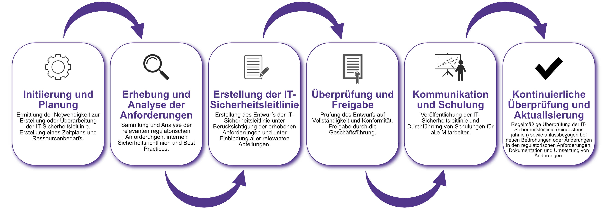

| Author | Dipl.-Ing. Daniel Mrskos, BSc |  
|--------|---------------------------------------------------------------|   
| Funktion | CEO von Security mit Passion, Penetration Tester, Mentor, FH-Lektor, NIS Prüfer |                               
| Datum  | 04. Juli 2024                                                 |
|     |                          |                                              |
| Zertifizierungen  | CSOM, CRTL, eCPTXv2, eWPTXv2, CCD, eCTHPv2, CRTE, CRTO, eCMAP, PNPT, eCPPTv2, eWPT, eCIR, CRTP, CARTP, PAWSP, eMAPT, eCXD, eCDFP, BTL1 (Gold), CAPEN, eEDA, OSWP, CNSP, Comptia Pentest+, ITIL Foundation V3, ICCA, CCNA, eJPTv2, Developing Security Software (LFD121), CAP, Checkmarx Security Champion                                         |
| LinkedIN  | [https://www.linkedin.com/in/dipl-ing-daniel-mrskos-bsc-0720081ab/](https://www.linkedin.com/in/dipl-ing-daniel-mrskos-bsc-0720081ab/)  
| Website  | [https://security-mit-passion.at](https://security-mit-passion.at)  

---
### Prozessbeschreibung: Erstellung und Pflege der IT-Sicherheitsleitlinie

#### Prozessname
Erstellung und Pflege der IT-Sicherheitsleitlinie

#### Prozessverantwortliche
- Max Mustermann (IT-Sicherheitsbeauftragter)
- Erika Mustermann (Leiterin IT-Abteilung)

#### Ziele des Prozesses
Dieser Prozess hat das Ziel, eine umfassende und aktuelle IT-Sicherheitsleitlinie zu erstellen und kontinuierlich zu pflegen, um die Informationssicherheit innerhalb der Bank zu gewährleisten und regulatorische Anforderungen zu erfüllen.

#### Beteiligte Stellen
- IT-Abteilung
- Compliance-Abteilung
- Personalabteilung
- Geschäftsführung

#### Anforderungen an die auslösende Stelle
Die Erstellung oder Überarbeitung der IT-Sicherheitsleitlinie wird initiiert durch:
- Änderungen in den regulatorischen Anforderungen
- Erkenntnisse aus internen oder externen Audits
- Sicherheitsvorfälle oder -bedrohungen
- Regelmäßige Überprüfungstermine (mindestens jährlich)

#### Anforderungen an die Ressourcen
- Fachliche Expertise in Informationssicherheit
- Aktuelle regulatorische Vorgaben und Best Practices
- Software zur Dokumentation und Verteilung der Leitlinie

#### Kosten und Zeitaufwand
- Einmalige Erstellung: ca. 50 Stunden
- Jährliche Überprüfung und Aktualisierung: ca. 20 Stunden

#### Ablauf / Tätigkeit

1. **Initiierung und Planung**
   - Verantwortlich: IT-Sicherheitsbeauftragter
   - Beschreibung: Ermittlung der Notwendigkeit zur Erstellung oder Überarbeitung der IT-Sicherheitsleitlinie. Erstellung eines Zeitplans und Ressourcenbedarfs.

2. **Erhebung und Analyse der Anforderungen**
   - Verantwortlich: IT-Sicherheitsbeauftragter, Compliance-Abteilung
   - Beschreibung: Sammlung und Analyse der relevanten regulatorischen Anforderungen, internen Sicherheitsrichtlinien und Best Practices.

3. **Erstellung der IT-Sicherheitsleitlinie**
   - Verantwortlich: IT-Sicherheitsbeauftragter
   - Beschreibung: Erstellung des Entwurfs der IT-Sicherheitsleitlinie unter Berücksichtigung der erhobenen Anforderungen und unter Einbindung aller relevanten Abteilungen.

4. **Überprüfung und Freigabe**
   - Verantwortlich: Geschäftsführung, Compliance-Abteilung
   - Beschreibung: Prüfung des Entwurfs auf Vollständigkeit und Konformität. Freigabe durch die Geschäftsführung.

5. **Kommunikation und Schulung**
   - Verantwortlich: Personalabteilung, IT-Abteilung
   - Beschreibung: Veröffentlichung der IT-Sicherheitsleitlinie und Durchführung von Schulungen für alle Mitarbeiter.

6. **Kontinuierliche Überprüfung und Aktualisierung**
   - Verantwortlich: IT-Sicherheitsbeauftragter
   - Beschreibung: Regelmäßige Überprüfung der IT-Sicherheitsleitlinie (mindestens jährlich) sowie anlassbezogen bei neuen Bedrohungen oder Änderungen in den regulatorischen Anforderungen. Dokumentation und Umsetzung von Änderungen.

 

#### Dokumentation
Alle Schritte und Entscheidungen im Prozess werden dokumentiert und revisionssicher archiviert. Dazu gehören:
- Entwurfsversionen der IT-Sicherheitsleitlinie
- Prüfergebnisse und Freigaben
- Schulungsunterlagen und Teilnehmerlisten
- Protokolle der Überprüfungen und Aktualisierungen

#### Kommunikationswege
- Regelmäßige Berichte an die Geschäftsführung
- Information der Mitarbeiter über Änderungen durch E-Mails und Intranet-Ankündigungen
- Schulungsveranstaltungen und Workshops