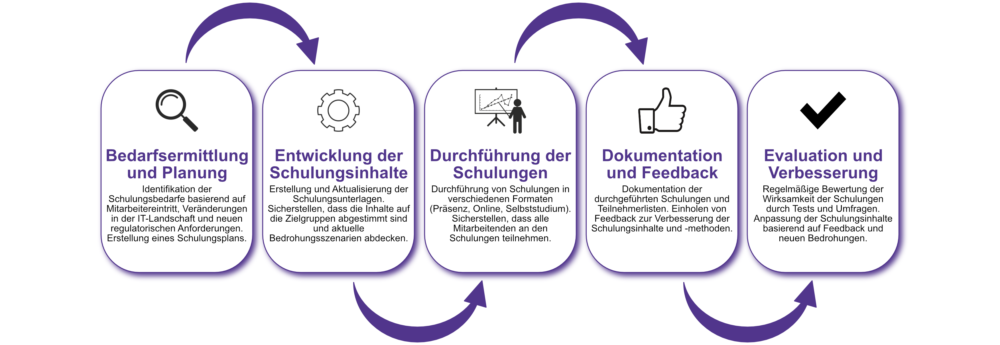

| Author | Dipl.-Ing. Daniel Mrskos, BSc |  
|--------|---------------------------------------------------------------|   
| Funktion | CEO von Security mit Passion, Penetration Tester, Mentor, FH-Lektor, NIS Prüfer |                               
| Datum  | 04. Juli 2024                                                 |
|     |                          |                                              |
| Zertifizierungen  | CSOM, CRTL, eCPTXv2, eWPTXv2, CCD, eCTHPv2, CRTE, CRTO, eCMAP, PNPT, eCPPTv2, eWPT, eCIR, CRTP, CARTP, PAWSP, eMAPT, eCXD, eCDFP, BTL1 (Gold), CAPEN, eEDA, OSWP, CNSP, Comptia Pentest+, ITIL Foundation V3, ICCA, CCNA, eJPTv2, Developing Security Software (LFD121), CAP, Checkmarx Security Champion                                         |
| LinkedIN  | [https://www.linkedin.com/in/dipl-ing-daniel-mrskos-bsc-0720081ab/](https://www.linkedin.com/in/dipl-ing-daniel-mrskos-bsc-0720081ab/)  
| Website  | [https://security-mit-passion.at](https://security-mit-passion.at)  

---
### Prozessbeschreibung: Regelmäßige Schulungen und Sensibilisierungen

#### Prozessname
Regelmäßige Schulungen und Sensibilisierungen

#### Prozessverantwortliche
- Max Mustermann (IT-Sicherheitsbeauftragter)
- Erika Mustermann (Leiterin Personalabteilung)

#### Ziele des Prozesses
Dieser Prozess hat das Ziel, alle Mitarbeitenden der Bank regelmäßig zu schulen und für Informationssicherheitsrisiken zu sensibilisieren. Dadurch soll das Sicherheitsbewusstsein gestärkt und die Einhaltung von Sicherheitsrichtlinien gewährleistet werden.

#### Beteiligte Stellen
- IT-Abteilung
- Personalabteilung
- Compliance-Abteilung
- Externe Schulungsanbieter

#### Anforderungen an die auslösende Stelle
Die Initiierung regelmäßiger Schulungen und Sensibilisierungsmaßnahmen wird ausgelöst durch:
- Neue Mitarbeitende (Onboarding-Prozess)
- Jährliche Auffrischungsschulungen
- Einführung neuer IT-Systeme oder Sicherheitsrichtlinien
- Erkenntnisse aus Sicherheitsvorfällen oder Audits

#### Anforderungen an die Ressourcen
- Fachliche Expertise in Informationssicherheit und Schulungsmethodik
- Aktuelle Schulungsunterlagen und Präsentationen
- Software für die Durchführung von Online-Schulungen
- Räume und technische Ausstattung für Präsenzschulungen

#### Kosten und Zeitaufwand
- Jährliche Auffrischungsschulungen: ca. 40 Stunden
- Onboarding-Schulungen: ca. 4 Stunden pro neuer Mitarbeitender
- Ad-hoc-Schulungen bei Änderungen: ca. 10 Stunden

#### Ablauf / Tätigkeit

1. **Bedarfsermittlung und Planung**
   - Verantwortlich: IT-Sicherheitsbeauftragter, Personalabteilung
   - Beschreibung: Identifikation der Schulungsbedarfe basierend auf Mitarbeitereintritt, Veränderungen in der IT-Landschaft und neuen regulatorischen Anforderungen. Erstellung eines Schulungsplans.

2. **Entwicklung der Schulungsinhalte**
   - Verantwortlich: IT-Sicherheitsbeauftragter, Compliance-Abteilung
   - Beschreibung: Erstellung und Aktualisierung der Schulungsunterlagen. Sicherstellen, dass die Inhalte auf die Zielgruppen abgestimmt sind und aktuelle Bedrohungsszenarien abdecken.

3. **Durchführung der Schulungen**
   - Verantwortlich: Personalabteilung, externe Schulungsanbieter
   - Beschreibung: Durchführung von Schulungen in verschiedenen Formaten (Präsenz, Online, Selbststudium). Sicherstellen, dass alle Mitarbeitenden an den Schulungen teilnehmen.

4. **Dokumentation und Feedback**
   - Verantwortlich: Personalabteilung
   - Beschreibung: Dokumentation der durchgeführten Schulungen und Teilnehmerlisten. Einholen von Feedback zur Verbesserung der Schulungsinhalte und -methoden.

5. **Evaluation und Verbesserung**
   - Verantwortlich: IT-Sicherheitsbeauftragter, Personalabteilung
   - Beschreibung: Regelmäßige Bewertung der Wirksamkeit der Schulungen durch Tests und Umfragen. Anpassung der Schulungsinhalte basierend auf Feedback und neuen Bedrohungen.

 

#### Dokumentation
Alle Schritte und Entscheidungen im Prozess werden dokumentiert und revisionssicher archiviert. Dazu gehören:
- Schulungspläne und -unterlagen
- Teilnehmerlisten und Zertifikate
- Feedbackbögen und Evaluationsergebnisse

#### Kommunikationswege
- Regelmäßige Berichte an die Geschäftsführung über den Stand der Schulungen und deren Wirksamkeit
- Information der Mitarbeitenden über Schulungstermine und -inhalte durch E-Mails und Intranet-Ankündigungen
- Bereitstellung von Schulungsunterlagen im Intranet
