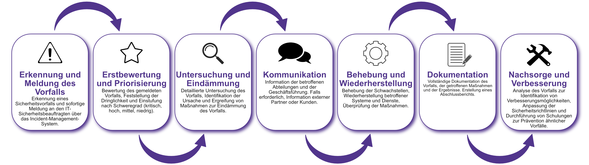

| Author | Dipl.-Ing. Daniel Mrskos, BSc |  
|--------|---------------------------------------------------------------|   
| Funktion | CEO von Security mit Passion, Penetration Tester, Mentor, FH-Lektor, NIS Prüfer |                               
| Datum  | 04. Juli 2024                                                 |
|     |                          |                                              |
| Zertifizierungen  | CSOM, CRTL, eCPTXv2, eWPTXv2, CCD, eCTHPv2, CRTE, CRTO, eCMAP, PNPT, eCPPTv2, eWPT, eCIR, CRTP, CARTP, PAWSP, eMAPT, eCXD, eCDFP, BTL1 (Gold), CAPEN, eEDA, OSWP, CNSP, Comptia Pentest+, ITIL Foundation V3, ICCA, CCNA, eJPTv2, Developing Security Software (LFD121), CAP, Checkmarx Security Champion                                         |
| LinkedIN  | [https://www.linkedin.com/in/dipl-ing-daniel-mrskos-bsc-0720081ab/](https://www.linkedin.com/in/dipl-ing-daniel-mrskos-bsc-0720081ab/)  
| Website  | [https://security-mit-passion.at](https://security-mit-passion.at)  

---

### Prozessbeschreibung: Meldung und Nachsorge von Sicherheitsvorfällen

#### Prozessname
Meldung und Nachsorge von Sicherheitsvorfällen

#### Prozessverantwortliche
- Max Mustermann (IT-Sicherheitsbeauftragter)
- Erika Mustermann (Leiterin IT-Abteilung)

#### Ziele des Prozesses
Dieser Prozess hat das Ziel, Sicherheitsvorfälle schnell und effizient zu melden, zu dokumentieren und nachzubereiten, um die Informationssicherheit zu gewährleisten und weitere Vorfälle zu verhindern.

#### Beteiligte Stellen
- IT-Abteilung
- Compliance-Abteilung
- Personalabteilung
- Geschäftsführung
- Externe Dienstleister (falls erforderlich)

#### Anforderungen an die auslösende Stelle
Die Meldung eines Sicherheitsvorfalls wird ausgelöst durch:
- Feststellung eines Vorfalls durch Mitarbeitende oder Systeme
- Hinweise von externen Partnern oder Kunden
- Ergebnisse von Audits oder Sicherheitsüberprüfungen

#### Anforderungen an die Ressourcen
- Incident-Management-Software
- Schulungen für Mitarbeitende zur Erkennung und Meldung von Sicherheitsvorfällen
- Kommunikationsmittel zur schnellen Information der relevanten Stellen

#### Kosten und Zeitaufwand
- Initiale Einrichtung des Meldesystems: ca. 30 Stunden
- Bearbeitung eines Vorfalls: variiert je nach Schweregrad (durchschnittlich 5-20 Stunden)

#### Ablauf / Tätigkeit

1. **Erkennung und Meldung des Vorfalls**
   - Verantwortlich: Alle Mitarbeitenden
   - Beschreibung: Erkennung eines Sicherheitsvorfalls und sofortige Meldung an den IT-Sicherheitsbeauftragten über das Incident-Management-System.

2. **Erstbewertung und Priorisierung**
   - Verantwortlich: IT-Sicherheitsbeauftragter
   - Beschreibung: Bewertung des gemeldeten Vorfalls, Feststellung der Dringlichkeit und Einstufung nach Schweregrad (kritisch, hoch, mittel, niedrig).

3. **Untersuchung und Eindämmung**
   - Verantwortlich: IT-Sicherheitsbeauftragter, IT-Abteilung
   - Beschreibung: Detaillierte Untersuchung des Vorfalls, Identifikation der Ursache und Ergreifung von Maßnahmen zur Eindämmung des Vorfalls.

4. **Kommunikation**
   - Verantwortlich: IT-Sicherheitsbeauftragter
   - Beschreibung: Information der betroffenen Abteilungen und der Geschäftsführung. Falls erforderlich, Information externer Partner oder Kunden.

5. **Behebung und Wiederherstellung**
   - Verantwortlich: IT-Abteilung
   - Beschreibung: Behebung der Schwachstellen, Wiederherstellung betroffener Systeme und Dienste, Überprüfung der Maßnahmen.

6. **Dokumentation**
   - Verantwortlich: IT-Sicherheitsbeauftragter
   - Beschreibung: Vollständige Dokumentation des Vorfalls, der getroffenen Maßnahmen und der Ergebnisse. Erstellung eines Abschlussberichts.

7. **Nachsorge und Verbesserung**
   - Verantwortlich: IT-Sicherheitsbeauftragter, Compliance-Abteilung
   - Beschreibung: Analyse des Vorfalls zur Identifikation von Verbesserungsmöglichkeiten, Anpassung der Sicherheitsrichtlinien und Durchführung von Schulungen zur Prävention ähnlicher Vorfälle.

 

#### Dokumentation
Alle Schritte und Entscheidungen im Prozess werden dokumentiert und revisionssicher archiviert. Dazu gehören:
- Meldungen von Sicherheitsvorfällen
- Bewertungs- und Priorisierungsberichte
- Untersuchungsberichte und Maßnahmenpläne
- Kommunikationsprotokolle
- Abschlussberichte und Nachsorgeprotokolle

#### Kommunikationswege
- Sofortige Benachrichtigung der relevanten Abteilungen und der Geschäftsführung über das Incident-Management-System
- Regelmäßige Berichte an die Geschäftsführung über den Status der Sicherheitsvorfälle und deren Nachsorge
- Information der Mitarbeitenden über Präventivmaßnahmen und Schulungen durch E-Mails und Intranet-Ankündigungen