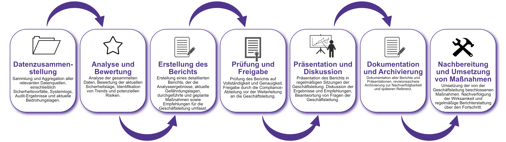

| Author | Dipl.-Ing. Daniel Mrskos, BSc |  
|--------|---------------------------------------------------------------|   
| Funktion | CEO von Security mit Passion, Penetration Tester, Mentor, FH-Lektor, NIS Prüfer |                               
| Datum  | 04. Juli 2024                                                 |
|     |                          |                                              |
| Zertifizierungen  | CSOM, CRTL, eCPTXv2, eWPTXv2, CCD, eCTHPv2, CRTE, CRTO, eCMAP, PNPT, eCPPTv2, eWPT, eCIR, CRTP, CARTP, PAWSP, eMAPT, eCXD, eCDFP, BTL1 (Gold), CAPEN, eEDA, OSWP, CNSP, Comptia Pentest+, ITIL Foundation V3, ICCA, CCNA, eJPTv2, Developing Security Software (LFD121), CAP, Checkmarx Security Champion                                         |
| LinkedIN  | [https://www.linkedin.com/in/dipl-ing-daniel-mrskos-bsc-0720081ab/](https://www.linkedin.com/in/dipl-ing-daniel-mrskos-bsc-0720081ab/)  
| Website  | [https://security-mit-passion.at](https://security-mit-passion.at)  

---

### Prozessbeschreibung: Regelmäßiges Reporting an die Geschäftsleitung

#### Prozessname
Regelmäßiges Reporting an die Geschäftsleitung

#### Prozessverantwortliche
- Max Mustermann (IT-Sicherheitsbeauftragter)
- Erika Mustermann (Leiterin IT-Abteilung)

#### Ziele des Prozesses
Dieser Prozess hat das Ziel, der Geschäftsleitung regelmäßig detaillierte Berichte über den Status der Informationssicherheit, aktuelle Gefährdungslagen, Maßnahmen und Verbesserungsmöglichkeiten zu liefern. Dadurch soll die Geschäftsleitung stets über den Sicherheitszustand der Organisation informiert sein und fundierte Entscheidungen treffen können.

#### Beteiligte Stellen
- IT-Abteilung
- Compliance-Abteilung
- Personalabteilung
- Geschäftsführung

#### Anforderungen an die auslösende Stelle
Das Reporting an die Geschäftsleitung wird initiiert durch:
- Festgelegte Reporting-Zyklen (monatlich, quartalsweise, jährlich)
- Ad-hoc-Berichte bei sicherheitsrelevanten Vorfällen oder Veränderungen

#### Anforderungen an die Ressourcen
- Reporting-Software
- Datenquellen für sicherheitsrelevante Informationen
- Schulungen für Mitarbeitende zur Erstellung und Analyse von Sicherheitsberichten

#### Kosten und Zeitaufwand
- Erstellung eines Standard-Reports: ca. 10 Stunden
- Ad-hoc-Berichte: variiert je nach Vorfall (durchschnittlich 5-15 Stunden)

#### Ablauf / Tätigkeit

1. **Datenzusammenstellung**
   - Verantwortlich: IT-Abteilung, Compliance-Abteilung
   - Beschreibung: Sammlung und Aggregation aller relevanten Datenquellen, einschließlich Sicherheitsvorfälle, Systemlogs, Audit-Ergebnisse und aktuelle Bedrohungslagen.

2. **Analyse und Bewertung**
   - Verantwortlich: IT-Sicherheitsbeauftragter
   - Beschreibung: Analyse der gesammelten Daten, Bewertung der aktuellen Sicherheitslage, Identifikation von Trends und potenziellen Risiken.

3. **Erstellung des Berichts**
   - Verantwortlich: IT-Sicherheitsbeauftragter
   - Beschreibung: Erstellung eines detaillierten Berichts, der die Analyseergebnisse, aktuelle Gefährdungslagen, durchgeführte und geplante Maßnahmen sowie Empfehlungen für die Geschäftsleitung umfasst.

4. **Prüfung und Freigabe**
   - Verantwortlich: IT-Sicherheitsbeauftragter, Compliance-Abteilung
   - Beschreibung: Prüfung des Berichts auf Vollständigkeit und Genauigkeit. Freigabe durch die Compliance-Abteilung vor der Weiterleitung an die Geschäftsleitung.

5. **Präsentation und Diskussion**
   - Verantwortlich: IT-Sicherheitsbeauftragter
   - Beschreibung: Präsentation des Berichts in regelmäßigen Sitzungen der Geschäftsleitung. Diskussion der Ergebnisse und Empfehlungen, Beantwortung von Fragen der Geschäftsleitung.

6. **Dokumentation und Archivierung**
   - Verantwortlich: IT-Sicherheitsbeauftragter
   - Beschreibung: Dokumentation aller Berichte und Präsentationen, revisionssichere Archivierung zur Nachverfolgbarkeit und späteren Referenz.

7. **Nachbereitung und Umsetzung von Maßnahmen**
   - Verantwortlich: IT-Sicherheitsbeauftragter, IT-Abteilung
   - Beschreibung: Umsetzung der von der Geschäftsleitung beschlossenen Maßnahmen. Nachverfolgung der Wirksamkeit und regelmäßige Berichterstattung über den Fortschritt.

 

#### Dokumentation
Alle Schritte und Entscheidungen im Prozess werden dokumentiert und revisionssicher archiviert. Dazu gehören:
- Gesammelte Rohdaten
- Analyseergebnisse und Berichte
- Protokolle der Besprechungen mit der Geschäftsleitung
- Umsetzungspläne und Fortschrittsberichte

#### Kommunikationswege
- Regelmäßige Berichte an die Geschäftsführung durch formelle Präsentationen und schriftliche Berichte
- Ad-hoc-Kommunikation bei sicherheitsrelevanten Vorfällen durch E-Mails und spezielle Meetings
- Bereitstellung der Berichte im internen Dokumentenmanagementsystem