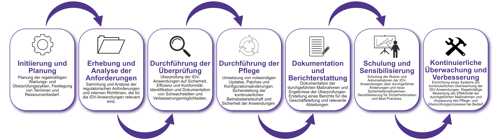

| Author | Dipl.-Ing. Daniel Mrskos, BSc |  
|--------|---------------------------------------------------------------|   
| Funktion | CEO von Security mit Passion, Penetration Tester, Mentor, FH-Lektor, NIS Prüfer |                               
| Datum  | 04. Juli 2024                                                 |
|     |                          |                                              |
| Zertifizierungen  | CSOM, CRTL, eCPTXv2, eWPTXv2, CCD, eCTHPv2, CRTE, CRTO, eCMAP, PNPT, eCPPTv2, eWPT, eCIR, CRTP, CARTP, PAWSP, eMAPT, eCXD, eCDFP, BTL1 (Gold), CAPEN, eEDA, OSWP, CNSP, Comptia Pentest+, ITIL Foundation V3, ICCA, CCNA, eJPTv2, Developing Security Software (LFD121), CAP, Checkmarx Security Champion                                         |
| LinkedIN  | [https://www.linkedin.com/in/dipl-ing-daniel-mrskos-bsc-0720081ab/](https://www.linkedin.com/in/dipl-ing-daniel-mrskos-bsc-0720081ab/)  
| Website  | [https://security-mit-passion.at](https://security-mit-passion.at)  

---

### Prozessbeschreibung: Pflege und Überprüfung der IDV-Anwendungen

#### Prozessname
Pflege und Überprüfung der IDV-Anwendungen

#### Prozessverantwortliche
- Max Mustermann (IDV-Anwendungsmanager)
- Erika Mustermann (Leiterin IT-Abteilung)

#### Ziele des Prozesses
Dieser Prozess hat das Ziel, die IDV-Anwendungen (Individuelle Datenverarbeitung) regelmäßig zu pflegen und zu überprüfen, um ihre Sicherheit, Effizienz und Einhaltung der regulatorischen Anforderungen sicherzustellen.

#### Beteiligte Stellen
- IT-Abteilung
- Compliance-Abteilung
- Fachabteilungen (Nutzer der IDV-Anwendungen)
- Externe Dienstleister (falls erforderlich)

#### Anforderungen an die auslösende Stelle
Die Pflege und Überprüfung der IDV-Anwendungen wird ausgelöst durch:
- Regelmäßige Wartungszyklen (monatlich, quartalsweise, jährlich)
- Änderungen in den regulatorischen Anforderungen
- Erkenntnisse aus internen oder externen Audits
- Sicherheitsvorfälle oder -bedrohungen

#### Anforderungen an die Ressourcen
- Software-Tools zur Überwachung und Pflege der IDV-Anwendungen
- Fachliche Expertise in den verwendeten Technologien und Regulierungsanforderungen
- Dokumentationssysteme für Änderungsprotokolle und Prüfberichte

#### Kosten und Zeitaufwand
- Einmalige Überprüfung: ca. 20 Stunden
- Regelmäßige Wartung: variiert je nach Umfang der Anwendungen (durchschnittlich 5-10 Stunden pro Anwendung)

#### Ablauf / Tätigkeit

1. **Initiierung und Planung**
   - Verantwortlich: IDV-Anwendungsmanager
   - Beschreibung: Planung der regelmäßigen Wartungs- und Überprüfungszyklen, Festlegung von Terminen und Ressourcenbedarf.

2. **Erhebung und Analyse der Anforderungen**
   - Verantwortlich: IT-Abteilung, Compliance-Abteilung
   - Beschreibung: Sammlung und Analyse der regulatorischen Anforderungen und internen Richtlinien, die für die IDV-Anwendungen relevant sind.

3. **Durchführung der Überprüfung**
   - Verantwortlich: IT-Abteilung
   - Beschreibung: Überprüfung der IDV-Anwendungen auf Sicherheit, Effizienz und Konformität. Identifikation und Dokumentation von Schwachstellen und Verbesserungsmöglichkeiten.

4. **Durchführung der Pflege**
   - Verantwortlich: IT-Abteilung
   - Beschreibung: Umsetzung von notwendigen Updates, Patches und Konfigurationsänderungen. Sicherstellung der kontinuierlichen Betriebsbereitschaft und Sicherheit der Anwendungen.

5. **Dokumentation und Berichterstattung**
   - Verantwortlich: IDV-Anwendungsmanager
   - Beschreibung: Dokumentation der durchgeführten Maßnahmen und Ergebnisse der Überprüfungen. Erstellung eines Berichts für die Geschäftsleitung und relevante Abteilungen.

6. **Schulung und Sensibilisierung**
   - Verantwortlich: IT-Abteilung, Compliance-Abteilung
   - Beschreibung: Schulung der Nutzer und Administratoren der IDV-Anwendungen über durchgeführte Änderungen und neue Sicherheitsmaßnahmen. Sensibilisierung für Sicherheitsrisiken und Best Practices.

7. **Kontinuierliche Überwachung und Verbesserung**
   - Verantwortlich: IT-Abteilung
   - Beschreibung: Einrichtung eines Systems zur kontinuierlichen Überwachung der IDV-Anwendungen. Regelmäßige Bewertung der Effektivität der durchgeführten Maßnahmen und Anpassung des Pflege- und Überprüfungsprozesses bei Bedarf.

 

#### Dokumentation
Alle Schritte und Entscheidungen im Prozess werden dokumentiert und revisionssicher archiviert. Dazu gehören:
- Wartungspläne und Überprüfungsprotokolle
- Änderungsprotokolle und Prüfberichte
- Berichte an die Geschäftsleitung
- Schulungsunterlagen und Teilnehmerlisten

#### Kommunikationswege
- Regelmäßige Berichte an die Geschäftsleitung über den Status der IDV-Anwendungen und durchgeführte Maßnahmen
- Information der beteiligten Abteilungen über Änderungen und Ergebnisse der Überprüfungen durch E-Mails und Intranet-Ankündigungen
- Bereitstellung der Dokumentation im internen Dokumentenmanagementsystem
