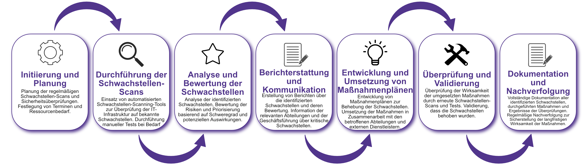

| Author | Dipl.-Ing. Daniel Mrskos, BSc |  
|--------|---------------------------------------------------------------|   
| Funktion | CEO von Security mit Passion, Penetration Tester, Mentor, FH-Lektor, NIS Prüfer |                               
| Datum  | 04. Juli 2024                                                 |
|     |                          |                                              |
| Zertifizierungen  | CSOM, CRTL, eCPTXv2, eWPTXv2, CCD, eCTHPv2, CRTE, CRTO, eCMAP, PNPT, eCPPTv2, eWPT, eCIR, CRTP, CARTP, PAWSP, eMAPT, eCXD, eCDFP, BTL1 (Gold), CAPEN, eEDA, OSWP, CNSP, Comptia Pentest+, ITIL Foundation V3, ICCA, CCNA, eJPTv2, Developing Security Software (LFD121), CAP, Checkmarx Security Champion                                         |
| LinkedIN  | [https://www.linkedin.com/in/dipl-ing-daniel-mrskos-bsc-0720081ab/](https://www.linkedin.com/in/dipl-ing-daniel-mrskos-bsc-0720081ab/)  
| Website  | [https://security-mit-passion.at](https://security-mit-passion.at)  

---
### Prozessbeschreibung: Identifikation und Verwaltung von Schwachstellen

#### Prozessname
Identifikation und Verwaltung von Schwachstellen

#### Prozessverantwortliche
- Max Mustermann (IT-Sicherheitsbeauftragter)
- Erika Mustermann (Leiterin IT-Abteilung)

#### Ziele des Prozesses
Dieser Prozess hat das Ziel, Schwachstellen in der IT-Infrastruktur der Bank frühzeitig zu identifizieren, zu bewerten und geeignete Maßnahmen zur Behebung und Minimierung von Risiken zu ergreifen. Dadurch soll die Informationssicherheit kontinuierlich verbessert werden.

#### Beteiligte Stellen
- IT-Abteilung
- Compliance-Abteilung
- Fachabteilungen (Nutzer der IT-Systeme)
- Externe Dienstleister (falls erforderlich)

#### Anforderungen an die auslösende Stelle
Die Identifikation und Verwaltung von Schwachstellen wird ausgelöst durch:
- Regelmäßige Schwachstellen-Scans und Sicherheitsüberprüfungen
- Hinweise von Mitarbeitenden oder externen Partnern
- Ergebnisse von Audits und Sicherheitsüberprüfungen
- Entdeckung von Sicherheitsvorfällen

#### Anforderungen an die Ressourcen
- Schwachstellen-Scanning-Software
- Zugang zu aktuellen Sicherheitsdatenbanken und Threat-Intelligence-Feeds
- Fachliche Expertise in IT-Sicherheit und Schwachstellenmanagement
- Dokumentationssysteme für Schwachstellenberichte und Maßnahmenpläne

#### Kosten und Zeitaufwand
- Regelmäßige Schwachstellen-Scans: ca. 20 Stunden pro Zyklus
- Behebung identifizierter Schwachstellen: variiert je nach Umfang (durchschnittlich 10-40 Stunden pro Schwachstelle)

#### Ablauf / Tätigkeit

1. **Initiierung und Planung**
   - Verantwortlich: IT-Sicherheitsbeauftragter
   - Beschreibung: Planung der regelmäßigen Schwachstellen-Scans und Sicherheitsüberprüfungen. Festlegung von Terminen und Ressourcenbedarf.

2. **Durchführung der Schwachstellen-Scans**
   - Verantwortlich: IT-Abteilung
   - Beschreibung: Einsatz von automatisierten Schwachstellen-Scanning-Tools zur Überprüfung der IT-Infrastruktur auf bekannte Schwachstellen. Durchführung manueller Tests bei Bedarf.

3. **Analyse und Bewertung der Schwachstellen**
   - Verantwortlich: IT-Sicherheitsbeauftragter
   - Beschreibung: Analyse der identifizierten Schwachstellen, Bewertung der Risiken und Priorisierung basierend auf Schweregrad und potenziellen Auswirkungen.

4. **Berichterstattung und Kommunikation**
   - Verantwortlich: IT-Sicherheitsbeauftragter
   - Beschreibung: Erstellung von Berichten über die identifizierten Schwachstellen und deren Bewertung. Information der relevanten Abteilungen und der Geschäftsführung über kritische Schwachstellen.

5. **Entwicklung und Umsetzung von Maßnahmenplänen**
   - Verantwortlich: IT-Abteilung
   - Beschreibung: Entwicklung von Maßnahmenplänen zur Behebung der Schwachstellen. Umsetzung der Maßnahmen in Zusammenarbeit mit den betroffenen Abteilungen und externen Dienstleistern.

6. **Überprüfung und Validierung**
   - Verantwortlich: IT-Sicherheitsbeauftragter
   - Beschreibung: Überprüfung der Wirksamkeit der umgesetzten Maßnahmen durch erneute Schwachstellen-Scans und Tests. Validierung, dass die Schwachstellen behoben wurden.

7. **Dokumentation und Nachverfolgung**
   - Verantwortlich: IT-Sicherheitsbeauftragter
   - Beschreibung: Vollständige Dokumentation aller identifizierten Schwachstellen, durchgeführten Maßnahmen und Ergebnisse der Überprüfungen. Regelmäßige Nachverfolgung zur Sicherstellung der langfristigen Wirksamkeit der Maßnahmen.

 

#### Dokumentation
Alle Schritte und Entscheidungen im Prozess werden dokumentiert und revisionssicher archiviert. Dazu gehören:
- Scanning-Berichte und Prüfprotokolle
- Risikoanalysen und Priorisierungsberichte
- Maßnahmenpläne und Umsetzungsprotokolle
- Validierungsberichte und Nachverfolgungsprotokolle

#### Kommunikationswege
- Regelmäßige Berichte an die Geschäftsführung über den Status der Schwachstellen und durchgeführten Maßnahmen
- Information der beteiligten Abteilungen über kritische Schwachstellen und Maßnahmenpläne durch E-Mails und Intranet-Ankündigungen
- Bereitstellung der Dokumentation im internen Dokumentenmanagementsystem