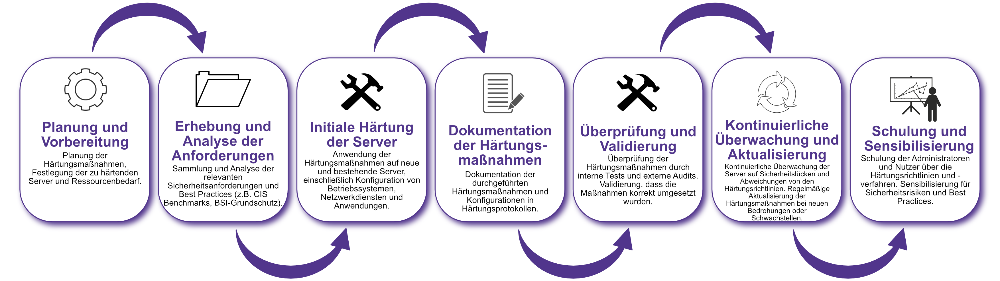

| Author | Dipl.-Ing. Daniel Mrskos, BSc |  
|--------|---------------------------------------------------------------|   
| Funktion | CEO von Security mit Passion, Penetration Tester, Mentor, FH-Lektor, NIS Prüfer |                               
| Datum  | 04. Juli 2024                                                 |
|     |                          |                                              |
| Zertifizierungen  | CSOM, CRTL, eCPTXv2, eWPTXv2, CCD, eCTHPv2, CRTE, CRTO, eCMAP, PNPT, eCPPTv2, eWPT, eCIR, CRTP, CARTP, PAWSP, eMAPT, eCXD, eCDFP, BTL1 (Gold), CAPEN, eEDA, OSWP, CNSP, Comptia Pentest+, ITIL Foundation V3, ICCA, CCNA, eJPTv2, Developing Security Software (LFD121), CAP, Checkmarx Security Champion                                         |
| LinkedIN  | [https://www.linkedin.com/in/dipl-ing-daniel-mrskos-bsc-0720081ab/](https://www.linkedin.com/in/dipl-ing-daniel-mrskos-bsc-0720081ab/)  
| Website  | [https://security-mit-passion.at](https://security-mit-passion.at)  

---

### Prozessbeschreibung: Serverhärtung

#### Prozessname
Serverhärtung

#### Prozessverantwortliche
- Max Mustermann (IT-Sicherheitsbeauftragter)
- Erika Mustermann (Leiterin IT-Abteilung)

#### Ziele des Prozesses
Dieser Prozess hat das Ziel, die Sicherheitskonfiguration von Servern zu standardisieren und zu optimieren, um die Angriffsfläche zu minimieren und die IT-Infrastruktur der Bank vor Bedrohungen zu schützen.

#### Beteiligte Stellen
- IT-Abteilung
- Compliance-Abteilung
- Externe Dienstleister (falls erforderlich)

#### Anforderungen an die auslösende Stelle
Die Initiierung der Serverhärtung wird ausgelöst durch:
- Neue Serverbereitstellungen
- Regelmäßige Wartungszyklen (monatlich, quartalsweise, jährlich)
- Sicherheitsvorfälle oder -bedrohungen
- Änderungen in den regulatorischen Anforderungen
- Erkenntnisse aus internen oder externen Audits

#### Anforderungen an die Ressourcen
- Tools für die Serverhärtung und Sicherheitskonfiguration
- Fachliche Expertise in IT-Sicherheitsstandards und Serveradministration
- Dokumentationssysteme für Härtungsprotokolle und Maßnahmenpläne

#### Kosten und Zeitaufwand
- Einmalige Härtung eines Servers: ca. 10-20 Stunden
- Regelmäßige Überprüfungen und Aktualisierungen: ca. 5-10 Stunden pro Zyklus

#### Ablauf / Tätigkeit

1. **Planung und Vorbereitung**
   - Verantwortlich: IT-Sicherheitsbeauftragter
   - Beschreibung: Planung der Härtungsmaßnahmen, Festlegung der zu härtenden Server und Ressourcenbedarf.

2. **Erhebung und Analyse der Anforderungen**
   - Verantwortlich: IT-Abteilung, Compliance-Abteilung
   - Beschreibung: Sammlung und Analyse der relevanten Sicherheitsanforderungen und Best Practices (z.B. CIS Benchmarks, BSI-Grundschutz).

3. **Initiale Härtung der Server**
   - Verantwortlich: IT-Abteilung
   - Beschreibung: Anwendung der Härtungsmaßnahmen auf neue und bestehende Server, einschließlich Konfiguration von Betriebssystemen, Netzwerkdiensten und Anwendungen.

4. **Dokumentation der Härtungsmaßnahmen**
   - Verantwortlich: IT-Sicherheitsbeauftragter
   - Beschreibung: Dokumentation der durchgeführten Härtungsmaßnahmen und Konfigurationen in Härtungsprotokollen.

5. **Überprüfung und Validierung**
   - Verantwortlich: IT-Sicherheitsbeauftragter, Externe Dienstleister
   - Beschreibung: Überprüfung der Härtungsmaßnahmen durch interne Tests und externe Audits. Validierung, dass die Maßnahmen korrekt umgesetzt wurden.

6. **Kontinuierliche Überwachung und Aktualisierung**
   - Verantwortlich: IT-Abteilung
   - Beschreibung: Kontinuierliche Überwachung der Server auf Sicherheitslücken und Abweichungen von den Härtungsrichtlinien. Regelmäßige Aktualisierung der Härtungsmaßnahmen bei neuen Bedrohungen oder Schwachstellen.

7. **Schulung und Sensibilisierung**
   - Verantwortlich: IT-Sicherheitsbeauftragter
   - Beschreibung: Schulung der Administratoren und Nutzer über die Härtungsrichtlinien und -verfahren. Sensibilisierung für Sicherheitsrisiken und Best Practices.

 

#### Dokumentation
Alle Schritte und Entscheidungen im Prozess werden dokumentiert und revisionssicher archiviert. Dazu gehören:
- Härtungsprotokolle und Konfigurationsdokumentationen
- Prüfberichte und Auditprotokolle
- Schulungsunterlagen und Teilnehmerlisten

#### Kommunikationswege
- Regelmäßige Berichte an die Geschäftsführung über den Status der Serverhärtung und durchgeführte Maßnahmen
- Information der beteiligten Abteilungen über Härtungsmaßnahmen und Ergebnisse der Überprüfungen durch E-Mails und Intranet-Ankündigungen
- Bereitstellung der Dokumentation im internen Dokumentenmanagementsystem
