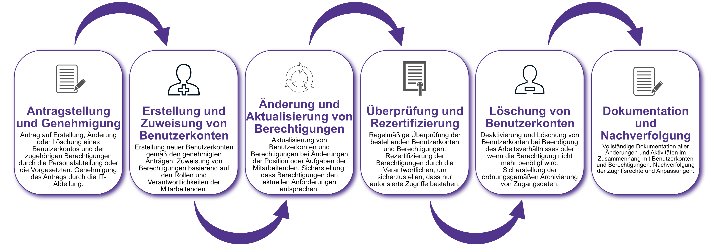

| Author | Dipl.-Ing. Daniel Mrskos, BSc |  
|--------|---------------------------------------------------------------|   
| Funktion | CEO von Security mit Passion, Penetration Tester, Mentor, FH-Lektor, NIS Prüfer |                               
| Datum  | 04. Juli 2024                                                 |
|     |                          |                                              |
| Zertifizierungen  | CSOM, CRTL, eCPTXv2, eWPTXv2, CCD, eCTHPv2, CRTE, CRTO, eCMAP, PNPT, eCPPTv2, eWPT, eCIR, CRTP, CARTP, PAWSP, eMAPT, eCXD, eCDFP, BTL1 (Gold), CAPEN, eEDA, OSWP, CNSP, Comptia Pentest+, ITIL Foundation V3, ICCA, CCNA, eJPTv2, Developing Security Software (LFD121), CAP, Checkmarx Security Champion                                         |
| LinkedIN  | [https://www.linkedin.com/in/dipl-ing-daniel-mrskos-bsc-0720081ab/](https://www.linkedin.com/in/dipl-ing-daniel-mrskos-bsc-0720081ab/)  
| Website  | [https://security-mit-passion.at](https://security-mit-passion.at)  

---
### Prozessbeschreibung: Verwaltung von Benutzerkonten und Berechtigungen

#### Prozessname
Verwaltung von Benutzerkonten und Berechtigungen

#### Prozessverantwortliche
- Max Mustermann (IT-Sicherheitsbeauftragter)
- Erika Mustermann (Leiterin IT-Abteilung)

#### Ziele des Prozesses
Dieser Prozess hat das Ziel, Benutzerkonten und Berechtigungen sicher und effizient zu verwalten, um sicherzustellen, dass nur autorisierte Personen Zugriff auf Systeme und Daten der Bank haben.

#### Beteiligte Stellen
- IT-Abteilung
- Compliance-Abteilung
- Personalabteilung
- Fachabteilungen

#### Anforderungen an die auslösende Stelle
Die Verwaltung von Benutzerkonten und Berechtigungen wird ausgelöst durch:
- Eintritt neuer Mitarbeitender
- Änderungen in den Aufgaben oder Positionen der Mitarbeitenden
- Beendigung von Arbeitsverhältnissen
- Regelmäßige Überprüfung der bestehenden Benutzerkonten und Berechtigungen

#### Anforderungen an die Ressourcen
- Identity and Access Management (IAM) Software
- Fachliche Expertise in den Bereichen IT-Sicherheit und Benutzerverwaltung
- Dokumentationssysteme für Zugriffsberechtigungen und Änderungsprotokolle

#### Kosten und Zeitaufwand
- Einmalige Einrichtung eines Benutzerkontos: ca. 1-2 Stunden
- Regelmäßige Überprüfungen und Aktualisierungen: ca. 5-10 Stunden pro Zyklus

#### Ablauf / Tätigkeit

1. **Antragstellung und Genehmigung**
   - Verantwortlich: Personalabteilung, Vorgesetzte
   - Beschreibung: Antrag auf Erstellung, Änderung oder Löschung eines Benutzerkontos und der zugehörigen Berechtigungen durch die Personalabteilung oder die Vorgesetzten. Genehmigung des Antrags durch die IT-Abteilung.

2. **Erstellung und Zuweisung von Benutzerkonten**
   - Verantwortlich: IT-Abteilung
   - Beschreibung: Erstellung neuer Benutzerkonten gemäß den genehmigten Anträgen. Zuweisung von Berechtigungen basierend auf den Rollen und Verantwortlichkeiten der Mitarbeitenden.

3. **Änderung und Aktualisierung von Berechtigungen**
   - Verantwortlich: IT-Abteilung
   - Beschreibung: Aktualisierung von Benutzerkonten und Berechtigungen bei Änderungen der Position oder Aufgaben der Mitarbeitenden. Sicherstellung, dass Berechtigungen den aktuellen Anforderungen entsprechen.

4. **Überprüfung und Rezertifizierung**
   - Verantwortlich: IT-Abteilung, Compliance-Abteilung
   - Beschreibung: Regelmäßige Überprüfung der bestehenden Benutzerkonten und Berechtigungen. Rezertifizierung der Berechtigungen durch die Verantwortlichen, um sicherzustellen, dass nur autorisierte Zugriffe bestehen.

5. **Löschung von Benutzerkonten**
   - Verantwortlich: IT-Abteilung
   - Beschreibung: Deaktivierung und Löschung von Benutzerkonten bei Beendigung des Arbeitsverhältnisses oder wenn die Berechtigung nicht mehr benötigt wird. Sicherstellung der ordnungsgemäßen Archivierung von Zugangsdaten.

6. **Dokumentation und Nachverfolgung**
   - Verantwortlich: IT-Sicherheitsbeauftragter
   - Beschreibung: Vollständige Dokumentation aller Änderungen und Aktivitäten im Zusammenhang mit Benutzerkonten und Berechtigungen. Nachverfolgung der Zugriffsrechte und Anpassungen.

 

#### Dokumentation
Alle Schritte und Entscheidungen im Prozess werden dokumentiert und revisionssicher archiviert. Dazu gehören:
- Anträge auf Erstellung, Änderung und Löschung von Benutzerkonten
- Genehmigungen und Änderungsprotokolle
- Berechtigungsnachweise und Rezertifizierungsberichte

#### Kommunikationswege
- Regelmäßige Berichte an die Geschäftsführung über den Status der Benutzerkonten und Berechtigungen
- Information der beteiligten Abteilungen über Änderungen und Überprüfungen durch E-Mails und Intranet-Ankündigungen
- Bereitstellung der Dokumentation im internen Dokumentenmanagementsystem
