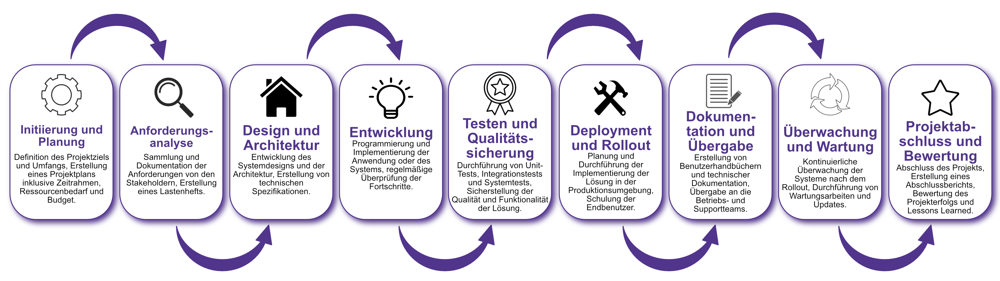

| Author | Dipl.-Ing. Daniel Mrskos, BSc |  
|--------|---------------------------------------------------------------|   
| Funktion | CEO von Security mit Passion, Penetration Tester, Mentor, FH-Lektor, NIS Prüfer |                               
| Datum  | 04. Juli 2024                                                 |
|     |                          |                                              |
| Zertifizierungen  | CSOM, CRTL, eCPTXv2, eWPTXv2, CCD, eCTHPv2, CRTE, CRTO, eCMAP, PNPT, eCPPTv2, eWPT, eCIR, CRTP, CARTP, PAWSP, eMAPT, eCXD, eCDFP, BTL1 (Gold), CAPEN, eEDA, OSWP, CNSP, Comptia Pentest+, ITIL Foundation V3, ICCA, CCNA, eJPTv2, Developing Security Software (LFD121), CAP, Checkmarx Security Champion                                         |
| LinkedIN  | [https://www.linkedin.com/in/dipl-ing-daniel-mrskos-bsc-0720081ab/](https://www.linkedin.com/in/dipl-ing-daniel-mrskos-bsc-0720081ab/)  
| Website  | [https://security-mit-passion.at](https://security-mit-passion.at)  

---

### Prozessbeschreibung: Handhabung von IT-Projekten und Anwendungsentwicklungen

#### Prozessname
Handhabung von IT-Projekten und Anwendungsentwicklungen

#### Prozessverantwortliche
- Max Mustermann (Projektmanager)
- Erika Mustermann (Leiterin IT-Abteilung)

#### Ziele des Prozesses
Dieser Prozess hat das Ziel, IT-Projekte und Anwendungsentwicklungen effektiv zu planen, durchzuführen und abzuschließen, um die IT-Infrastruktur der Bank zu verbessern und die Geschäftsanforderungen zu erfüllen.

#### Beteiligte Stellen
- IT-Abteilung
- Fachabteilungen
- Externe Dienstleister (falls erforderlich)
- Compliance-Abteilung

#### Anforderungen an die auslösende Stelle
Die Handhabung von IT-Projekten und Anwendungsentwicklungen wird ausgelöst durch:
- Bedarf an neuen IT-Systemen oder Anwendungen
- Anforderungen aus den Fachabteilungen
- Technologische Aktualisierungen und Innovationen
- Regulatorische Anforderungen

#### Anforderungen an die Ressourcen
- Projektmanagement-Software
- Fachliche Expertise in den Bereichen IT-Entwicklung und Projektmanagement
- Entwicklungs- und Testumgebungen

#### Kosten und Zeitaufwand
- Initiale Projektplanung: ca. 20-40 Stunden
- Durchführung und Abschluss von Projekten: variiert je nach Umfang und Komplexität (durchschnittlich 100-1000 Stunden)

#### Ablauf / Tätigkeit

1. **Initiierung und Planung**
   - Verantwortlich: Projektmanager
   - Beschreibung: Definition des Projektziels und Umfangs, Erstellung eines Projektplans inklusive Zeitrahmen, Ressourcenbedarf und Budget.

2. **Anforderungsanalyse**
   - Verantwortlich: Projektmanager, Fachabteilungen
   - Beschreibung: Sammlung und Dokumentation der Anforderungen von den Stakeholdern, Erstellung eines Lastenhefts.

3. **Design und Architektur**
   - Verantwortlich: IT-Abteilung
   - Beschreibung: Entwicklung des Systemdesigns und der Architektur, Erstellung von technischen Spezifikationen.

4. **Entwicklung**
   - Verantwortlich: IT-Abteilung
   - Beschreibung: Programmierung und Implementierung der Anwendung oder des Systems, regelmäßige Überprüfung der Fortschritte.

5. **Testen und Qualitätssicherung**
   - Verantwortlich: IT-Abteilung, Fachabteilungen
   - Beschreibung: Durchführung von Unit-Tests, Integrationstests und Systemtests, Sicherstellung der Qualität und Funktionalität der Lösung.

6. **Deployment und Rollout**
   - Verantwortlich: IT-Abteilung
   - Beschreibung: Planung und Durchführung der Implementierung der Lösung in der Produktionsumgebung, Schulung der Endbenutzer.

7. **Dokumentation und Übergabe**
   - Verantwortlich: IT-Abteilung
   - Beschreibung: Erstellung von Benutzerhandbüchern und technischer Dokumentation, Übergabe an die Betriebs- und Supportteams.

8. **Überwachung und Wartung**
   - Verantwortlich: IT-Abteilung
   - Beschreibung: Kontinuierliche Überwachung der Systeme nach dem Rollout, Durchführung von Wartungsarbeiten und Updates.

9. **Projektabschluss und Bewertung**
   - Verantwortlich: Projektmanager
   - Beschreibung: Abschluss des Projekts, Erstellung eines Abschlussberichts, Bewertung des Projekterfolgs und Lessons Learned.

 

#### Dokumentation
Alle Schritte und Entscheidungen im Prozess werden dokumentiert und revisionssicher archiviert. Dazu gehören:
- Projektpläne und Lastenhefte
- Design- und Architekturdokumente
- Testpläne und Testberichte
- Deployment-Dokumentation
- Benutzerhandbücher und technische Dokumentation
- Abschlussberichte und Lessons Learned

#### Kommunikationswege
- Regelmäßige Projektstatusberichte an die Geschäftsführung und Stakeholder
- Meetings und Workshops zur Anforderungsanalyse und Projektplanung
- Schulungen und Trainings für Endbenutzer und Supportteams
- Bereitstellung der Projektdokumentation im internen Dokumentenmanagementsystem