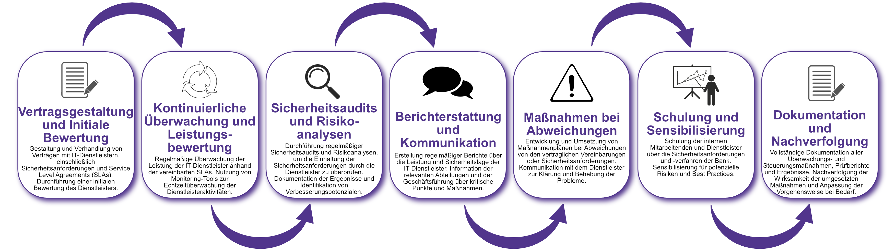

| Author | Dipl.-Ing. Daniel Mrskos, BSc |  
|--------|---------------------------------------------------------------|   
| Funktion | CEO von Security mit Passion, Penetration Tester, Mentor, FH-Lektor, NIS Prüfer |                               
| Datum  | 04. Juli 2024                                                 |
|     |                          |                                              |
| Zertifizierungen  | CSOM, CRTL, eCPTXv2, eWPTXv2, CCD, eCTHPv2, CRTE, CRTO, eCMAP, PNPT, eCPPTv2, eWPT, eCIR, CRTP, CARTP, PAWSP, eMAPT, eCXD, eCDFP, BTL1 (Gold), CAPEN, eEDA, OSWP, CNSP, Comptia Pentest+, ITIL Foundation V3, ICCA, CCNA, eJPTv2, Developing Security Software (LFD121), CAP, Checkmarx Security Champion                                         |
| LinkedIN  | [https://www.linkedin.com/in/dipl-ing-daniel-mrskos-bsc-0720081ab/](https://www.linkedin.com/in/dipl-ing-daniel-mrskos-bsc-0720081ab/)  
| Website  | [https://security-mit-passion.at](https://security-mit-passion.at)  

---

### Prozessbeschreibung: Steuerung und Überwachung von IT-Dienstleistern

#### Prozessname
Steuerung und Überwachung von IT-Dienstleistern

#### Prozessverantwortliche
- Max Mustermann (IT-Sicherheitsbeauftragter)
- Erika Mustermann (Leiterin IT-Abteilung)

#### Ziele des Prozesses
Dieser Prozess hat das Ziel, die Leistung und Sicherheit der IT-Dienstleister zu steuern und zu überwachen, um sicherzustellen, dass sie den vertraglichen und sicherheitsrelevanten Anforderungen der Bank entsprechen.

#### Beteiligte Stellen
- IT-Abteilung
- Compliance-Abteilung
- Fachabteilungen
- Externe Dienstleister

#### Anforderungen an die auslösende Stelle
Die Steuerung und Überwachung von IT-Dienstleistern wird ausgelöst durch:
- Neue Vertragsabschlüsse mit IT-Dienstleistern
- Regelmäßige Überprüfungen und Audits
- Sicherheitsvorfälle oder Änderungen in den Dienstleistungen
- Änderungen in den regulatorischen Anforderungen

#### Anforderungen an die Ressourcen
- Vertragsmanagement-Software
- Monitoring-Tools zur Überwachung der Dienstleistungen
- Fachliche Expertise in Vertragsrecht und IT-Sicherheitsstandards
- Dokumentationssysteme für Berichte und Prüfprotokolle

#### Kosten und Zeitaufwand
- Einmalige Vertragsprüfung und Einrichtung: ca. 20 Stunden
- Regelmäßige Überprüfungen und Audits: ca. 10-20 Stunden pro Dienstleister

#### Ablauf / Tätigkeit

1. **Vertragsgestaltung und Initiale Bewertung**
   - Verantwortlich: IT-Abteilung, Compliance-Abteilung
   - Beschreibung: Gestaltung und Verhandlung von Verträgen mit IT-Dienstleistern, einschließlich Sicherheitsanforderungen und Service Level Agreements (SLAs). Durchführung einer initialen Bewertung des Dienstleisters.

2. **Kontinuierliche Überwachung und Leistungsbewertung**
   - Verantwortlich: IT-Abteilung
   - Beschreibung: Regelmäßige Überwachung der Leistung der IT-Dienstleister anhand der vereinbarten SLAs. Nutzung von Monitoring-Tools zur Echtzeitüberwachung der Dienstleisteraktivitäten.

3. **Sicherheitsaudits und Risikoanalysen**
   - Verantwortlich: IT-Sicherheitsbeauftragter
   - Beschreibung: Durchführung regelmäßiger Sicherheitsaudits und Risikoanalysen, um die Einhaltung der Sicherheitsanforderungen durch die Dienstleister zu überprüfen. Dokumentation der Ergebnisse und Identifikation von Verbesserungspotenzialen.

4. **Berichterstattung und Kommunikation**
   - Verantwortlich: IT-Abteilung, Compliance-Abteilung
   - Beschreibung: Erstellung regelmäßiger Berichte über die Leistung und Sicherheitslage der IT-Dienstleister. Information der relevanten Abteilungen und der Geschäftsführung über kritische Punkte und Maßnahmen.

5. **Maßnahmen bei Abweichungen**
   - Verantwortlich: IT-Abteilung
   - Beschreibung: Entwicklung und Umsetzung von Maßnahmenplänen bei Abweichungen von den vertraglichen Vereinbarungen oder Sicherheitsanforderungen. Kommunikation mit dem Dienstleister zur Klärung und Behebung der Probleme.

6. **Schulung und Sensibilisierung**
   - Verantwortlich: IT-Abteilung
   - Beschreibung: Schulung der internen Mitarbeitenden und Dienstleister über die Sicherheitsanforderungen und -verfahren der Bank. Sensibilisierung für potenzielle Risiken und Best Practices.

7. **Dokumentation und Nachverfolgung**
   - Verantwortlich: IT-Sicherheitsbeauftragter
   - Beschreibung: Vollständige Dokumentation aller Überwachungs- und Steuerungsmaßnahmen, Prüfberichte und Ergebnisse. Nachverfolgung der Wirksamkeit der umgesetzten Maßnahmen und Anpassung der Vorgehensweise bei Bedarf.

 

#### Dokumentation
Alle Schritte und Entscheidungen im Prozess werden dokumentiert und revisionssicher archiviert. Dazu gehören:
- Verträge und SLAs mit IT-Dienstleistern
- Prüf- und Überwachungsprotokolle
- Auditberichte und Risikoanalysen
- Maßnahmenpläne und Umsetzungsergebnisse

#### Kommunikationswege
- Regelmäßige Berichte an die Geschäftsführung über den Status der IT-Dienstleister und durchgeführte Maßnahmen
- Information der beteiligten Abteilungen über Ergebnisse der Überwachungen und Audits durch E-Mails und Intranet-Ankündigungen
- Bereitstellung der Dokumentation im internen Dokumentenmanagementsystem