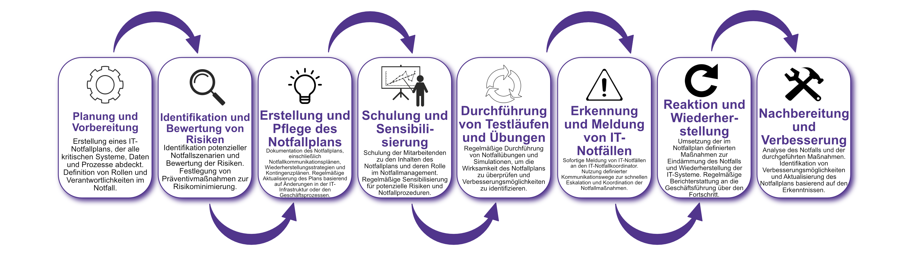

| Author | Dipl.-Ing. Daniel Mrskos, BSc |  
|--------|---------------------------------------------------------------|   
| Funktion | CEO von Security mit Passion, Penetration Tester, Mentor, FH-Lektor, NIS Prüfer |                               
| Datum  | 04. Juli 2024                                                 |
|     |                          |                                              |
| Zertifizierungen  | CSOM, CRTL, eCPTXv2, eWPTXv2, CCD, eCTHPv2, CRTE, CRTO, eCMAP, PNPT, eCPPTv2, eWPT, eCIR, CRTP, CARTP, PAWSP, eMAPT, eCXD, eCDFP, BTL1 (Gold), CAPEN, eEDA, OSWP, CNSP, Comptia Pentest+, ITIL Foundation V3, ICCA, CCNA, eJPTv2, Developing Security Software (LFD121), CAP, Checkmarx Security Champion                                         |
| LinkedIN  | [https://www.linkedin.com/in/dipl-ing-daniel-mrskos-bsc-0720081ab/](https://www.linkedin.com/in/dipl-ing-daniel-mrskos-bsc-0720081ab/)  
| Website  | [https://security-mit-passion.at](https://security-mit-passion.at)  

---
### Prozessbeschreibung: IT-Notfallmanagement

#### Prozessname
IT-Notfallmanagement

#### Prozessverantwortliche
- Max Mustermann (IT-Notfallkoordinator)
- Erika Mustermann (Leiterin IT-Abteilung)

#### Ziele des Prozesses
Dieser Prozess hat das Ziel, die Auswirkungen von IT-Notfällen auf die Bank zu minimieren, die Kontinuität der Geschäftsprozesse sicherzustellen und einen schnellen und geordneten Wiederanlauf der IT-Systeme zu gewährleisten.

#### Beteiligte Stellen
- IT-Abteilung
- Geschäftsführung
- Fachabteilungen
- Externe Dienstleister

#### Anforderungen an die auslösende Stelle
Das IT-Notfallmanagement wird ausgelöst durch:
- Erkennung eines IT-Notfalls (z.B. Systemausfall, Cyberangriff)
- Regelmäßige Testläufe und Überprüfungen des Notfallplans
- Änderungen in der IT-Infrastruktur oder den Geschäftsprozessen

#### Anforderungen an die Ressourcen
- Notfallmanagement-Software
- Fachliche Expertise in IT-Sicherheit und Notfallmanagement
- Dokumentationssysteme für Notfallpläne und Berichte

#### Kosten und Zeitaufwand
- Einmalige Erstellung des Notfallplans: ca. 40 Stunden
- Regelmäßige Überprüfungen und Testläufe: ca. 10-20 Stunden pro Zyklus

#### Ablauf / Tätigkeit

1. **Planung und Vorbereitung**
   - Verantwortlich: IT-Notfallkoordinator
   - Beschreibung: Erstellung eines IT-Notfallplans, der alle kritischen Systeme, Daten und Prozesse abdeckt. Definition von Rollen und Verantwortlichkeiten im Notfall.

2. **Identifikation und Bewertung von Risiken**
   - Verantwortlich: IT-Abteilung
   - Beschreibung: Identifikation potenzieller Notfallszenarien und Bewertung der Risiken. Festlegung von Präventivmaßnahmen zur Risikominimierung.

3. **Erstellung und Pflege des Notfallplans**
   - Verantwortlich: IT-Notfallkoordinator
   - Beschreibung: Dokumentation des Notfallplans, einschließlich Notfallkommunikationsplänen, Wiederherstellungsstrategien und Kontingenzplänen. Regelmäßige Aktualisierung des Plans basierend auf Änderungen in der IT-Infrastruktur oder den Geschäftsprozessen.

4. **Schulung und Sensibilisierung**
   - Verantwortlich: IT-Abteilung
   - Beschreibung: Schulung der Mitarbeitenden zu den Inhalten des Notfallplans und deren Rolle im Notfallmanagement. Regelmäßige Sensibilisierung für potenzielle Risiken und Notfallprozeduren.

5. **Durchführung von Testläufen und Übungen**
   - Verantwortlich: IT-Abteilung
   - Beschreibung: Regelmäßige Durchführung von Notfallübungen und Simulationen, um die Wirksamkeit des Notfallplans zu überprüfen und Verbesserungsmöglichkeiten zu identifizieren.

6. **Erkennung und Meldung von IT-Notfällen**
   - Verantwortlich: Alle Mitarbeitenden
   - Beschreibung: Sofortige Meldung von IT-Notfällen an den IT-Notfallkoordinator. Nutzung definierter Kommunikationswege zur schnellen Eskalation und Koordination der Notfallmaßnahmen.

7. **Reaktion und Wiederherstellung**
   - Verantwortlich: IT-Abteilung, Externe Dienstleister
   - Beschreibung: Umsetzung der im Notfallplan definierten Maßnahmen zur Eindämmung des Notfalls und Wiederherstellung der IT-Systeme. Regelmäßige Berichterstattung an die Geschäftsführung über den Fortschritt.

8. **Nachbereitung und Verbesserung**
   - Verantwortlich: IT-Notfallkoordinator
   - Beschreibung: Analyse des Notfalls und der durchgeführten Maßnahmen. Identifikation von Verbesserungsmöglichkeiten und Aktualisierung des Notfallplans basierend auf den Erkenntnissen.

 

#### Dokumentation
Alle Schritte und Entscheidungen im Prozess werden dokumentiert und revisionssicher archiviert. Dazu gehören:
- Notfallpläne und Kommunikationspläne
- Testberichte und Übungsprotokolle
- Vorfallberichte und Analysen
- Maßnahmenpläne und Umsetzungsergebnisse

#### Kommunikationswege
- Regelmäßige Berichte an die Geschäftsführung über den Status des Notfallmanagements und durchgeführte Maßnahmen
- Information der beteiligten Abteilungen über Notfallübungen und Ergebnisse durch E-Mails und Intranet-Ankündigungen
- Bereitstellung der Dokumentation im internen Dokumentenmanagementsystem