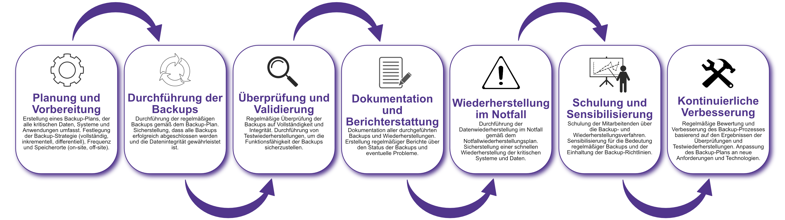

| Author | Dipl.-Ing. Daniel Mrskos, BSc |  
|--------|---------------------------------------------------------------|   
| Funktion | CEO von Security mit Passion, Penetration Tester, Mentor, FH-Lektor, NIS Prüfer |                               
| Datum  | 04. Juli 2024                                                 |
|     |                          |                                              |
| Zertifizierungen  | CSOM, CRTL, eCPTXv2, eWPTXv2, CCD, eCTHPv2, CRTE, CRTO, eCMAP, PNPT, eCPPTv2, eWPT, eCIR, CRTP, CARTP, PAWSP, eMAPT, eCXD, eCDFP, BTL1 (Gold), CAPEN, eEDA, OSWP, CNSP, Comptia Pentest+, ITIL Foundation V3, ICCA, CCNA, eJPTv2, Developing Security Software (LFD121), CAP, Checkmarx Security Champion                                         |
| LinkedIN  | [https://www.linkedin.com/in/dipl-ing-daniel-mrskos-bsc-0720081ab/](https://www.linkedin.com/in/dipl-ing-daniel-mrskos-bsc-0720081ab/)  
| Website  | [https://security-mit-passion.at](https://security-mit-passion.at)  

---
### Prozessbeschreibung: Backupmanagement

#### Prozessname
Backupmanagement

#### Prozessverantwortliche
- Max Mustermann (IT-Sicherheitsbeauftragter)
- Erika Mustermann (Leiterin IT-Abteilung)

#### Ziele des Prozesses
Dieser Prozess hat das Ziel, die Datensicherheit durch regelmäßige Backups zu gewährleisten, Datenverluste zu verhindern und eine schnelle Wiederherstellung von Daten im Notfall zu ermöglichen.

#### Beteiligte Stellen
- IT-Abteilung
- Fachabteilungen
- Externe Dienstleister (falls erforderlich)

#### Anforderungen an die auslösende Stelle
Das Backupmanagement wird ausgelöst durch:
- Regelmäßige Wartungszyklen (täglich, wöchentlich, monatlich)
- Systemänderungen oder -upgrades
- Sicherheitsvorfälle oder Datenverluste
- Änderungen in den regulatorischen Anforderungen

#### Anforderungen an die Ressourcen
- Backup-Software und Hardware
- Fachliche Expertise in IT-Sicherheit und Backupverfahren
- Dokumentationssysteme für Backup- und Wiederherstellungsprotokolle

#### Kosten und Zeitaufwand
- Einmalige Einrichtung des Backup-Systems: ca. 20 Stunden
- Regelmäßige Backups: variiert je nach Umfang der Daten (durchschnittlich 5-10 Stunden pro Woche)

#### Ablauf / Tätigkeit

1. **Planung und Vorbereitung**
   - Verantwortlich: IT-Sicherheitsbeauftragter
   - Beschreibung: Erstellung eines Backup-Plans, der alle kritischen Daten, Systeme und Anwendungen umfasst. Festlegung der Backup-Strategie (vollständig, inkrementell, differentiell), Frequenz und Speicherorte (on-site, off-site).

2. **Durchführung der Backups**
   - Verantwortlich: IT-Abteilung
   - Beschreibung: Durchführung der regelmäßigen Backups gemäß dem Backup-Plan. Sicherstellung, dass alle Backups erfolgreich abgeschlossen werden und die Datenintegrität gewährleistet ist.

3. **Überprüfung und Validierung**
   - Verantwortlich: IT-Abteilung
   - Beschreibung: Regelmäßige Überprüfung der Backups auf Vollständigkeit und Integrität. Durchführung von Testwiederherstellungen, um die Funktionsfähigkeit der Backups sicherzustellen.

4. **Dokumentation und Berichterstattung**
   - Verantwortlich: IT-Sicherheitsbeauftragter
   - Beschreibung: Dokumentation aller durchgeführten Backups und Wiederherstellungen. Erstellung regelmäßiger Berichte über den Status der Backups und eventuelle Probleme.

5. **Wiederherstellung im Notfall**
   - Verantwortlich: IT-Abteilung
   - Beschreibung: Durchführung der Datenwiederherstellung im Notfall gemäß dem Notfallwiederherstellungsplan. Sicherstellung einer schnellen Wiederherstellung der kritischen Systeme und Daten.

6. **Schulung und Sensibilisierung**
   - Verantwortlich: IT-Abteilung
   - Beschreibung: Schulung der Mitarbeitenden über die Backup- und Wiederherstellungsverfahren. Sensibilisierung für die Bedeutung regelmäßiger Backups und der Einhaltung der Backup-Richtlinien.

7. **Kontinuierliche Verbesserung**
   - Verantwortlich: IT-Sicherheitsbeauftragter
   - Beschreibung: Regelmäßige Bewertung und Verbesserung des Backup-Prozesses basierend auf den Ergebnissen der Überprüfungen und Testwiederherstellungen. Anpassung des Backup-Plans an neue Anforderungen und Technologien.

 

#### Dokumentation
Alle Schritte und Entscheidungen im Prozess werden dokumentiert und revisionssicher archiviert. Dazu gehören:
- Backup-Pläne und -Strategien
- Backup- und Wiederherstellungsprotokolle
- Berichte über Überprüfungen und Testwiederherstellungen
- Schulungsunterlagen und Teilnehmerlisten

#### Kommunikationswege
- Regelmäßige Berichte an die Geschäftsführung über den Status der Backups und durchgeführte Maßnahmen
- Information der beteiligten Abteilungen über Änderungen und Ergebnisse der Überprüfungen durch E-Mails und Intranet-Ankündigungen
- Bereitstellung der Dokumentation im internen Dokumentenmanagementsystem