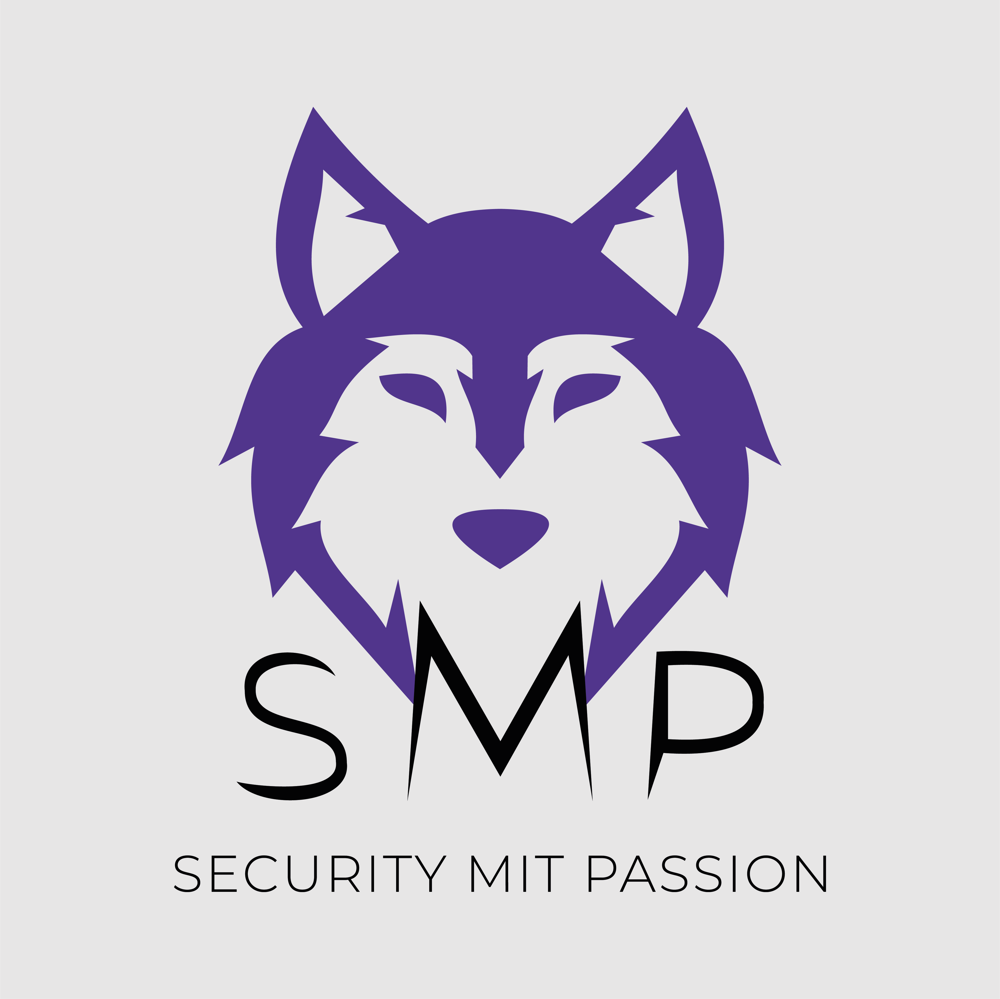
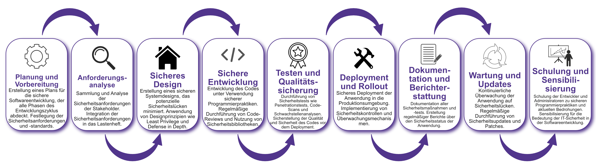

| Author | Dipl.-Ing. Daniel Mrskos, BSc |  
|--------|---------------------------------------------------------------|   
| Funktion | CEO von Security mit Passion, Penetration Tester, Mentor, FH-Lektor, NIS Prüfer |                               
| Datum  | 04. Juli 2024                                                 |
|     |                          |                                              |
| Zertifizierungen  | CSOM, CRTL, eCPTXv2, eWPTXv2, CCD, eCTHPv2, CRTE, CRTO, eCMAP, PNPT, eCPPTv2, eWPT, eCIR, CRTP, CARTP, PAWSP, eMAPT, eCXD, eCDFP, BTL1 (Gold), CAPEN, eEDA, OSWP, CNSP, Comptia Pentest+, ITIL Foundation V3, ICCA, CCNA, eJPTv2, Developing Security Software (LFD121), CAP, Checkmarx Security Champion                                         |
| LinkedIN  | [https://www.linkedin.com/in/dipl-ing-daniel-mrskos-bsc-0720081ab/](https://www.linkedin.com/in/dipl-ing-daniel-mrskos-bsc-0720081ab/)  
| Website  | [https://security-mit-passion.at](https://security-mit-passion.at)  

---

### Prozessbeschreibung: Sichere Softwareentwicklung

#### Prozessname
Sichere Softwareentwicklung

#### Prozessverantwortliche
- Max Mustermann (Leiter Softwareentwicklung)
- Erika Mustermann (IT-Sicherheitsbeauftragter)

#### Ziele des Prozesses
Dieser Prozess hat das Ziel, die Sicherheit in allen Phasen der Softwareentwicklung zu integrieren, um Sicherheitslücken zu minimieren und den Schutz von Daten und Systemen zu gewährleisten.

#### Beteiligte Stellen
- IT-Abteilung
- Compliance-Abteilung
- Fachabteilungen
- Externe Dienstleister (falls erforderlich)

#### Anforderungen an die auslösende Stelle
Die Initiierung des sicheren Softwareentwicklungsprozesses wird ausgelöst durch:
- Neue Entwicklungsprojekte
- Änderungen an bestehenden Anwendungen
- Sicherheitsvorfälle oder neue Bedrohungen
- Regulatorische Anforderungen

#### Anforderungen an die Ressourcen
- Tools für sichere Softwareentwicklung (z.B. Code-Scanner, Sicherheitsbibliotheken)
- Fachliche Expertise in sicherer Softwareentwicklung und IT-Sicherheit
- Dokumentationssysteme für Entwicklungs- und Sicherheitsprotokolle

#### Kosten und Zeitaufwand
- Initiale Implementierung sicherer Entwicklungstools und -prozesse: ca. 40 Stunden
- Regelmäßige Sicherheitsüberprüfungen und Updates: ca. 10-20 Stunden pro Zyklus

#### Ablauf / Tätigkeit

1. **Planung und Vorbereitung**
   - Verantwortlich: Leiter Softwareentwicklung
   - Beschreibung: Erstellung eines Plans für die sichere Softwareentwicklung, der alle Phasen des Entwicklungszyklus abdeckt. Festlegung der Sicherheitsanforderungen und -standards.

2. **Anforderungsanalyse**
   - Verantwortlich: IT-Abteilung, Fachabteilungen
   - Beschreibung: Sammlung und Analyse der Sicherheitsanforderungen der Stakeholder. Integration der Sicherheitsanforderungen in das Lastenheft.

3. **Sicheres Design**
   - Verantwortlich: IT-Abteilung
   - Beschreibung: Erstellung eines sicheren Systemdesigns, das potenzielle Sicherheitslücken minimiert. Anwendung von Designprinzipien wie Least Privilege und Defense in Depth.

4. **Sichere Entwicklung**
   - Verantwortlich: IT-Abteilung
   - Beschreibung: Entwicklung des Codes unter Verwendung sicherer Programmierpraktiken. Regelmäßige Durchführung von Code-Reviews und Nutzung von Sicherheitsbibliotheken.

5. **Testen und Qualitätssicherung**
   - Verantwortlich: IT-Abteilung, Compliance-Abteilung
   - Beschreibung: Durchführung von Sicherheitstests wie Penetrationstests, Code-Scans und Schwachstellenanalysen. Sicherstellung der Qualität und Sicherheit des Codes vor dem Deployment.

6. **Deployment und Rollout**
   - Verantwortlich: IT-Abteilung
   - Beschreibung: Sicheres Deployment der Anwendung in die Produktionsumgebung. Implementierung von Sicherheitskontrollen und Überwachungsmechanismen.

7. **Dokumentation und Berichterstattung**
   - Verantwortlich: IT-Sicherheitsbeauftragter
   - Beschreibung: Dokumentation aller Sicherheitsmaßnahmen und -tests. Erstellung regelmäßiger Berichte über den Sicherheitsstatus der Anwendung.

8. **Wartung und Updates**
   - Verantwortlich: IT-Abteilung
   - Beschreibung: Kontinuierliche Überwachung der Anwendung auf Sicherheitslücken. Regelmäßige Durchführung von Sicherheitsupdates und Patches.

9. **Schulung und Sensibilisierung**
   - Verantwortlich: IT-Abteilung
   - Beschreibung: Schulung der Entwickler und Administratoren zu sicheren Programmierpraktiken und aktuellen Bedrohungen. Sensibilisierung für die Bedeutung der IT-Sicherheit in der Softwareentwicklung.

 

#### Dokumentation
Alle Schritte und Entscheidungen im Prozess werden dokumentiert und revisionssicher archiviert. Dazu gehören:
- Anforderungsdokumente und Lastenhefte
- Design- und Architekturdokumente
- Code-Reviews und Testberichte
- Deployment- und Überwachungsprotokolle
- Schulungsunterlagen und Teilnehmerlisten

#### Kommunikationswege
- Regelmäßige Berichte an die Geschäftsführung über den Status der sicheren Softwareentwicklung und durchgeführte Maßnahmen
- Information der beteiligten Abteilungen über Sicherheitsupdates und Ergebnisse der Überprüfungen durch E-Mails und Intranet-Ankündigungen
- Bereitstellung der Dokumentation im internen Dokumentenmanagementsystem