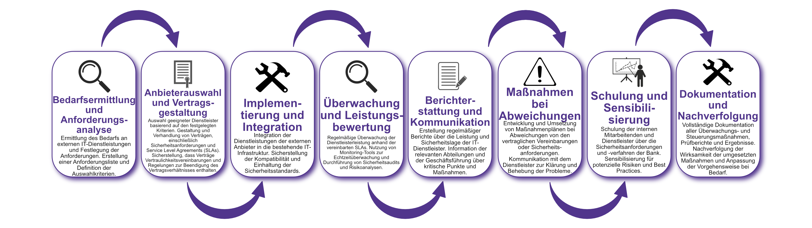

| Author | Dipl.-Ing. Daniel Mrskos, BSc |  
|--------|---------------------------------------------------------------|   
| Funktion | CEO von Security mit Passion, Penetration Tester, Mentor, FH-Lektor, NIS Prüfer |                               
| Datum  | 04. Juli 2024                                                 |
|     |                          |                                              |
| Zertifizierungen  | CSOM, CRTL, eCPTXv2, eWPTXv2, CCD, eCTHPv2, CRTE, CRTO, eCMAP, PNPT, eCPPTv2, eWPT, eCIR, CRTP, CARTP, PAWSP, eMAPT, eCXD, eCDFP, BTL1 (Gold), CAPEN, eEDA, OSWP, CNSP, Comptia Pentest+, ITIL Foundation V3, ICCA, CCNA, eJPTv2, Developing Security Software (LFD121), CAP, Checkmarx Security Champion                                         |
| LinkedIN  | [https://www.linkedin.com/in/dipl-ing-daniel-mrskos-bsc-0720081ab/](https://www.linkedin.com/in/dipl-ing-daniel-mrskos-bsc-0720081ab/)  
| Website  | [https://security-mit-passion.at](https://security-mit-passion.at)  

---
### Prozessbeschreibung: Outsourcing von IT und IT-Sicherheit

#### Prozessname
Outsourcing von IT und IT-Sicherheit

#### Prozessverantwortliche
- Max Mustermann (IT-Sicherheitsbeauftragter)
- Erika Mustermann (Leiterin IT-Abteilung)

#### Ziele des Prozesses
Dieser Prozess hat das Ziel, die Auslagerung von IT- und IT-Sicherheitsdiensten sicher und effizient zu gestalten, um die Qualitäts- und Sicherheitsanforderungen der Bank zu erfüllen und rechtliche sowie regulatorische Vorgaben einzuhalten.

#### Beteiligte Stellen
- IT-Abteilung
- Compliance-Abteilung
- Fachabteilungen
- Externe Dienstleister

#### Anforderungen an die auslösende Stelle
Das Outsourcing von IT und IT-Sicherheit wird ausgelöst durch:
- Bedarf an spezialisierten IT-Dienstleistungen
- Kosteneffizienzmaßnahmen
- Technologische Aktualisierungen und Innovationen
- Regulatorische Anforderungen

#### Anforderungen an die Ressourcen
- Vertragsmanagement-Software
- Monitoring-Tools zur Überwachung der Dienstleister
- Fachliche Expertise in IT-Sicherheit und Vertragsrecht
- Dokumentationssysteme für Berichte und Prüfprotokolle

#### Kosten und Zeitaufwand
- Einmalige Vertragsprüfung und Einrichtung: ca. 40 Stunden
- Regelmäßige Überprüfungen und Audits: ca. 10-20 Stunden pro Dienstleister

#### Ablauf / Tätigkeit

1. **Bedarfsermittlung und Anforderungsanalyse**
   - Verantwortlich: IT-Abteilung, Fachabteilungen
   - Beschreibung: Ermittlung des Bedarfs an externen IT-Dienstleistungen und Festlegung der Anforderungen. Erstellung einer Anforderungsliste und Definition der Auswahlkriterien.

2. **Anbieterauswahl und Vertragsgestaltung**
   - Verantwortlich: IT-Abteilung, Compliance-Abteilung
   - Beschreibung: Auswahl geeigneter Dienstleister basierend auf den festgelegten Kriterien. Gestaltung und Verhandlung von Verträgen, einschließlich Sicherheitsanforderungen und Service Level Agreements (SLAs). Sicherstellung, dass Verträge Vertraulichkeitsvereinbarungen und Regelungen zur Beendigung des Vertragsverhältnisses enthalten.

3. **Implementierung und Integration**
   - Verantwortlich: IT-Abteilung, Externe Dienstleister
   - Beschreibung: Integration der Dienstleistungen der externen Anbieter in die bestehende IT-Infrastruktur. Sicherstellung der Kompatibilität und Einhaltung der Sicherheitsstandards.

4. **Überwachung und Leistungsbewertung**
   - Verantwortlich: IT-Abteilung
   - Beschreibung: Regelmäßige Überwachung der Dienstleisterleistung anhand der vereinbarten SLAs. Nutzung von Monitoring-Tools zur Echtzeitüberwachung und Durchführung von Sicherheitsaudits und Risikoanalysen.

5. **Berichterstattung und Kommunikation**
   - Verantwortlich: IT-Abteilung, Compliance-Abteilung
   - Beschreibung: Erstellung regelmäßiger Berichte über die Leistung und Sicherheitslage der IT-Dienstleister. Information der relevanten Abteilungen und der Geschäftsführung über kritische Punkte und Maßnahmen.

6. **Maßnahmen bei Abweichungen**
   - Verantwortlich: IT-Abteilung
   - Beschreibung: Entwicklung und Umsetzung von Maßnahmenplänen bei Abweichungen von den vertraglichen Vereinbarungen oder Sicherheitsanforderungen. Kommunikation mit dem Dienstleister zur Klärung und Behebung der Probleme.

7. **Schulung und Sensibilisierung**
   - Verantwortlich: IT-Abteilung
   - Beschreibung: Schulung der internen Mitarbeitenden und Dienstleister über die Sicherheitsanforderungen und -verfahren der Bank. Sensibilisierung für potenzielle Risiken und Best Practices.

8. **Dokumentation und Nachverfolgung**
   - Verantwortlich: IT-Sicherheitsbeauftragter
   - Beschreibung: Vollständige Dokumentation aller Überwachungs- und Steuerungsmaßnahmen, Prüfberichte und Ergebnisse. Nachverfolgung der Wirksamkeit der umgesetzten Maßnahmen und Anpassung der Vorgehensweise bei Bedarf.

 

#### Dokumentation
Alle Schritte und Entscheidungen im Prozess werden dokumentiert und revisionssicher archiviert. Dazu gehören:
- Anforderungsliste und Auswahlkriterien
- Verträge und SLAs mit IT-Dienstleistern
- Prüf- und Überwachungsprotokolle
- Auditberichte und Risikoanalysen
- Maßnahmenpläne und Umsetzungsergebnisse

#### Kommunikationswege
- Regelmäßige Berichte an die Geschäftsführung über den Status der IT-Dienstleister und durchgeführte Maßnahmen
- Information der beteiligten Abteilungen über Ergebnisse der Überwachungen und Audits durch E-Mails und Intranet-Ankündigungen
- Bereitstellung der Dokumentation im internen Dokumentenmanagementsystem