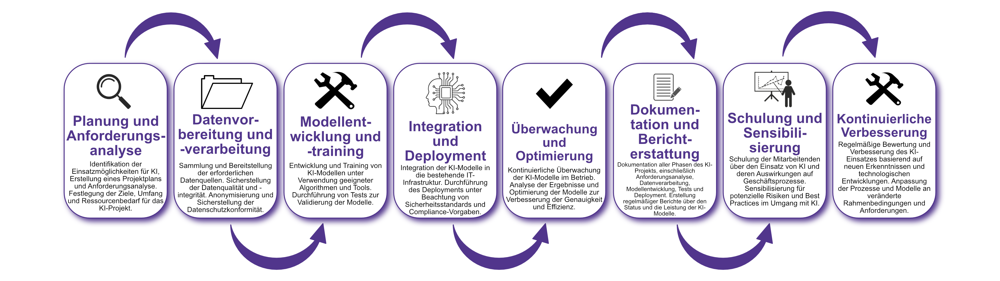

| Author | Dipl.-Ing. Daniel Mrskos, BSc |  
|--------|---------------------------------------------------------------|   
| Funktion | CEO von Security mit Passion, Penetration Tester, Mentor, FH-Lektor, NIS Prüfer |                               
| Datum  | 04. Juli 2024                                                 |
|     |                          |                                              |
| Zertifizierungen  | CSOM, CRTL, eCPTXv2, eWPTXv2, CCD, eCTHPv2, CRTE, CRTO, eCMAP, PNPT, eCPPTv2, eWPT, eCIR, CRTP, CARTP, PAWSP, eMAPT, eCXD, eCDFP, BTL1 (Gold), CAPEN, eEDA, OSWP, CNSP, Comptia Pentest+, ITIL Foundation V3, ICCA, CCNA, eJPTv2, Developing Security Software (LFD121), CAP, Checkmarx Security Champion                                         |
| LinkedIN  | [https://www.linkedin.com/in/dipl-ing-daniel-mrskos-bsc-0720081ab/](https://www.linkedin.com/in/dipl-ing-daniel-mrskos-bsc-0720081ab/)  
| Website  | [https://security-mit-passion.at](https://security-mit-passion.at)  

---

### Prozessbeschreibung: Nutzung von Künstlicher Intelligenz (KI)

#### Prozessname
Nutzung von Künstlicher Intelligenz (KI)

#### Prozessverantwortliche
- Max Mustermann (Leiter KI-Projekte)
- Erika Mustermann (IT-Sicherheitsbeauftragter)

#### Ziele des Prozesses
Dieser Prozess hat das Ziel, den Einsatz von Künstlicher Intelligenz in der Bank zu planen, zu implementieren und zu überwachen, um Effizienz zu steigern und Innovationen voranzutreiben, während gleichzeitig die Sicherheit und Einhaltung von regulatorischen Vorgaben gewährleistet wird.

#### Beteiligte Stellen
- IT-Abteilung
- Compliance-Abteilung
- Fachabteilungen
- Externe Dienstleister

#### Anforderungen an die auslösende Stelle
Die Nutzung von KI wird ausgelöst durch:
- Bedarf an Automatisierung und Effizienzsteigerung
- Projekte zur Datenanalyse und Entscheidungsunterstützung
- Anforderungen aus den Fachabteilungen
- Technologische Aktualisierungen und Innovationen

#### Anforderungen an die Ressourcen
- KI-Entwicklungs- und Implementierungstools
- Fachliche Expertise in KI-Entwicklung und IT-Sicherheit
- Datenquellen und Datenverarbeitungsinfrastruktur
- Dokumentationssysteme für Entwicklungs- und Sicherheitsprotokolle

#### Kosten und Zeitaufwand
- Initiale Implementierung von KI-Projekten: variiert je nach Projektumfang (durchschnittlich 100-500 Stunden)
- Regelmäßige Überprüfungen und Wartung: ca. 20-50 Stunden pro Monat

#### Ablauf / Tätigkeit

1. **Planung und Anforderungsanalyse**
   - Verantwortlich: Leiter KI-Projekte, Fachabteilungen
   - Beschreibung: Identifikation der Einsatzmöglichkeiten für KI, Erstellung eines Projektplans und Anforderungsanalyse. Festlegung der Ziele, Umfang und Ressourcenbedarf für das KI-Projekt.

2. **Datenvorbereitung und -verarbeitung**
   - Verantwortlich: IT-Abteilung
   - Beschreibung: Sammlung und Bereitstellung der erforderlichen Datenquellen. Sicherstellung der Datenqualität und -integrität. Anonymisierung und Sicherstellung der Datenschutzkonformität.

3. **Modellentwicklung und -training**
   - Verantwortlich: IT-Abteilung
   - Beschreibung: Entwicklung und Training von KI-Modellen unter Verwendung geeigneter Algorithmen und Tools. Durchführung von Tests zur Validierung der Modelle.

4. **Integration und Deployment**
   - Verantwortlich: IT-Abteilung, Externe Dienstleister
   - Beschreibung: Integration der KI-Modelle in die bestehende IT-Infrastruktur. Durchführung des Deployments unter Beachtung von Sicherheitsstandards und Compliance-Vorgaben.

5. **Überwachung und Optimierung**
   - Verantwortlich: IT-Abteilung
   - Beschreibung: Kontinuierliche Überwachung der KI-Modelle im Betrieb. Analyse der Ergebnisse und Optimierung der Modelle zur Verbesserung der Genauigkeit und Effizienz.

6. **Dokumentation und Berichterstattung**
   - Verantwortlich: IT-Sicherheitsbeauftragter
   - Beschreibung: Dokumentation aller Phasen des KI-Projekts, einschließlich Anforderungsanalyse, Datenverarbeitung, Modellentwicklung, Tests und Deployment. Erstellung regelmäßiger Berichte über den Status und die Leistung der KI-Modelle.

7. **Schulung und Sensibilisierung**
   - Verantwortlich: IT-Abteilung
   - Beschreibung: Schulung der Mitarbeitenden über den Einsatz von KI und deren Auswirkungen auf Geschäftsprozesse. Sensibilisierung für potenzielle Risiken und Best Practices im Umgang mit KI.

8. **Kontinuierliche Verbesserung**
   - Verantwortlich: IT-Sicherheitsbeauftragter
   - Beschreibung: Regelmäßige Bewertung und Verbesserung des KI-Einsatzes basierend auf neuen Erkenntnissen und technologischen Entwicklungen. Anpassung der Prozesse und Modelle an veränderte Rahmenbedingungen und Anforderungen.

 

#### Dokumentation
Alle Schritte und Entscheidungen im Prozess werden dokumentiert und revisionssicher archiviert. Dazu gehören:
- Projektpläne und Anforderungsanalysen
- Datenverarbeitungs- und Anonymisierungsprotokolle
- Modellentwicklungs- und Testberichte
- Deployment- und Überwachungsprotokolle
- Schulungsunterlagen und Teilnehmerlisten

#### Kommunikationswege
- Regelmäßige Berichte an die Geschäftsführung über den Status und die Leistung der KI-Projekte
- Information der beteiligten Abteilungen über Fortschritte und Ergebnisse der KI-Einsätze durch E-Mails und Intranet-Ankündigungen
- Bereitstellung der Dokumentation im internen Dokumentenmanagementsystem
