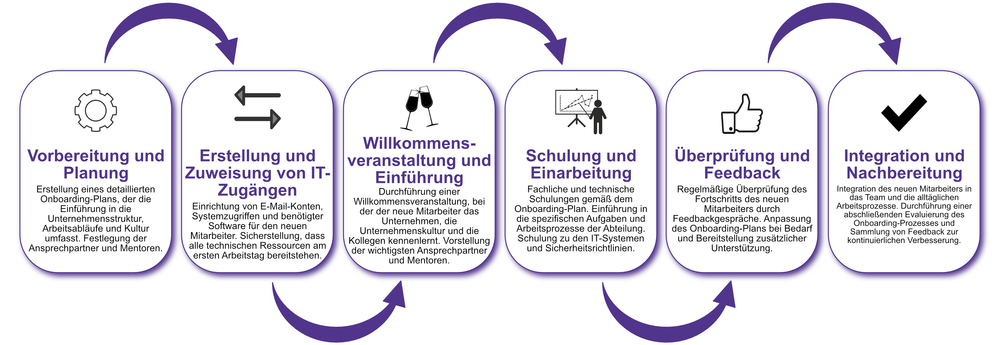

| Author | Dipl.-Ing. Daniel Mrskos, BSc |  
|--------|---------------------------------------------------------------|   
| Funktion | CEO von Security mit Passion, Penetration Tester, Mentor, FH-Lektor, NIS Prüfer |                               
| Datum  | 04. Juli 2024                                                 |
|     |                          |                                              |
| Zertifizierungen  | CSOM, CRTL, eCPTXv2, eWPTXv2, CCD, eCTHPv2, CRTE, CRTO, eCMAP, PNPT, eCPPTv2, eWPT, eCIR, CRTP, CARTP, PAWSP, eMAPT, eCXD, eCDFP, BTL1 (Gold), CAPEN, eEDA, OSWP, CNSP, Comptia Pentest+, ITIL Foundation V3, ICCA, CCNA, eJPTv2, Developing Security Software (LFD121), CAP, Checkmarx Security Champion                                         |
| LinkedIN  | [https://www.linkedin.com/in/dipl-ing-daniel-mrskos-bsc-0720081ab/](https://www.linkedin.com/in/dipl-ing-daniel-mrskos-bsc-0720081ab/)  
| Website  | [https://security-mit-passion.at](https://security-mit-passion.at)  

---
### Prozessbeschreibung: Onboarding von Mitarbeitern

#### Prozessname
Onboarding von Mitarbeitern

#### Prozessverantwortliche
- Max Mustermann (Leiter Personalabteilung)
- Erika Mustermann (IT-Abteilungsleiterin)

#### Ziele des Prozesses
Dieser Prozess hat das Ziel, neue Mitarbeitende effektiv und umfassend in die Organisation einzuführen, damit sie schnell produktiv werden und sich in die Unternehmenskultur integrieren.

#### Beteiligte Stellen
- Personalabteilung
- IT-Abteilung
- Fachabteilungen
- Compliance-Abteilung

#### Anforderungen an die auslösende Stelle
Das Onboarding von Mitarbeitern wird ausgelöst durch:
- Einstellung eines neuen Mitarbeiters
- Vertragsunterzeichnung

#### Anforderungen an die Ressourcen
- HR-Management-Software
- IT-Ressourcen für Konto- und Zugriffsverwaltung
- Schulungs- und Informationsmaterialien

#### Kosten und Zeitaufwand
- Vorbereitung und Durchführung eines Onboarding-Prozesses: ca. 10-20 Stunden
- Regelmäßige Schulungen und Updates: ca. 5 Stunden pro Zyklus

#### Ablauf / Tätigkeit

1. **Vorbereitung und Planung**
   - Verantwortlich: Personalabteilung
   - Beschreibung: Erstellung eines detaillierten Onboarding-Plans, der die Einführung in die Unternehmensstruktur, Arbeitsabläufe und Kultur umfasst. Festlegung der Ansprechpartner und Mentoren.

2. **Erstellung und Zuweisung von IT-Zugängen**
   - Verantwortlich: IT-Abteilung
   - Beschreibung: Einrichtung von E-Mail-Konten, Systemzugriffen und benötigter Software für den neuen Mitarbeiter. Sicherstellung, dass alle technischen Ressourcen am ersten Arbeitstag bereitstehen.

3. **Willkommensveranstaltung und Einführung**
   - Verantwortlich: Personalabteilung
   - Beschreibung: Durchführung einer Willkommensveranstaltung, bei der der neue Mitarbeiter das Unternehmen, die Unternehmenskultur und die Kollegen kennenlernt. Vorstellung der wichtigsten Ansprechpartner und Mentoren.

4. **Schulung und Einarbeitung**
   - Verantwortlich: Fachabteilungen, IT-Abteilung
   - Beschreibung: Fachliche und technische Schulungen gemäß dem Onboarding-Plan. Einführung in die spezifischen Aufgaben und Arbeitsprozesse der Abteilung. Schulung zu den IT-Systemen und Sicherheitsrichtlinien.

5. **Überprüfung und Feedback**
   - Verantwortlich: Personalabteilung
   - Beschreibung: Regelmäßige Überprüfung des Fortschritts des neuen Mitarbeiters durch Feedbackgespräche. Anpassung des Onboarding-Plans bei Bedarf und Bereitstellung zusätzlicher Unterstützung.

6. **Integration und Nachbereitung**
   - Verantwortlich: Fachabteilungen, Personalabteilung
   - Beschreibung: Integration des neuen Mitarbeiters in das Team und die alltäglichen Arbeitsprozesse. Durchführung einer abschließenden Evaluierung des Onboarding-Prozesses und Sammlung von Feedback zur kontinuierlichen Verbesserung.

 

#### Dokumentation
Alle Schritte und Entscheidungen im Prozess werden dokumentiert und revisionssicher archiviert. Dazu gehören:
- Onboarding-Pläne und Zeitpläne
- IT-Zugangsprotokolle und Schulungsunterlagen
- Feedbackgespräche und Evaluierungsberichte

#### Kommunikationswege
- Regelmäßige Berichte an die Geschäftsführung über den Status und Fortschritt des Onboardings
- Information der beteiligten Abteilungen über den Onboarding-Status durch E-Mails und Intranet-Ankündigungen
- Bereitstellung der Dokumentation im internen Dokumentenmanagementsystem