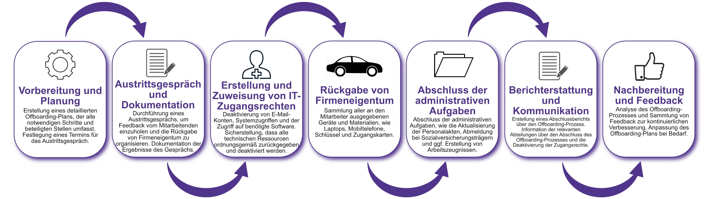

| Author | Dipl.-Ing. Daniel Mrskos, BSc |  
|--------|---------------------------------------------------------------|   
| Funktion | CEO von Security mit Passion, Penetration Tester, Mentor, FH-Lektor, NIS Prüfer |                               
| Datum  | 04. Juli 2024                                                 |
|     |                          |                                              |
| Zertifizierungen  | CSOM, CRTL, eCPTXv2, eWPTXv2, CCD, eCTHPv2, CRTE, CRTO, eCMAP, PNPT, eCPPTv2, eWPT, eCIR, CRTP, CARTP, PAWSP, eMAPT, eCXD, eCDFP, BTL1 (Gold), CAPEN, eEDA, OSWP, CNSP, Comptia Pentest+, ITIL Foundation V3, ICCA, CCNA, eJPTv2, Developing Security Software (LFD121), CAP, Checkmarx Security Champion                                         |
| LinkedIN  | [https://www.linkedin.com/in/dipl-ing-daniel-mrskos-bsc-0720081ab/](https://www.linkedin.com/in/dipl-ing-daniel-mrskos-bsc-0720081ab/)  
| Website  | [https://security-mit-passion.at](https://security-mit-passion.at)  

---
### Prozessbeschreibung: Offboarding von Mitarbeitern

#### Prozessname
Offboarding von Mitarbeitern

#### Prozessverantwortliche
- Max Mustermann (Leiter Personalabteilung)
- Erika Mustermann (IT-Abteilungsleiterin)

#### Ziele des Prozesses
Dieser Prozess hat das Ziel, das Ausscheiden von Mitarbeitenden aus der Organisation sicher und effizient zu gestalten, um sowohl organisatorische als auch sicherheitsrelevante Aspekte zu berücksichtigen und die Integrität der Unternehmensdaten zu gewährleisten.

#### Beteiligte Stellen
- Personalabteilung
- IT-Abteilung
- Fachabteilungen
- Compliance-Abteilung

#### Anforderungen an die auslösende Stelle
Das Offboarding von Mitarbeitern wird ausgelöst durch:
- Kündigung oder Entlassung eines Mitarbeiters
- Renteneintritt
- Ende eines befristeten Arbeitsverhältnisses

#### Anforderungen an die Ressourcen
- HR-Management-Software
- IT-Ressourcen für Konto- und Zugriffsverwaltung
- Checklisten und Dokumentationssysteme für Offboarding-Prozesse

#### Kosten und Zeitaufwand
- Einmalige Durchführung eines Offboarding-Prozesses: ca. 5-10 Stunden

#### Ablauf / Tätigkeit

1. **Vorbereitung und Planung**
   - Verantwortlich: Personalabteilung
   - Beschreibung: Erstellung eines detaillierten Offboarding-Plans, der alle notwendigen Schritte und beteiligten Stellen umfasst. Festlegung eines Termins für das Austrittsgespräch.

2. **Austrittsgespräch und Dokumentation**
   - Verantwortlich: Personalabteilung
   - Beschreibung: Durchführung eines Austrittsgesprächs, um Feedback vom Mitarbeitenden einzuholen und die Rückgabe von Firmeneigentum zu organisieren. Dokumentation der Ergebnisse des Gesprächs.

3. **Erstellung und Zuweisung von IT-Zugangsrechten**
   - Verantwortlich: IT-Abteilung
   - Beschreibung: Deaktivierung von E-Mail-Konten, Systemzugriffen und der Zugriff auf benötigte Software. Sicherstellung, dass alle technischen Ressourcen ordnungsgemäß zurückgegeben und deaktiviert werden.

4. **Rückgabe von Firmeneigentum**
   - Verantwortlich: Personalabteilung, Fachabteilungen
   - Beschreibung: Sammlung aller an den Mitarbeiter ausgegebenen Geräte und Materialien, wie Laptops, Mobiltelefone, Schlüssel und Zugangskarten.

5. **Abschluss der administrativen Aufgaben**
   - Verantwortlich: Personalabteilung
   - Beschreibung: Abschluss der administrativen Aufgaben, wie die Aktualisierung der Personalakten, Abmeldung bei Sozialversicherungsträgern und ggf. Erstellung von Arbeitszeugnissen.

6. **Berichterstattung und Kommunikation**
   - Verantwortlich: Personalabteilung, IT-Abteilung
   - Beschreibung: Erstellung eines Abschlussberichts über den Offboarding-Prozess. Information der relevanten Abteilungen über den Abschluss des Offboarding-Prozesses und die Deaktivierung der Zugangsrechte.

7. **Nachbereitung und Feedback**
   - Verantwortlich: Personalabteilung
   - Beschreibung: Analyse des Offboarding-Prozesses und Sammlung von Feedback zur kontinuierlichen Verbesserung. Anpassung des Offboarding-Plans bei Bedarf.

 

#### Dokumentation
Alle Schritte und Entscheidungen im Prozess werden dokumentiert und revisionssicher archiviert. Dazu gehören:
- Offboarding-Pläne und Zeitpläne
- Protokolle der Austrittsgespräche
- IT-Deaktivierungsprotokolle
- Rückgabeprotokolle für Firmeneigentum
- Abschlussberichte und Feedbackformulare

#### Kommunikationswege
- Regelmäßige Berichte an die Geschäftsführung über den Status und Fortschritt des Offboardings
- Information der beteiligten Abteilungen über den Offboarding-Status durch E-Mails und Intranet-Ankündigungen
- Bereitstellung der Dokumentation im internen Dokumentenmanagementsystem