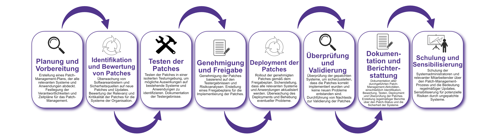

| Author | Dipl.-Ing. Daniel Mrskos, BSc |  
|--------|---------------------------------------------------------------|   
| Funktion | CEO von Security mit Passion, Penetration Tester, Mentor, FH-Lektor, NIS Prüfer |                               
| Datum  | 04. Juli 2024                                                 |
|     |                          |                                              |
| Zertifizierungen  | CSOM, CRTL, eCPTXv2, eWPTXv2, CCD, eCTHPv2, CRTE, CRTO, eCMAP, PNPT, eCPPTv2, eWPT, eCIR, CRTP, CARTP, PAWSP, eMAPT, eCXD, eCDFP, BTL1 (Gold), CAPEN, eEDA, OSWP, CNSP, Comptia Pentest+, ITIL Foundation V3, ICCA, CCNA, eJPTv2, Developing Security Software (LFD121), CAP, Checkmarx Security Champion                                         |
| LinkedIN  | [https://www.linkedin.com/in/dipl-ing-daniel-mrskos-bsc-0720081ab/](https://www.linkedin.com/in/dipl-ing-daniel-mrskos-bsc-0720081ab/)  
| Website  | [https://security-mit-passion.at](https://security-mit-passion.at)  

---
### Prozessbeschreibung: Patch-Management

#### Prozessname
Patch-Management

#### Prozessverantwortliche
- Max Mustermann (IT-Sicherheitsbeauftragter)
- Erika Mustermann (Leiterin IT-Abteilung)

#### Ziele des Prozesses
Dieser Prozess hat das Ziel, sicherzustellen, dass alle Systeme und Anwendungen regelmäßig mit den neuesten Sicherheitspatches und Updates versehen werden, um Sicherheitslücken zu schließen und das Risiko von Angriffen zu minimieren.

#### Beteiligte Stellen
- IT-Abteilung
- Fachabteilungen
- Externe Dienstleister (falls erforderlich)
- Compliance-Abteilung

#### Anforderungen an die auslösende Stelle
Das Patch-Management wird ausgelöst durch:
- Veröffentlichung neuer Patches und Updates durch Softwareanbieter
- Regelmäßige Wartungszyklen (monatlich, quartalsweise)
- Sicherheitsvorfälle oder Entdeckung neuer Schwachstellen
- Änderungen in den regulatorischen Anforderungen

#### Anforderungen an die Ressourcen
- Patch-Management-Software
- Testumgebungen für Patches
- Fachliche Expertise in IT-Sicherheit und Systemadministration
- Dokumentationssysteme für Patch- und Änderungsprotokolle

#### Kosten und Zeitaufwand
- Einmalige Implementierung des Patch-Management-Systems: ca. 20-40 Stunden
- Regelmäßige Patch-Überprüfungen und -Deployments: variiert je nach Umfang der Patches (durchschnittlich 5-10 Stunden pro Zyklus)

#### Ablauf / Tätigkeit

1. **Planung und Vorbereitung**
   - Verantwortlich: IT-Sicherheitsbeauftragter
   - Beschreibung: Erstellung eines Patch-Management-Plans, der alle relevanten Systeme und Anwendungen abdeckt. Festlegung der Verantwortlichkeiten und Zeitpläne für das Patch-Management.

2. **Identifikation und Bewertung von Patches**
   - Verantwortlich: IT-Abteilung
   - Beschreibung: Überwachung von Softwareanbietern und Sicherheitsquellen auf neue Patches und Updates. Bewertung der Relevanz und Kritikalität der Patches für die Systeme der Organisation.

3. **Testen der Patches**
   - Verantwortlich: IT-Abteilung
   - Beschreibung: Testen der Patches in einer isolierten Testumgebung, um mögliche Auswirkungen auf bestehende Systeme und Anwendungen zu identifizieren. Dokumentation der Testergebnisse.

4. **Genehmigung und Freigabe**
   - Verantwortlich: IT-Sicherheitsbeauftragter, Compliance-Abteilung
   - Beschreibung: Genehmigung der Patches basierend auf den Testergebnissen und Risikoanalysen. Erstellung eines Freigabeplans für die Implementierung der Patches.

5. **Deployment der Patches**
   - Verantwortlich: IT-Abteilung
   - Beschreibung: Rollout der genehmigten Patches gemäß dem Freigabeplan. Sicherstellung, dass alle relevanten Systeme und Anwendungen aktualisiert werden. Überwachung des Deployments und Behebung eventueller Probleme.

6. **Überprüfung und Validierung**
   - Verantwortlich: IT-Abteilung
   - Beschreibung: Überprüfung der gepatchten Systeme, um sicherzustellen, dass die Patches korrekt implementiert wurden und keine neuen Probleme entstanden sind. Durchführung von Nachtests zur Validierung der Patches.

7. **Dokumentation und Berichterstattung**
   - Verantwortlich: IT-Sicherheitsbeauftragter
   - Beschreibung: Dokumentation aller durchgeführten Patch-Management-Aktivitäten, einschließlich Identifikation, Bewertung, Testen, Deployment und Überprüfung der Patches. Erstellung regelmäßiger Berichte über den Patch-Status und die Sicherheit der Systeme.

8. **Schulung und Sensibilisierung**
   - Verantwortlich: IT-Abteilung
   - Beschreibung: Schulung der Systemadministratoren und relevanter Mitarbeitender über den Patch-Management-Prozess und die Bedeutung regelmäßiger Updates. Sensibilisierung für potenzielle Risiken durch ungepatchte Systeme.

 

#### Dokumentation
Alle Schritte und Entscheidungen im Prozess werden dokumentiert und revisionssicher archiviert. Dazu gehören:
- Patch-Management-Pläne und Zeitpläne
- Patch-Bewertungs- und Testprotokolle
- Genehmigungs- und Freigabeprotokolle
- Deployment- und Überwachungsprotokolle
- Überprüfungs- und Validierungsberichte
- Schulungsunterlagen und Teilnehmerlisten

#### Kommunikationswege
- Regelmäßige Berichte an die Geschäftsführung über den Status des Patch-Managements und durchgeführte Maßnahmen
- Information der beteiligten Abteilungen über geplante und durchgeführte Patches durch E-Mails und Intranet-Ankündigungen
- Bereitstellung der Dokumentation im internen Dokumentenmanagementsystem
