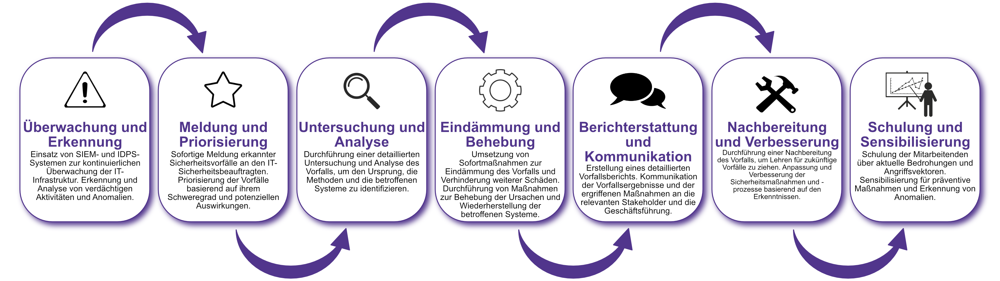

| Author | Dipl.-Ing. Daniel Mrskos, BSc |  
|--------|---------------------------------------------------------------|   
| Funktion | CEO von Security mit Passion, Penetration Tester, Mentor, FH-Lektor, NIS Prüfer |                               
| Datum  | 04. Juli 2024                                                 |
|     |                          |                                              |
| Zertifizierungen  | CSOM, CRTL, eCPTXv2, eWPTXv2, CCD, eCTHPv2, CRTE, CRTO, eCMAP, PNPT, eCPPTv2, eWPT, eCIR, CRTP, CARTP, PAWSP, eMAPT, eCXD, eCDFP, BTL1 (Gold), CAPEN, eEDA, OSWP, CNSP, Comptia Pentest+, ITIL Foundation V3, ICCA, CCNA, eJPTv2, Developing Security Software (LFD121), CAP, Checkmarx Security Champion                                         |
| LinkedIN  | [https://www.linkedin.com/in/dipl-ing-daniel-mrskos-bsc-0720081ab/](https://www.linkedin.com/in/dipl-ing-daniel-mrskos-bsc-0720081ab/)  
| Website  | [https://security-mit-passion.at](https://security-mit-passion.at)  

---

### Prozessbeschreibung: Erkennung und Abwehr von Cyberangriffen

#### Prozessname
Erkennung und Abwehr von Cyberangriffen

#### Prozessverantwortliche
- Max Mustermann (IT-Sicherheitsbeauftragter)
- Erika Mustermann (Leiterin IT-Abteilung)

#### Ziele des Prozesses
Dieser Prozess hat das Ziel, frühzeitige Erkennung und effektive Abwehr von Cyberangriffen zu gewährleisten, um die Integrität, Vertraulichkeit und Verfügbarkeit der IT-Systeme der Bank zu schützen.

#### Beteiligte Stellen
- IT-Abteilung
- Compliance-Abteilung
- Fachabteilungen
- Externe Sicherheitsdienstleister (falls erforderlich)

#### Anforderungen an die auslösende Stelle
Die Erkennung und Abwehr von Cyberangriffen wird ausgelöst durch:
- Hinweise auf ungewöhnliche Aktivitäten oder Sicherheitsvorfälle
- Warnungen von externen Sicherheitsdiensten oder Behörden
- Regelmäßige Überprüfungen und Audits
- Änderungen in der Bedrohungslage

#### Anforderungen an die Ressourcen
- Security Information and Event Management (SIEM) Systeme
- Intrusion Detection und Prevention Systeme (IDPS)
- Fachliche Expertise in IT-Sicherheit und Incident Response
- Dokumentationssysteme für Vorfallsberichte und Maßnahmenpläne

#### Kosten und Zeitaufwand
- Einmalige Einrichtung von SIEM- und IDPS-Systemen: ca. 50-100 Stunden
- Regelmäßige Überwachung und Vorfallmanagement: ca. 10-20 Stunden pro Monat

#### Ablauf / Tätigkeit

1. **Überwachung und Erkennung**
   - Verantwortlich: IT-Abteilung
   - Beschreibung: Einsatz von SIEM- und IDPS-Systemen zur kontinuierlichen Überwachung der IT-Infrastruktur. Erkennung und Analyse von verdächtigen Aktivitäten und Anomalien.

2. **Meldung und Priorisierung**
   - Verantwortlich: IT-Abteilung
   - Beschreibung: Sofortige Meldung erkannter Sicherheitsvorfälle an den IT-Sicherheitsbeauftragten. Priorisierung der Vorfälle basierend auf ihrem Schweregrad und potenziellen Auswirkungen.

3. **Untersuchung und Analyse**
   - Verantwortlich: IT-Abteilung, Externe Sicherheitsdienstleister
   - Beschreibung: Durchführung einer detaillierten Untersuchung und Analyse des Vorfalls, um den Ursprung, die Methoden und die betroffenen Systeme zu identifizieren.

4. **Eindämmung und Behebung**
   - Verantwortlich: IT-Abteilung
   - Beschreibung: Umsetzung von Sofortmaßnahmen zur Eindämmung des Vorfalls und Verhinderung weiterer Schäden. Durchführung von Maßnahmen zur Behebung der Ursachen und Wiederherstellung der betroffenen Systeme.

5. **Berichterstattung und Kommunikation**
   - Verantwortlich: IT-Abteilung, Compliance-Abteilung
   - Beschreibung: Erstellung eines detaillierten Vorfallsberichts. Kommunikation der Vorfallsergebnisse und der ergriffenen Maßnahmen an die relevanten Stakeholder und die Geschäftsführung.

6. **Nachbereitung und Verbesserung**
   - Verantwortlich: IT-Sicherheitsbeauftragter
   - Beschreibung: Durchführung einer Nachbereitung des Vorfalls, um Lehren für zukünftige Vorfälle zu ziehen. Anpassung und Verbesserung der Sicherheitsmaßnahmen und -prozesse basierend auf den Erkenntnissen.

7. **Schulung und Sensibilisierung**
   - Verantwortlich: IT-Abteilung
   - Beschreibung: Schulung der Mitarbeitenden über aktuelle Bedrohungen und Angriffsvektoren. Sensibilisierung für präventive Maßnahmen und Erkennung von Anomalien.

 

#### Dokumentation
Alle Schritte und Entscheidungen im Prozess werden dokumentiert und revisionssicher archiviert. Dazu gehören:
- Überwachungsprotokolle und Vorfallsberichte
- Analysen und Maßnahmenpläne
- Berichte und Kommunikationsergebnisse
- Schulungsunterlagen und Teilnehmerlisten

#### Kommunikationswege
- Regelmäßige Berichte an die Geschäftsführung über den Status und die Ergebnisse von Sicherheitsvorfällen
- Information der beteiligten Abteilungen über erkannte Vorfälle und ergriffene Maßnahmen durch E-Mails und Intranet-Ankündigungen
- Bereitstellung der Dokumentation im internen Dokumentenmanagementsystem