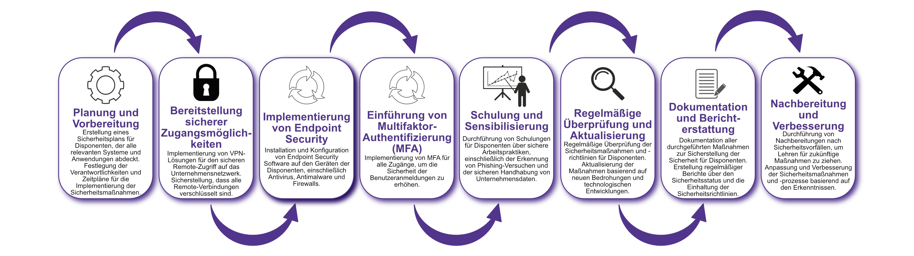

| Author | Dipl.-Ing. Daniel Mrskos, BSc |  
|--------|---------------------------------------------------------------|   
| Funktion | CEO von Security mit Passion, Penetration Tester, Mentor, FH-Lektor, NIS Prüfer |                               
| Datum  | 04. Juli 2024                                                 |
|     |                          |                                              |
| Zertifizierungen  | CSOM, CRTL, eCPTXv2, eWPTXv2, CCD, eCTHPv2, CRTE, CRTO, eCMAP, PNPT, eCPPTv2, eWPT, eCIR, CRTP, CARTP, PAWSP, eMAPT, eCXD, eCDFP, BTL1 (Gold), CAPEN, eEDA, OSWP, CNSP, Comptia Pentest+, ITIL Foundation V3, ICCA, CCNA, eJPTv2, Developing Security Software (LFD121), CAP, Checkmarx Security Champion                                         |
| LinkedIN  | [https://www.linkedin.com/in/dipl-ing-daniel-mrskos-bsc-0720081ab/](https://www.linkedin.com/in/dipl-ing-daniel-mrskos-bsc-0720081ab/)  
| Website  | [https://security-mit-passion.at](https://security-mit-passion.at)  

---

### Prozessbeschreibung: Sicherstellung von Sicherheit für Disponenten

#### Prozessname
Sicherstellung von Sicherheit für Disponenten

#### Prozessverantwortliche
- Max Mustermann (IT-Sicherheitsbeauftragter)
- Erika Mustermann (Leiterin IT-Abteilung)

#### Ziele des Prozesses
Dieser Prozess hat das Ziel, die Sicherheit der IT-Infrastruktur und der sensiblen Daten für Disponenten sicherzustellen, um deren Arbeitsprozesse zu schützen und zu optimieren.

#### Beteiligte Stellen
- IT-Abteilung
- Compliance-Abteilung
- Fachabteilungen
- Personalabteilung

#### Anforderungen an die auslösende Stelle
Die Sicherstellung der Sicherheit für Disponenten wird ausgelöst durch:
- Neueinstellungen oder Änderungen in den Aufgaben der Disponenten
- Sicherheitsvorfälle oder Änderungen in den Bedrohungslagen
- Regelmäßige Überprüfungen und Audits

#### Anforderungen an die Ressourcen
- VPN-Software und -Hardware
- Endpoint Security Software
- Multifaktor-Authentifizierung (MFA)
- Schulungs- und Informationsmaterialien
- Dokumentationssysteme für Sicherheitsrichtlinien und -protokolle

#### Kosten und Zeitaufwand
- Einmalige Implementierung von Sicherheitsmaßnahmen: ca. 20-40 Stunden
- Regelmäßige Überprüfungen und Schulungen: ca. 5-10 Stunden pro Monat

#### Ablauf / Tätigkeit

1. **Planung und Vorbereitung**
   - Verantwortlich: IT-Sicherheitsbeauftragter
   - Beschreibung: Erstellung eines Sicherheitsplans für Disponenten, der alle relevanten Systeme und Anwendungen abdeckt. Festlegung der Verantwortlichkeiten und Zeitpläne für die Implementierung der Sicherheitsmaßnahmen.

2. **Bereitstellung sicherer Zugangsmöglichkeiten**
   - Verantwortlich: IT-Abteilung
   - Beschreibung: Implementierung von VPN-Lösungen für den sicheren Remote-Zugriff auf das Unternehmensnetzwerk. Sicherstellung, dass alle Remote-Verbindungen verschlüsselt sind.

3. **Implementierung von Endpoint Security**
   - Verantwortlich: IT-Abteilung
   - Beschreibung: Installation und Konfiguration von Endpoint Security Software auf den Geräten der Disponenten, einschließlich Antivirus, Antimalware und Firewalls.

4. **Einführung von Multifaktor-Authentifizierung (MFA)**
   - Verantwortlich: IT-Abteilung
   - Beschreibung: Implementierung von MFA für alle Zugänge, um die Sicherheit der Benutzeranmeldungen zu erhöhen.

5. **Schulung und Sensibilisierung**
   - Verantwortlich: Personalabteilung, IT-Abteilung
   - Beschreibung: Durchführung von Schulungen für Disponenten über sichere Arbeitspraktiken, einschließlich der Erkennung von Phishing-Versuchen und der sicheren Handhabung von Unternehmensdaten.

6. **Regelmäßige Überprüfung und Aktualisierung**
   - Verantwortlich: IT-Sicherheitsbeauftragter
   - Beschreibung: Regelmäßige Überprüfung der Sicherheitsmaßnahmen und -richtlinien für Disponenten. Aktualisierung der Maßnahmen basierend auf neuen Bedrohungen und technologischen Entwicklungen.

7. **Dokumentation und Berichterstattung**
   - Verantwortlich: IT-Sicherheitsbeauftragter
   - Beschreibung: Dokumentation aller durchgeführten Maßnahmen zur Sicherstellung der Sicherheit für Disponenten. Erstellung regelmäßiger Berichte über den Sicherheitsstatus und die Einhaltung der Sicherheitsrichtlinien.

8. **Nachbereitung und Verbesserung**
   - Verantwortlich: IT-Sicherheitsbeauftragter
   - Beschreibung: Durchführung von Nachbereitungen nach Sicherheitsvorfällen, um Lehren für zukünftige Maßnahmen zu ziehen. Anpassung und Verbesserung der Sicherheitsmaßnahmen und -prozesse basierend auf den Erkenntnissen.

   
 

#### Dokumentation
Alle Schritte und Entscheidungen im Prozess werden dokumentiert und revisionssicher archiviert. Dazu gehören:
- Sicherheitspläne und Zeitpläne
- Protokolle zur Bereitstellung sicherer Zugangsmöglichkeiten
- Endpoint Security Konfigurationsprotokolle
- MFA-Implementierungsprotokolle
- Schulungsunterlagen und Teilnehmerlisten
- Berichte und Kommunikationsergebnisse

#### Kommunikationswege
- Regelmäßige Berichte an die Geschäftsführung über den Status der Sicherheit für Disponenten und durchgeführte Maßnahmen
- Information der beteiligten Abteilungen über Sicherheitsrichtlinien und Änderungen durch E-Mails und Intranet-Ankündigungen
- Bereitstellung der Dokumentation im internen Dokumentenmanagementsystem