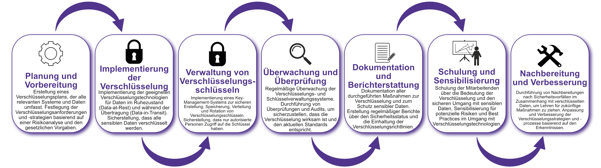

| Author | Dipl.-Ing. Daniel Mrskos, BSc |  
|--------|---------------------------------------------------------------|   
| Funktion | CEO von Security mit Passion, Penetration Tester, Mentor, FH-Lektor, NIS Prüfer |                               
| Datum  | 04. Juli 2024                                                 |
|     |                          |                                              |
| Zertifizierungen  | CSOM, CRTL, eCPTXv2, eWPTXv2, CCD, eCTHPv2, CRTE, CRTO, eCMAP, PNPT, eCPPTv2, eWPT, eCIR, CRTP, CARTP, PAWSP, eMAPT, eCXD, eCDFP, BTL1 (Gold), CAPEN, eEDA, OSWP, CNSP, Comptia Pentest+, ITIL Foundation V3, ICCA, CCNA, eJPTv2, Developing Security Software (LFD121), CAP, Checkmarx Security Champion                                         |
| LinkedIN  | [https://www.linkedin.com/in/dipl-ing-daniel-mrskos-bsc-0720081ab/](https://www.linkedin.com/in/dipl-ing-daniel-mrskos-bsc-0720081ab/)  
| Website  | [https://security-mit-passion.at](https://security-mit-passion.at)  

---

### Prozessbeschreibung: Verschlüsselung und Schutz sensibler Daten

#### Prozessname
Verschlüsselung und Schutz sensibler Daten

#### Prozessverantwortliche
- Max Mustermann (IT-Sicherheitsbeauftragter)
- Erika Mustermann (Leiterin IT-Abteilung)

#### Ziele des Prozesses
Dieser Prozess hat das Ziel, sensible Daten durch geeignete Verschlüsselungsmechanismen zu schützen, um die Vertraulichkeit, Integrität und Verfügbarkeit der Daten zu gewährleisten und den gesetzlichen und regulatorischen Anforderungen zu entsprechen.

#### Beteiligte Stellen
- IT-Abteilung
- Compliance-Abteilung
- Fachabteilungen
- Externe Dienstleister (falls erforderlich)

#### Anforderungen an die auslösende Stelle
Die Verschlüsselung und der Schutz sensibler Daten werden ausgelöst durch:
- Neue Datenverarbeitungssysteme oder -anwendungen
- Änderungen in den gesetzlichen oder regulatorischen Anforderungen
- Sicherheitsvorfälle oder Entdeckung neuer Schwachstellen
- Regelmäßige Überprüfungen und Audits

#### Anforderungen an die Ressourcen
- Verschlüsselungssoftware und -hardware
- Key-Management-Systeme
- Fachliche Expertise in IT-Sicherheit und Verschlüsselungstechniken
- Dokumentationssysteme für Sicherheitsrichtlinien und -protokolle

#### Kosten und Zeitaufwand
- Einmalige Implementierung der Verschlüsselungssysteme: ca. 30-50 Stunden
- Regelmäßige Überprüfungen und Aktualisierungen: ca. 10-20 Stunden pro Monat

#### Ablauf / Tätigkeit

1. **Planung und Vorbereitung**
   - Verantwortlich: IT-Sicherheitsbeauftragter
   - Beschreibung: Erstellung eines Verschlüsselungsplans, der alle relevanten Systeme und Daten umfasst. Festlegung der Verschlüsselungsanforderungen und -strategien basierend auf einer Risikoanalyse und den gesetzlichen Vorgaben.

2. **Implementierung der Verschlüsselung**
   - Verantwortlich: IT-Abteilung
   - Beschreibung: Implementierung der geeigneten Verschlüsselungstechnologien für Daten im Ruhezustand (Data-at-Rest) und während der Übertragung (Data-in-Transit). Sicherstellung, dass alle sensiblen Daten verschlüsselt werden.

3. **Verwaltung von Verschlüsselungsschlüsseln**
   - Verantwortlich: IT-Abteilung
   - Beschreibung: Implementierung eines Key-Management-Systems zur sicheren Erstellung, Speicherung, Verteilung und Rotation von Verschlüsselungsschlüsseln. Sicherstellung, dass nur autorisierte Personen Zugriff auf die Schlüssel haben.

4. **Überwachung und Überprüfung**
   - Verantwortlich: IT-Sicherheitsbeauftragter
   - Beschreibung: Regelmäßige Überwachung der Verschlüsselungs- und Schlüsselverwaltungssysteme. Durchführung von Überprüfungen und Audits, um sicherzustellen, dass die Verschlüsselung wirksam ist und den aktuellen Standards entspricht.

5. **Dokumentation und Berichterstattung**
   - Verantwortlich: IT-Sicherheitsbeauftragter
   - Beschreibung: Dokumentation aller durchgeführten Maßnahmen zur Verschlüsselung und zum Schutz sensibler Daten. Erstellung regelmäßiger Berichte über den Sicherheitsstatus und die Einhaltung der Verschlüsselungsrichtlinien.

6. **Schulung und Sensibilisierung**
   - Verantwortlich: IT-Abteilung
   - Beschreibung: Schulung der Mitarbeitenden über die Bedeutung der Verschlüsselung und den sicheren Umgang mit sensiblen Daten. Sensibilisierung für potenzielle Risiken und Best Practices im Umgang mit Verschlüsselungstechnologien.

7. **Nachbereitung und Verbesserung**
   - Verantwortlich: IT-Sicherheitsbeauftragter
   - Beschreibung: Durchführung von Nachbereitungen nach Sicherheitsvorfällen im Zusammenhang mit verschlüsselten Daten, um Lehren für zukünftige Maßnahmen zu ziehen. Anpassung und Verbesserung der Verschlüsselungsstrategien und -prozesse basierend auf den Erkenntnissen.

 

#### Dokumentation
Alle Schritte und Entscheidungen im Prozess werden dokumentiert und revisionssicher archiviert. Dazu gehören:
- Verschlüsselungspläne und -strategien
- Protokolle zur Implementierung der Verschlüsselung
- Key-Management-Dokumentationen
- Überprüfungs- und Auditberichte
- Schulungsunterlagen und Teilnehmerlisten
- Berichte und Kommunikationsergebnisse

#### Kommunikationswege
- Regelmäßige Berichte an die Geschäftsführung über den Status der Verschlüsselung und durchgeführte Maßnahmen
- Information der beteiligten Abteilungen über Verschlüsselungsrichtlinien und Änderungen durch E-Mails und Intranet-Ankündigungen
- Bereitstellung der Dokumentation im internen Dokumentenmanagementsystem