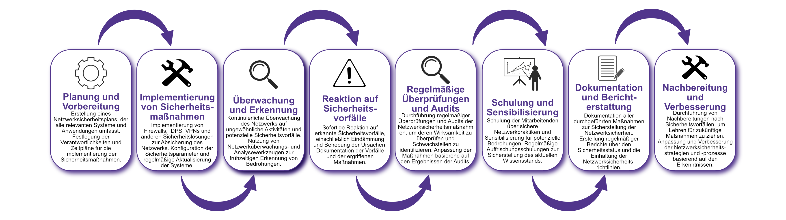

| Author | Dipl.-Ing. Daniel Mrskos, BSc |  
|--------|---------------------------------------------------------------|   
| Funktion | CEO von Security mit Passion, Penetration Tester, Mentor, FH-Lektor, NIS Prüfer |                               
| Datum  | 04. Juli 2024                                                 |
|     |                          |                                              |
| Zertifizierungen  | CSOM, CRTL, eCPTXv2, eWPTXv2, CCD, eCTHPv2, CRTE, CRTO, eCMAP, PNPT, eCPPTv2, eWPT, eCIR, CRTP, CARTP, PAWSP, eMAPT, eCXD, eCDFP, BTL1 (Gold), CAPEN, eEDA, OSWP, CNSP, Comptia Pentest+, ITIL Foundation V3, ICCA, CCNA, eJPTv2, Developing Security Software (LFD121), CAP, Checkmarx Security Champion                                         |
| LinkedIN  | [https://www.linkedin.com/in/dipl-ing-daniel-mrskos-bsc-0720081ab/](https://www.linkedin.com/in/dipl-ing-daniel-mrskos-bsc-0720081ab/)  
| Website  | [https://security-mit-passion.at](https://security-mit-passion.at)  

---

### Prozessbeschreibung: Sicherstellung der Netzwerksicherheit

#### Prozessname
Sicherstellung der Netzwerksicherheit

#### Prozessverantwortliche
- Max Mustermann (IT-Sicherheitsbeauftragter)
- Erika Mustermann (Leiterin IT-Abteilung)

#### Ziele des Prozesses
Dieser Prozess hat das Ziel, die Netzwerksicherheit durch geeignete Maßnahmen zu gewährleisten, um die Integrität, Vertraulichkeit und Verfügbarkeit der IT-Infrastruktur und der Daten der Bank zu schützen.

#### Beteiligte Stellen
- IT-Abteilung
- Compliance-Abteilung
- Fachabteilungen
- Externe Dienstleister (falls erforderlich)

#### Anforderungen an die auslösende Stelle
Die Sicherstellung der Netzwerksicherheit wird ausgelöst durch:
- Neue Netzwerkimplementierungen oder -änderungen
- Sicherheitsvorfälle oder Änderungen in den Bedrohungslagen
- Regelmäßige Überprüfungen und Audits
- Änderungen in den gesetzlichen oder regulatorischen Anforderungen

#### Anforderungen an die Ressourcen
- Firewalls, Intrusion Detection and Prevention Systems (IDPS)
- VPN-Software und -Hardware
- Netzwerküberwachungs- und Analysewerkzeuge
- Fachliche Expertise in Netzwerksicherheit und IT-Sicherheit
- Dokumentationssysteme für Sicherheitsrichtlinien und -protokolle

#### Kosten und Zeitaufwand
- Einmalige Implementierung der Netzwerksicherheitsmaßnahmen: ca. 50-100 Stunden
- Regelmäßige Überprüfungen und Aktualisierungen: ca. 10-20 Stunden pro Monat

#### Ablauf / Tätigkeit

1. **Planung und Vorbereitung**
   - Verantwortlich: IT-Sicherheitsbeauftragter
   - Beschreibung: Erstellung eines Netzwerksicherheitsplans, der alle relevanten Systeme und Anwendungen umfasst. Festlegung der Verantwortlichkeiten und Zeitpläne für die Implementierung der Sicherheitsmaßnahmen.

2. **Implementierung von Sicherheitsmaßnahmen**
   - Verantwortlich: IT-Abteilung
   - Beschreibung: Implementierung von Firewalls, IDPS, VPNs und anderen Sicherheitslösungen zur Absicherung des Netzwerks. Konfiguration der Sicherheitsparameter und regelmäßige Aktualisierung der Systeme.

3. **Überwachung und Erkennung**
   - Verantwortlich: IT-Abteilung
   - Beschreibung: Kontinuierliche Überwachung des Netzwerks auf ungewöhnliche Aktivitäten und potenzielle Sicherheitsvorfälle. Nutzung von Netzwerküberwachungs- und Analysewerkzeugen zur frühzeitigen Erkennung von Bedrohungen.

4. **Reaktion auf Sicherheitsvorfälle**
   - Verantwortlich: IT-Abteilung
   - Beschreibung: Sofortige Reaktion auf erkannte Sicherheitsvorfälle, einschließlich Eindämmung und Behebung der Ursachen. Dokumentation der Vorfälle und der ergriffenen Maßnahmen.

5. **Regelmäßige Überprüfungen und Audits**
   - Verantwortlich: IT-Sicherheitsbeauftragter
   - Beschreibung: Durchführung regelmäßiger Überprüfungen und Audits der Netzwerksicherheitsmaßnahmen, um deren Wirksamkeit zu überprüfen und Schwachstellen zu identifizieren. Anpassung der Maßnahmen basierend auf den Ergebnissen der Audits.

6. **Schulung und Sensibilisierung**
   - Verantwortlich: Personalabteilung, IT-Abteilung
   - Beschreibung: Schulung der Mitarbeitenden über sichere Netzwerkpraktiken und Sensibilisierung für potenzielle Bedrohungen. Regelmäßige Auffrischungsschulungen zur Sicherstellung des aktuellen Wissensstands.

7. **Dokumentation und Berichterstattung**
   - Verantwortlich: IT-Sicherheitsbeauftragter
   - Beschreibung: Dokumentation aller durchgeführten Maßnahmen zur Sicherstellung der Netzwerksicherheit. Erstellung regelmäßiger Berichte über den Sicherheitsstatus und die Einhaltung der Netzwerksicherheitsrichtlinien.

8. **Nachbereitung und Verbesserung**
   - Verantwortlich: IT-Sicherheitsbeauftragter
   - Beschreibung: Durchführung von Nachbereitungen nach Sicherheitsvorfällen, um Lehren für zukünftige Maßnahmen zu ziehen. Anpassung und Verbesserung der Netzwerksicherheitsstrategien und -prozesse basierend auf den Erkenntnissen.

 

#### Dokumentation
Alle Schritte und Entscheidungen im Prozess werden dokumentiert und revisionssicher archiviert. Dazu gehören:
- Netzwerksicherheitspläne und -strategien
- Protokolle zur Implementierung von Sicherheitsmaßnahmen
- Überwachungs- und Erkennungsprotokolle
- Vorfallsberichte und Dokumentationen der Reaktionen
- Audit- und Überprüfungsberichte
- Schulungsunterlagen und Teilnehmerlisten
- Berichte und Kommunikationsergebnisse

#### Kommunikationswege
- Regelmäßige Berichte an die Geschäftsführung über den Status der Netzwerksicherheit und durchgeführte Maßnahmen
- Information der beteiligten Abteilungen über Netzwerksicherheitsrichtlinien und Änderungen durch E-Mails und Intranet-Ankündigungen
- Bereitstellung der Dokumentation im internen Dokumentenmanagementsystem
