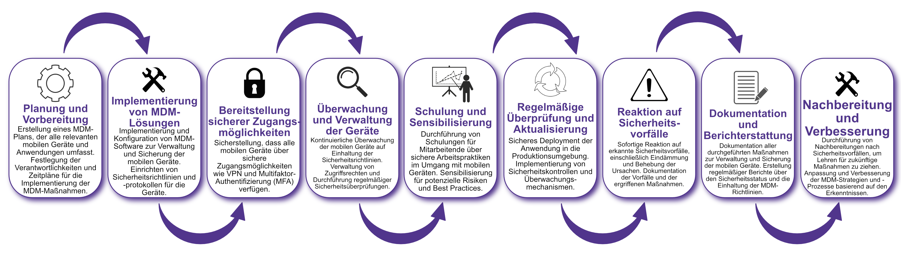

| Author | Dipl.-Ing. Daniel Mrskos, BSc |  
|--------|---------------------------------------------------------------|   
| Funktion | CEO von Security mit Passion, Penetration Tester, Mentor, FH-Lektor, NIS Prüfer |                               
| Datum  | 04. Juli 2024                                                 |
|     |                          |                                              |
| Zertifizierungen  | CSOM, CRTL, eCPTXv2, eWPTXv2, CCD, eCTHPv2, CRTE, CRTO, eCMAP, PNPT, eCPPTv2, eWPT, eCIR, CRTP, CARTP, PAWSP, eMAPT, eCXD, eCDFP, BTL1 (Gold), CAPEN, eEDA, OSWP, CNSP, Comptia Pentest+, ITIL Foundation V3, ICCA, CCNA, eJPTv2, Developing Security Software (LFD121), CAP, Checkmarx Security Champion                                         |
| LinkedIN  | [https://www.linkedin.com/in/dipl-ing-daniel-mrskos-bsc-0720081ab/](https://www.linkedin.com/in/dipl-ing-daniel-mrskos-bsc-0720081ab/)  
| Website  | [https://security-mit-passion.at](https://security-mit-passion.at)  

---
### Prozessbeschreibung: Verwaltung von Mobile Devices (Mobile Device Management, MDM)

#### Prozessname
Verwaltung von Mobile Devices (Mobile Device Management, MDM)

#### Prozessverantwortliche
- Max Mustermann (IT-Sicherheitsbeauftragter)
- Erika Mustermann (Leiterin IT-Abteilung)

#### Ziele des Prozesses
Dieser Prozess hat das Ziel, die Sicherheit und Verwaltung aller mobilen Geräte zu gewährleisten, die auf Unternehmensdaten zugreifen. Dies umfasst die Implementierung von Sicherheitsrichtlinien, die Verwaltung von Zugriffsrechten und die Sicherstellung der Datenintegrität und -vertraulichkeit.

#### Beteiligte Stellen
- IT-Abteilung
- Compliance-Abteilung
- Fachabteilungen
- Personalabteilung
- Externe Dienstleister (falls erforderlich)

#### Anforderungen an die auslösende Stelle
Die Verwaltung von Mobile Devices wird ausgelöst durch:
- Neueinstellungen oder Änderungen in den Aufgaben der Mitarbeitenden
- Sicherheitsvorfälle oder Änderungen in den Bedrohungslagen
- Regelmäßige Überprüfungen und Audits
- Änderungen in den gesetzlichen oder regulatorischen Anforderungen

#### Anforderungen an die Ressourcen
- MDM-Software und -Hardware
- Fachliche Expertise in Netzwerksicherheit und IT-Sicherheit
- Dokumentationssysteme für Sicherheitsrichtlinien und -protokolle
- Schulungs- und Informationsmaterialien

#### Kosten und Zeitaufwand
- Einmalige Implementierung der MDM-Lösungen: ca. 50-100 Stunden
- Regelmäßige Überprüfungen und Aktualisierungen: ca. 10-20 Stunden pro Monat

#### Ablauf / Tätigkeit

1. **Planung und Vorbereitung**
   - Verantwortlich: IT-Sicherheitsbeauftragter
   - Beschreibung: Erstellung eines MDM-Plans, der alle relevanten mobilen Geräte und Anwendungen umfasst. Festlegung der Verantwortlichkeiten und Zeitpläne für die Implementierung der MDM-Maßnahmen.

2. **Implementierung von MDM-Lösungen**
   - Verantwortlich: IT-Abteilung
   - Beschreibung: Implementierung und Konfiguration von MDM-Software zur Verwaltung und Sicherung der mobilen Geräte. Einrichten von Sicherheitsrichtlinien und -protokollen für die Geräte.

3. **Bereitstellung sicherer Zugangsmöglichkeiten**
   - Verantwortlich: IT-Abteilung
   - Beschreibung: Sicherstellung, dass alle mobilen Geräte über sichere Zugangsmöglichkeiten wie VPN und Multifaktor-Authentifizierung (MFA) verfügen.

4. **Überwachung und Verwaltung der Geräte**
   - Verantwortlich: IT-Abteilung
   - Beschreibung: Kontinuierliche Überwachung der mobilen Geräte auf Einhaltung der Sicherheitsrichtlinien. Verwaltung von Zugriffsrechten und Durchführung regelmäßiger Sicherheitsüberprüfungen.

5. **Schulung und Sensibilisierung**
   - Verantwortlich: Personalabteilung, IT-Abteilung
   - Beschreibung: Durchführung von Schulungen für Mitarbeitende über sichere Arbeitspraktiken im Umgang mit mobilen Geräten. Sensibilisierung für potenzielle Risiken und Best Practices.

6. **Regelmäßige Überprüfung und Aktualisierung**
   - Verantwortlich: IT-Sicherheitsbeauftragter
   - Beschreibung: Regelmäßige Überprüfung der MDM-Richtlinien und -Protokolle. Aktualisierung der Maßnahmen basierend auf neuen Bedrohungen und technologischen Entwicklungen.

7. **Reaktion auf Sicherheitsvorfälle**
   - Verantwortlich: IT-Abteilung
   - Beschreibung: Sofortige Reaktion auf erkannte Sicherheitsvorfälle, einschließlich Eindämmung und Behebung der Ursachen. Dokumentation der Vorfälle und der ergriffenen Maßnahmen.

8. **Dokumentation und Berichterstattung**
   - Verantwortlich: IT-Sicherheitsbeauftragter
   - Beschreibung: Dokumentation aller durchgeführten Maßnahmen zur Verwaltung und Sicherung der mobilen Geräte. Erstellung regelmäßiger Berichte über den Sicherheitsstatus und die Einhaltung der MDM-Richtlinien.

9. **Nachbereitung und Verbesserung**
   - Verantwortlich: IT-Sicherheitsbeauftragter
   - Beschreibung: Durchführung von Nachbereitungen nach Sicherheitsvorfällen, um Lehren für zukünftige Maßnahmen zu ziehen. Anpassung und Verbesserung der MDM-Strategien und -Prozesse basierend auf den Erkenntnissen.

 

#### Dokumentation
Alle Schritte und Entscheidungen im Prozess werden dokumentiert und revisionssicher archiviert. Dazu gehören:
- MDM-Pläne und -Strategien
- Protokolle zur Implementierung von MDM-Lösungen
- Überwachungs- und Verwaltungssprotokolle
- Vorfallsberichte und Dokumentationen der Reaktionen
- Schulungsunterlagen und Teilnehmerlisten
- Berichte und Kommunikationsergebnisse

#### Kommunikationswege
- Regelmäßige Berichte an die Geschäftsführung über den Status der mobilen Geräte und durchgeführte Maßnahmen
- Information der beteiligten Abteilungen über MDM-Richtlinien und Änderungen durch E-Mails und Intranet-Ankündigungen
- Bereitstellung der Dokumentation im internen Dokumentenmanagementsystem