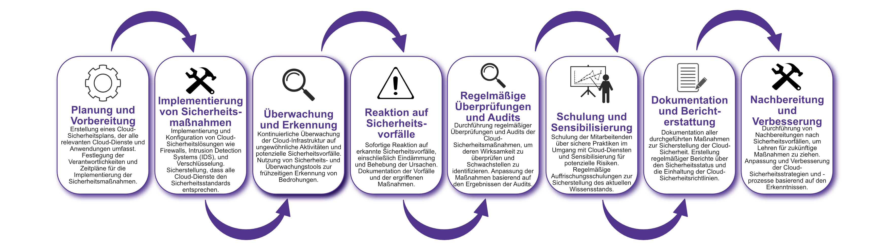

| Author | Dipl.-Ing. Daniel Mrskos, BSc |  
|--------|---------------------------------------------------------------|   
| Funktion | CEO von Security mit Passion, Penetration Tester, Mentor, FH-Lektor, NIS Prüfer |                               
| Datum  | 04. Juli 2024                                                 |
|     |                          |                                              |
| Zertifizierungen  | CSOM, CRTL, eCPTXv2, eWPTXv2, CCD, eCTHPv2, CRTE, CRTO, eCMAP, PNPT, eCPPTv2, eWPT, eCIR, CRTP, CARTP, PAWSP, eMAPT, eCXD, eCDFP, BTL1 (Gold), CAPEN, eEDA, OSWP, CNSP, Comptia Pentest+, ITIL Foundation V3, ICCA, CCNA, eJPTv2, Developing Security Software (LFD121), CAP, Checkmarx Security Champion                                         |
| LinkedIN  | [https://www.linkedin.com/in/dipl-ing-daniel-mrskos-bsc-0720081ab/](https://www.linkedin.com/in/dipl-ing-daniel-mrskos-bsc-0720081ab/)  
| Website  | [https://security-mit-passion.at](https://security-mit-passion.at)  

---
### Prozessbeschreibung: Überwachung und Verwaltung von Cloud-Sicherheit

#### Prozessname
Überwachung und Verwaltung von Cloud-Sicherheit

#### Prozessverantwortliche
- Max Mustermann (IT-Sicherheitsbeauftragter)
- Erika Mustermann (Leiterin IT-Abteilung)

#### Ziele des Prozesses
Dieser Prozess hat das Ziel, die Sicherheit der Cloud-Infrastruktur und der darauf gespeicherten Daten zu gewährleisten, um die Integrität, Vertraulichkeit und Verfügbarkeit der IT-Ressourcen zu schützen und den gesetzlichen und regulatorischen Anforderungen zu entsprechen.

#### Beteiligte Stellen
- IT-Abteilung
- Compliance-Abteilung
- Fachabteilungen
- Externe Dienstleister (Cloud-Anbieter)

#### Anforderungen an die auslösende Stelle
Die Überwachung und Verwaltung der Cloud-Sicherheit wird ausgelöst durch:
- Neue Cloud-Implementierungen oder -änderungen
- Sicherheitsvorfälle oder Änderungen in den Bedrohungslagen
- Regelmäßige Überprüfungen und Audits
- Änderungen in den gesetzlichen oder regulatorischen Anforderungen

#### Anforderungen an die Ressourcen
- Cloud-Sicherheitssoftware und -hardware
- Fachliche Expertise in Cloud-Sicherheit und IT-Sicherheit
- Dokumentationssysteme für Sicherheitsrichtlinien und -protokolle
- Schulungs- und Informationsmaterialien

#### Kosten und Zeitaufwand
- Einmalige Implementierung der Cloud-Sicherheitsmaßnahmen: ca. 50-100 Stunden
- Regelmäßige Überprüfungen und Aktualisierungen: ca. 10-20 Stunden pro Monat

#### Ablauf / Tätigkeit

1. **Planung und Vorbereitung**
   - Verantwortlich: IT-Sicherheitsbeauftragter
   - Beschreibung: Erstellung eines Cloud-Sicherheitsplans, der alle relevanten Cloud-Dienste und Anwendungen umfasst. Festlegung der Verantwortlichkeiten und Zeitpläne für die Implementierung der Sicherheitsmaßnahmen.

2. **Implementierung von Sicherheitsmaßnahmen**
   - Verantwortlich: IT-Abteilung
   - Beschreibung: Implementierung und Konfiguration von Cloud-Sicherheitslösungen wie Firewalls, Intrusion Detection Systems (IDS), und Verschlüsselung. Sicherstellung, dass alle Cloud-Dienste den Sicherheitsstandards entsprechen.

3. **Überwachung und Erkennung**
   - Verantwortlich: IT-Abteilung
   - Beschreibung: Kontinuierliche Überwachung der Cloud-Infrastruktur auf ungewöhnliche Aktivitäten und potenzielle Sicherheitsvorfälle. Nutzung von Sicherheits- und Überwachungstools zur frühzeitigen Erkennung von Bedrohungen.

4. **Reaktion auf Sicherheitsvorfälle**
   - Verantwortlich: IT-Abteilung
   - Beschreibung: Sofortige Reaktion auf erkannte Sicherheitsvorfälle, einschließlich Eindämmung und Behebung der Ursachen. Dokumentation der Vorfälle und der ergriffenen Maßnahmen.

5. **Regelmäßige Überprüfungen und Audits**
   - Verantwortlich: IT-Sicherheitsbeauftragter
   - Beschreibung: Durchführung regelmäßiger Überprüfungen und Audits der Cloud-Sicherheitsmaßnahmen, um deren Wirksamkeit zu überprüfen und Schwachstellen zu identifizieren. Anpassung der Maßnahmen basierend auf den Ergebnissen der Audits.

6. **Schulung und Sensibilisierung**
   - Verantwortlich: Personalabteilung, IT-Abteilung
   - Beschreibung: Schulung der Mitarbeitenden über sichere Praktiken im Umgang mit Cloud-Diensten und Sensibilisierung für potenzielle Risiken. Regelmäßige Auffrischungsschulungen zur Sicherstellung des aktuellen Wissensstands.

7. **Dokumentation und Berichterstattung**
   - Verantwortlich: IT-Sicherheitsbeauftragter
   - Beschreibung: Dokumentation aller durchgeführten Maßnahmen zur Sicherstellung der Cloud-Sicherheit. Erstellung regelmäßiger Berichte über den Sicherheitsstatus und die Einhaltung der Cloud-Sicherheitsrichtlinien.

8. **Nachbereitung und Verbesserung**
   - Verantwortlich: IT-Sicherheitsbeauftragter
   - Beschreibung: Durchführung von Nachbereitungen nach Sicherheitsvorfällen, um Lehren für zukünftige Maßnahmen zu ziehen. Anpassung und Verbesserung der Cloud-Sicherheitsstrategien und -prozesse basierend auf den Erkenntnissen.

 

#### Dokumentation
Alle Schritte und Entscheidungen im Prozess werden dokumentiert und revisionssicher archiviert. Dazu gehören:
- Cloud-Sicherheitspläne und -strategien
- Protokolle zur Implementierung von Sicherheitsmaßnahmen
- Überwachungs- und Erkennungsprotokolle
- Vorfallsberichte und Dokumentationen der Reaktionen
- Audit- und Überprüfungsberichte
- Schulungsunterlagen und Teilnehmerlisten
- Berichte und Kommunikationsergebnisse

#### Kommunikationswege
- Regelmäßige Berichte an die Geschäftsführung über den Status der Cloud-Sicherheit und durchgeführte Maßnahmen
- Information der beteiligten Abteilungen über Cloud-Sicherheitsrichtlinien und Änderungen durch E-Mails und Intranet-Ankündigungen
- Bereitstellung der Dokumentation im internen Dokumentenmanagementsystem