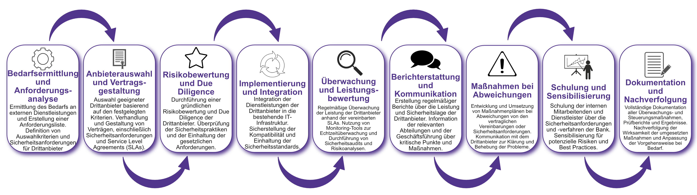

| Author | Dipl.-Ing. Daniel Mrskos, BSc |  
|--------|---------------------------------------------------------------|   
| Funktion | CEO von Security mit Passion, Penetration Tester, Mentor, FH-Lektor, NIS Prüfer |                               
| Datum  | 04. Juli 2024                                                 |
|     |                          |                                              |
| Zertifizierungen  | CSOM, CRTL, eCPTXv2, eWPTXv2, CCD, eCTHPv2, CRTE, CRTO, eCMAP, PNPT, eCPPTv2, eWPT, eCIR, CRTP, CARTP, PAWSP, eMAPT, eCXD, eCDFP, BTL1 (Gold), CAPEN, eEDA, OSWP, CNSP, Comptia Pentest+, ITIL Foundation V3, ICCA, CCNA, eJPTv2, Developing Security Software (LFD121), CAP, Checkmarx Security Champion                                         |
| LinkedIN  | [https://www.linkedin.com/in/dipl-ing-daniel-mrskos-bsc-0720081ab/](https://www.linkedin.com/in/dipl-ing-daniel-mrskos-bsc-0720081ab/)  
| Website  | [https://security-mit-passion.at](https://security-mit-passion.at)  

---

### Prozessbeschreibung: Verwaltung von Drittanbietern (Third-Party Risk Management)

#### Prozessname
Verwaltung von Drittanbietern (Third-Party Risk Management)

#### Prozessverantwortliche
- Max Mustermann (IT-Sicherheitsbeauftragter)
- Erika Mustermann (Leiterin IT-Abteilung)

#### Ziele des Prozesses
Dieser Prozess hat das Ziel, Risiken im Zusammenhang mit Drittanbietern zu identifizieren, zu bewerten und zu verwalten, um die Sicherheit und Integrität der IT-Infrastruktur und der Daten der Bank zu gewährleisten.

#### Beteiligte Stellen
- IT-Abteilung
- Compliance-Abteilung
- Fachabteilungen
- Beschaffungsabteilung
- Externe Dienstleister

#### Anforderungen an die auslösende Stelle
Die Verwaltung von Drittanbietern wird ausgelöst durch:
- Auswahl und Beauftragung neuer Drittanbieter
- Regelmäßige Überprüfungen bestehender Drittanbieter
- Sicherheitsvorfälle oder Änderungen in den Bedrohungslagen
- Änderungen in den gesetzlichen oder regulatorischen Anforderungen

#### Anforderungen an die Ressourcen
- Vertragsmanagement-Software
- Risikobewertungs- und Überwachungstools
- Fachliche Expertise in IT-Sicherheit und Drittanbietermanagement
- Dokumentationssysteme für Sicherheitsrichtlinien und -protokolle

#### Kosten und Zeitaufwand
- Einmalige Implementierung des Drittanbietermanagements: ca. 50-100 Stunden
- Regelmäßige Überprüfungen und Bewertungen: ca. 10-20 Stunden pro Monat

#### Ablauf / Tätigkeit

1. **Bedarfsermittlung und Anforderungsanalyse**
   - Verantwortlich: Beschaffungsabteilung, Fachabteilungen
   - Beschreibung: Ermittlung des Bedarfs an externen Dienstleistungen und Erstellung einer Anforderungsliste. Definition von Auswahlkriterien und Sicherheitsanforderungen für Drittanbieter.

2. **Anbieterauswahl und Vertragsgestaltung**
   - Verantwortlich: Beschaffungsabteilung, IT-Abteilung
   - Beschreibung: Auswahl geeigneter Drittanbieter basierend auf den festgelegten Kriterien. Verhandlung und Gestaltung von Verträgen, einschließlich Sicherheitsanforderungen und Service Level Agreements (SLAs).

3. **Risikobewertung und Due Diligence**
   - Verantwortlich: IT-Abteilung, Compliance-Abteilung
   - Beschreibung: Durchführung einer gründlichen Risikobewertung und Due Diligence der Drittanbieter. Überprüfung der Sicherheitspraktiken und der Einhaltung der gesetzlichen Anforderungen.

4. **Implementierung und Integration**
   - Verantwortlich: IT-Abteilung, Fachabteilungen
   - Beschreibung: Integration der Dienstleistungen der Drittanbieter in die bestehende IT-Infrastruktur. Sicherstellung der Kompatibilität und Einhaltung der Sicherheitsstandards.

5. **Überwachung und Leistungsbewertung**
   - Verantwortlich: IT-Abteilung
   - Beschreibung: Regelmäßige Überwachung der Leistung der Drittanbieter anhand der vereinbarten SLAs. Nutzung von Monitoring-Tools zur Echtzeitüberwachung und Durchführung von Sicherheitsaudits und Risikoanalysen.

6. **Berichterstattung und Kommunikation**
   - Verantwortlich: IT-Abteilung, Compliance-Abteilung
   - Beschreibung: Erstellung regelmäßiger Berichte über die Leistung und Sicherheitslage der Drittanbieter. Information der relevanten Abteilungen und der Geschäftsführung über kritische Punkte und Maßnahmen.

7. **Maßnahmen bei Abweichungen**
   - Verantwortlich: IT-Abteilung
   - Beschreibung: Entwicklung und Umsetzung von Maßnahmenplänen bei Abweichungen von den vertraglichen Vereinbarungen oder Sicherheitsanforderungen. Kommunikation mit dem Drittanbieter zur Klärung und Behebung der Probleme.

8. **Schulung und Sensibilisierung**
   - Verantwortlich: IT-Abteilung
   - Beschreibung: Schulung der internen Mitarbeitenden und Dienstleister über die Sicherheitsanforderungen und -verfahren der Bank. Sensibilisierung für potenzielle Risiken und Best Practices.

9. **Dokumentation und Nachverfolgung**
   - Verantwortlich: IT-Sicherheitsbeauftragter
   - Beschreibung: Vollständige Dokumentation aller Überwachungs- und Steuerungsmaßnahmen, Prüfberichte und Ergebnisse. Nachverfolgung der Wirksamkeit der umgesetzten Maßnahmen und Anpassung der Vorgehensweise bei Bedarf.

 

#### Dokumentation
Alle Schritte und Entscheidungen im Prozess werden dokumentiert und revisionssicher archiviert. Dazu gehören:
- Anforderungsliste und Auswahlkriterien
- Verträge und SLAs mit Drittanbietern
- Prüf- und Überwachungsprotokolle
- Auditberichte und Risikoanalysen
- Maßnahmenpläne und Umsetzungsergebnisse

#### Kommunikationswege
- Regelmäßige Berichte an die Geschäftsführung über den Status der Drittanbieter und durchgeführte Maßnahmen
- Information der beteiligten Abteilungen über Ergebnisse der Überwachungen und Audits durch E-Mails und Intranet-Ankündigungen
- Bereitstellung der Dokumentation im internen Dokumentenmanagementsystem
