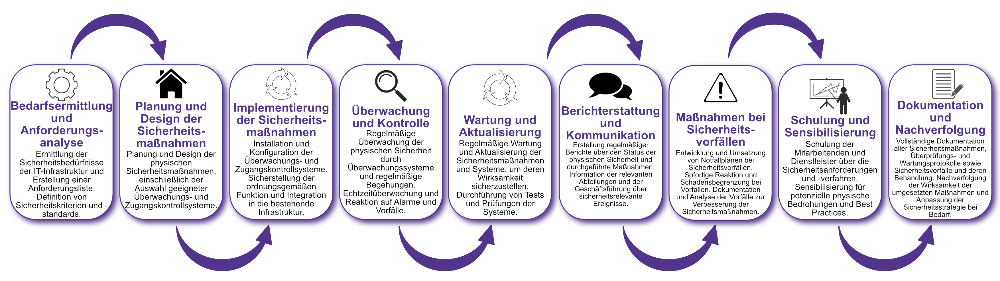

| Author | Dipl.-Ing. Daniel Mrskos, BSc |  
|--------|---------------------------------------------------------------|   
| Funktion | CEO von Security mit Passion, Penetration Tester, Mentor, FH-Lektor, NIS Prüfer |                               
| Datum  | 04. Juli 2024                                                 |
|     |                          |                                              |
| Zertifizierungen  | CSOM, CRTL, eCPTXv2, eWPTXv2, CCD, eCTHPv2, CRTE, CRTO, eCMAP, PNPT, eCPPTv2, eWPT, eCIR, CRTP, CARTP, PAWSP, eMAPT, eCXD, eCDFP, BTL1 (Gold), CAPEN, eEDA, OSWP, CNSP, Comptia Pentest+, ITIL Foundation V3, ICCA, CCNA, eJPTv2, Developing Security Software (LFD121), CAP, Checkmarx Security Champion                                         |
| LinkedIN  | [https://www.linkedin.com/in/dipl-ing-daniel-mrskos-bsc-0720081ab/](https://www.linkedin.com/in/dipl-ing-daniel-mrskos-bsc-0720081ab/)  
| Website  | [https://security-mit-passion.at](https://security-mit-passion.at)  

---

### Prozessbeschreibung: Sicherstellung der physischen Sicherheit der IT-Infrastruktur

#### Prozessname
Sicherstellung der physischen Sicherheit der IT-Infrastruktur

#### Prozessverantwortliche
- Max Mustermann (IT-Sicherheitsbeauftragter)
- Erika Mustermann (Leiterin IT-Abteilung)

#### Ziele des Prozesses
Dieser Prozess hat das Ziel, die physische Sicherheit der IT-Infrastruktur der Bank zu gewährleisten, um unbefugten Zugang, Diebstahl und Beschädigungen zu verhindern und somit die Verfügbarkeit und Integrität der IT-Systeme sicherzustellen.

#### Beteiligte Stellen
- IT-Abteilung
- Facility Management
- Sicherheitsabteilung
- Compliance-Abteilung
- Externe Sicherheitsdienstleister

#### Anforderungen an die auslösende Stelle
Die Sicherstellung der physischen Sicherheit der IT-Infrastruktur wird ausgelöst durch:
- Aufbau neuer IT-Infrastruktureinrichtungen
- Regelmäßige Sicherheitsüberprüfungen
- Sicherheitsvorfälle oder Schwachstellenanalysen
- Änderungen in den gesetzlichen oder regulatorischen Anforderungen

#### Anforderungen an die Ressourcen
- Überwachungssysteme (Kameras, Alarmsysteme)
- Zugangskontrollsysteme (Schlüsselkarten, biometrische Systeme)
- Sicherheitsprotokolle und -richtlinien
- Fachliche Expertise in physischer Sicherheit und Facility Management
- Dokumentationssysteme für Sicherheitsvorfälle und -maßnahmen

#### Kosten und Zeitaufwand
- Einmalige Implementierung der Sicherheitssysteme: ca. 80-120 Stunden
- Regelmäßige Überprüfungen und Wartung: ca. 15-25 Stunden pro Monat

#### Ablauf / Tätigkeit

1. **Bedarfsermittlung und Anforderungsanalyse**
   - Verantwortlich: IT-Abteilung, Facility Management
   - Beschreibung: Ermittlung der Sicherheitsbedürfnisse der IT-Infrastruktur und Erstellung einer Anforderungsliste. Definition von Sicherheitskriterien und -standards.

2. **Planung und Design der Sicherheitsmaßnahmen**
   - Verantwortlich: IT-Abteilung, Sicherheitsabteilung
   - Beschreibung: Planung und Design der physischen Sicherheitsmaßnahmen, einschließlich der Auswahl geeigneter Überwachungs- und Zugangskontrollsysteme.

3. **Implementierung der Sicherheitsmaßnahmen**
   - Verantwortlich: IT-Abteilung, Facility Management, Externe Sicherheitsdienstleister
   - Beschreibung: Installation und Konfiguration der Überwachungs- und Zugangskontrollsysteme. Sicherstellung der ordnungsgemäßen Funktion und Integration in die bestehende Infrastruktur.

4. **Überwachung und Kontrolle**
   - Verantwortlich: Sicherheitsabteilung, IT-Abteilung
   - Beschreibung: Regelmäßige Überwachung der physischen Sicherheit durch Überwachungssysteme und regelmäßige Begehungen. Echtzeitüberwachung und Reaktion auf Alarme und Vorfälle.

5. **Wartung und Aktualisierung**
   - Verantwortlich: IT-Abteilung, Facility Management
   - Beschreibung: Regelmäßige Wartung und Aktualisierung der Sicherheitsmaßnahmen und Systeme, um deren Wirksamkeit sicherzustellen. Durchführung von Tests und Prüfungen der Systeme.

6. **Berichterstattung und Kommunikation**
   - Verantwortlich: Sicherheitsabteilung, IT-Abteilung
   - Beschreibung: Erstellung regelmäßiger Berichte über den Status der physischen Sicherheit und durchgeführte Maßnahmen. Information der relevanten Abteilungen und der Geschäftsführung über sicherheitsrelevante Ereignisse.

7. **Maßnahmen bei Sicherheitsvorfällen**
   - Verantwortlich: Sicherheitsabteilung, IT-Abteilung
   - Beschreibung: Entwicklung und Umsetzung von Notfallplänen bei Sicherheitsvorfällen. Sofortige Reaktion und Schadensbegrenzung bei Vorfällen. Dokumentation und Analyse der Vorfälle zur Verbesserung der Sicherheitsmaßnahmen.

8. **Schulung und Sensibilisierung**
   - Verantwortlich: IT-Abteilung, Sicherheitsabteilung
   - Beschreibung: Schulung der Mitarbeitenden und Dienstleister über die Sicherheitsanforderungen und -verfahren. Sensibilisierung für potenzielle physische Bedrohungen und Best Practices.

9. **Dokumentation und Nachverfolgung**
   - Verantwortlich: IT-Sicherheitsbeauftragter
   - Beschreibung: Vollständige Dokumentation aller Sicherheitsmaßnahmen, Überprüfungs- und Wartungsprotokolle sowie Sicherheitsvorfälle und deren Behandlung. Nachverfolgung der Wirksamkeit der umgesetzten Maßnahmen und Anpassung der Sicherheitsstrategie bei Bedarf.

 

#### Dokumentation
Alle Schritte und Entscheidungen im Prozess werden dokumentiert und revisionssicher archiviert. Dazu gehören:
- Anforderungsliste und Sicherheitskriterien
- Pläne und Designs der Sicherheitsmaßnahmen
- Installations- und Konfigurationsprotokolle
- Überwachungs- und Wartungsprotokolle
- Sicherheitsvorfallsberichte und Maßnahmenpläne

#### Kommunikationswege
- Regelmäßige Berichte an die Geschäftsführung über den Status der physischen Sicherheit und durchgeführte Maßnahmen
- Information der beteiligten Abteilungen über sicherheitsrelevante Ereignisse und Ergebnisse der Überwachungen durch E-Mails und Intranet-Ankündigungen
- Bereitstellung der Dokumentation im internen Dokumentenmanagementsystem