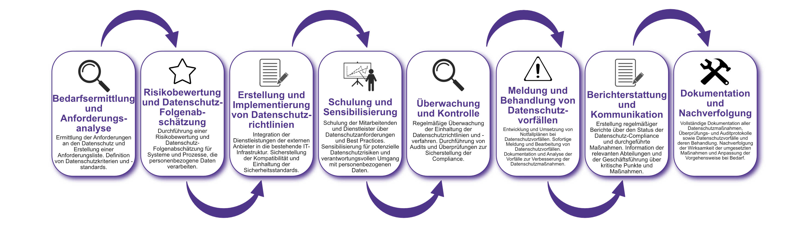

| Author | Dipl.-Ing. Daniel Mrskos, BSc |  
|--------|---------------------------------------------------------------|   
| Funktion | CEO von Security mit Passion, Penetration Tester, Mentor, FH-Lektor, NIS Prüfer |                               
| Datum  | 04. Juli 2024                                                 |
|     |                          |                                              |
| Zertifizierungen  | CSOM, CRTL, eCPTXv2, eWPTXv2, CCD, eCTHPv2, CRTE, CRTO, eCMAP, PNPT, eCPPTv2, eWPT, eCIR, CRTP, CARTP, PAWSP, eMAPT, eCXD, eCDFP, BTL1 (Gold), CAPEN, eEDA, OSWP, CNSP, Comptia Pentest+, ITIL Foundation V3, ICCA, CCNA, eJPTv2, Developing Security Software (LFD121), CAP, Checkmarx Security Champion                                         |
| LinkedIN  | [https://www.linkedin.com/in/dipl-ing-daniel-mrskos-bsc-0720081ab/](https://www.linkedin.com/in/dipl-ing-daniel-mrskos-bsc-0720081ab/)  
| Website  | [https://security-mit-passion.at](https://security-mit-passion.at)  

---

### Prozessbeschreibung: Datenschutz-Compliance

#### Prozessname
Datenschutz-Compliance

#### Prozessverantwortliche
- Max Mustermann (Datenschutzbeauftragter)
- Erika Mustermann (Leiterin IT-Abteilung)

#### Ziele des Prozesses
Dieser Prozess hat das Ziel, die Einhaltung der Datenschutzbestimmungen sicherzustellen, um die Vertraulichkeit, Integrität und Verfügbarkeit personenbezogener Daten zu gewährleisten und rechtliche und regulatorische Anforderungen zu erfüllen.

#### Beteiligte Stellen
- Datenschutzabteilung
- IT-Abteilung
- Compliance-Abteilung
- Fachabteilungen
- Externe Berater

#### Anforderungen an die auslösende Stelle
Die Datenschutz-Compliance wird ausgelöst durch:
- Einführung neuer Systeme oder Anwendungen, die personenbezogene Daten verarbeiten
- Regelmäßige Überprüfungen und Audits
- Datenschutzvorfälle oder Meldungen
- Änderungen in den gesetzlichen oder regulatorischen Anforderungen

#### Anforderungen an die Ressourcen
- Datenschutzmanagement-Software
- Verschlüsselungs- und Anonymisierungstools
- Fachliche Expertise in Datenschutzrecht und IT-Sicherheit
- Dokumentationssysteme für Datenschutzrichtlinien und -protokolle

#### Kosten und Zeitaufwand
- Einmalige Implementierung des Datenschutz-Compliance-Systems: ca. 70-120 Stunden
- Regelmäßige Überprüfungen und Audits: ca. 15-30 Stunden pro Monat

#### Ablauf / Tätigkeit

1. **Bedarfsermittlung und Anforderungsanalyse**
   - Verantwortlich: Datenschutzabteilung, Fachabteilungen
   - Beschreibung: Ermittlung der Anforderungen an den Datenschutz und Erstellung einer Anforderungsliste. Definition von Datenschutzkriterien und -standards.

2. **Risikobewertung und Datenschutz-Folgenabschätzung**
   - Verantwortlich: Datenschutzabteilung, IT-Abteilung
   - Beschreibung: Durchführung einer Risikobewertung und Datenschutz-Folgenabschätzung für Systeme und Prozesse, die personenbezogene Daten verarbeiten.

3. **Erstellung und Implementierung von Datenschutzrichtlinien**
   - Verantwortlich: Datenschutzabteilung, Compliance-Abteilung
   - Beschreibung: Erstellung und Implementierung von Datenschutzrichtlinien und -verfahren, um die Einhaltung der Datenschutzbestimmungen sicherzustellen.

4. **Schulung und Sensibilisierung**
   - Verantwortlich: Datenschutzabteilung
   - Beschreibung: Schulung der Mitarbeitenden und Dienstleister über Datenschutzanforderungen und Best Practices. Sensibilisierung für potenzielle Datenschutzrisiken und verantwortungsvollen Umgang mit personenbezogenen Daten.

5. **Überwachung und Kontrolle**
   - Verantwortlich: Datenschutzabteilung, IT-Abteilung
   - Beschreibung: Regelmäßige Überwachung der Einhaltung der Datenschutzrichtlinien und -verfahren. Durchführung von Audits und Überprüfungen zur Sicherstellung der Compliance.

6. **Meldung und Behandlung von Datenschutzvorfällen**
   - Verantwortlich: Datenschutzabteilung, IT-Abteilung
   - Beschreibung: Entwicklung und Umsetzung von Notfallplänen bei Datenschutzvorfällen. Sofortige Meldung und Bearbeitung von Datenschutzvorfällen. Dokumentation und Analyse der Vorfälle zur Verbesserung der Datenschutzmaßnahmen.

7. **Berichterstattung und Kommunikation**
   - Verantwortlich: Datenschutzabteilung, Compliance-Abteilung
   - Beschreibung: Erstellung regelmäßiger Berichte über den Status der Datenschutz-Compliance und durchgeführte Maßnahmen. Information der relevanten Abteilungen und der Geschäftsführung über kritische Punkte und Maßnahmen.

8. **Dokumentation und Nachverfolgung**
   - Verantwortlich: Datenschutzbeauftragter
   - Beschreibung: Vollständige Dokumentation aller Datenschutzmaßnahmen, Überprüfungs- und Auditprotokolle sowie Datenschutzvorfälle und deren Behandlung. Nachverfolgung der Wirksamkeit der umgesetzten Maßnahmen und Anpassung der Vorgehensweise bei Bedarf.

 

#### Dokumentation
Alle Schritte und Entscheidungen im Prozess werden dokumentiert und revisionssicher archiviert. Dazu gehören:
- Anforderungsliste und Datenschutzkriterien
- Datenschutz-Folgenabschätzungen
- Datenschutzrichtlinien und -verfahren
- Schulungsunterlagen und Teilnahmeprotokolle
- Überwachungs- und Auditprotokolle
- Datenschutzvorfallsberichte und Maßnahmenpläne

#### Kommunikationswege
- Regelmäßige Berichte an die Geschäftsführung über den Status der Datenschutz-Compliance und durchgeführte Maßnahmen
- Information der beteiligten Abteilungen über Ergebnisse der Überwachungen und Audits durch E-Mails und Intranet-Ankündigungen
- Bereitstellung der Dokumentation im internen Dokumentenmanagementsystem