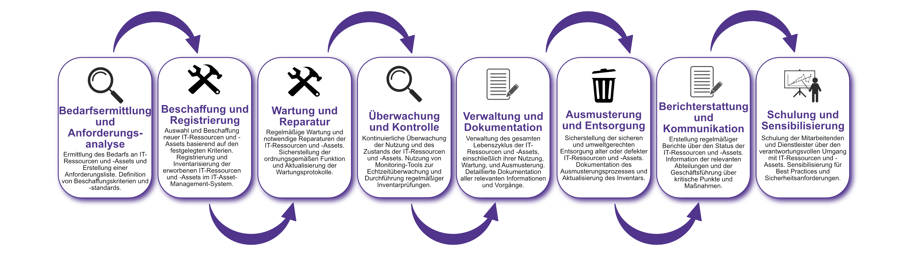

| Author | Dipl.-Ing. Daniel Mrskos, BSc |  
|--------|---------------------------------------------------------------|   
| Funktion | CEO von Security mit Passion, Penetration Tester, Mentor, FH-Lektor, NIS Prüfer |                               
| Datum  | 04. Juli 2024                                                 |
|     |                          |                                              |
| Zertifizierungen  | CSOM, CRTL, eCPTXv2, eWPTXv2, CCD, eCTHPv2, CRTE, CRTO, eCMAP, PNPT, eCPPTv2, eWPT, eCIR, CRTP, CARTP, PAWSP, eMAPT, eCXD, eCDFP, BTL1 (Gold), CAPEN, eEDA, OSWP, CNSP, Comptia Pentest+, ITIL Foundation V3, ICCA, CCNA, eJPTv2, Developing Security Software (LFD121), CAP, Checkmarx Security Champion                                         |
| LinkedIN  | [https://www.linkedin.com/in/dipl-ing-daniel-mrskos-bsc-0720081ab/](https://www.linkedin.com/in/dipl-ing-daniel-mrskos-bsc-0720081ab/)  
| Website  | [https://security-mit-passion.at](https://security-mit-passion.at)  

---

### Prozessbeschreibung: Verwaltung von IT-Ressourcen und -Assets

#### Prozessname
Verwaltung von IT-Ressourcen und -Assets

#### Prozessverantwortliche
- Max Mustermann (IT-Asset-Manager)
- Erika Mustermann (Leiterin IT-Abteilung)

#### Ziele des Prozesses
Dieser Prozess hat das Ziel, den gesamten Lebenszyklus von IT-Ressourcen und -Assets zu verwalten, um deren effektive Nutzung, Wartung, Sicherheit und Kosteneffizienz sicherzustellen.

#### Beteiligte Stellen
- IT-Abteilung
- Beschaffungsabteilung
- Finanzabteilung
- Fachabteilungen
- Externe Dienstleister

#### Anforderungen an die auslösende Stelle
Die Verwaltung von IT-Ressourcen und -Assets wird ausgelöst durch:
- Anschaffung neuer IT-Ressourcen und -Assets
- Regelmäßige Inventarprüfungen und -audits
- Wartungs- und Reparaturbedarf
- Ausmusterung und Entsorgung alter oder defekter IT-Ressourcen und -Assets

#### Anforderungen an die Ressourcen
- IT-Asset-Management-Software
- Wartungs- und Reparaturtools
- Fachliche Expertise in IT-Asset-Management und IT-Sicherheit
- Dokumentationssysteme für Inventar und Wartungsprotokolle

#### Kosten und Zeitaufwand
- Einmalige Implementierung des IT-Asset-Management-Systems: ca. 60-100 Stunden
- Regelmäßige Überprüfungen und Wartung: ca. 10-20 Stunden pro Monat

#### Ablauf / Tätigkeit

1. **Bedarfsermittlung und Anforderungsanalyse**
   - Verantwortlich: IT-Abteilung, Fachabteilungen
   - Beschreibung: Ermittlung des Bedarfs an IT-Ressourcen und -Assets und Erstellung einer Anforderungsliste. Definition von Beschaffungskriterien und -standards.

2. **Beschaffung und Registrierung**
   - Verantwortlich: Beschaffungsabteilung, IT-Abteilung
   - Beschreibung: Auswahl und Beschaffung neuer IT-Ressourcen und -Assets basierend auf den festgelegten Kriterien. Registrierung und Inventarisierung der erworbenen IT-Ressourcen und -Assets im IT-Asset-Management-System.

3. **Wartung und Reparatur**
   - Verantwortlich: IT-Abteilung, Externe Dienstleister
   - Beschreibung: Regelmäßige Wartung und notwendige Reparaturen der IT-Ressourcen und -Assets. Sicherstellung der ordnungsgemäßen Funktion und Aktualisierung der Wartungsprotokolle.

4. **Überwachung und Kontrolle**
   - Verantwortlich: IT-Abteilung
   - Beschreibung: Kontinuierliche Überwachung der Nutzung und des Zustands der IT-Ressourcen und -Assets. Nutzung von Monitoring-Tools zur Echtzeitüberwachung und Durchführung regelmäßiger Inventarprüfungen.

5. **Verwaltung und Dokumentation**
   - Verantwortlich: IT-Abteilung, Finanzabteilung
   - Beschreibung: Verwaltung des gesamten Lebenszyklus der IT-Ressourcen und -Assets, einschließlich ihrer Nutzung, Wartung, und Ausmusterung. Detaillierte Dokumentation aller relevanten Informationen und Vorgänge.

6. **Ausmusterung und Entsorgung**
   - Verantwortlich: IT-Abteilung, Externe Dienstleister
   - Beschreibung: Sicherstellung der sicheren und umweltgerechten Entsorgung alter oder defekter IT-Ressourcen und -Assets. Dokumentation des Ausmusterungsprozesses und Aktualisierung des Inventars.

7. **Berichterstattung und Kommunikation**
   - Verantwortlich: IT-Abteilung, Finanzabteilung
   - Beschreibung: Erstellung regelmäßiger Berichte über den Status der IT-Ressourcen und -Assets. Information der relevanten Abteilungen und der Geschäftsführung über kritische Punkte und Maßnahmen.

8. **Schulung und Sensibilisierung**
   - Verantwortlich: IT-Abteilung
   - Beschreibung: Schulung der Mitarbeitenden und Dienstleister über den verantwortungsvollen Umgang mit IT-Ressourcen und -Assets. Sensibilisierung für Best Practices und Sicherheitsanforderungen.

 

#### Dokumentation
Alle Schritte und Entscheidungen im Prozess werden dokumentiert und revisionssicher archiviert. Dazu gehören:
- Anforderungsliste und Beschaffungskriterien
- Registrierungs- und Inventarprotokolle
- Wartungs- und Reparaturprotokolle
- Überwachungs- und Auditprotokolle
- Dokumentation des Ausmusterungs- und Entsorgungsprozesses

#### Kommunikationswege
- Regelmäßige Berichte an die Geschäftsführung über den Status der IT-Ressourcen und -Assets und durchgeführte Maßnahmen
- Information der beteiligten Abteilungen über Ergebnisse der Überwachungen und Audits durch E-Mails und Intranet-Ankündigungen
- Bereitstellung der Dokumentation im internen Dokumentenmanagementsystem