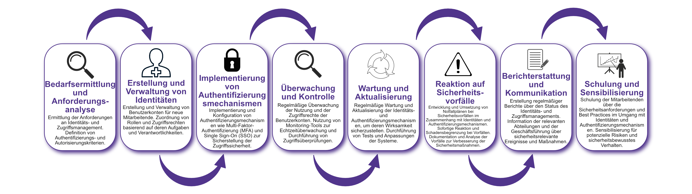

| Author | Dipl.-Ing. Daniel Mrskos, BSc |  
|--------|---------------------------------------------------------------|   
| Funktion | CEO von Security mit Passion, Penetration Tester, Mentor, FH-Lektor, NIS Prüfer |                               
| Datum  | 04. Juli 2024                                                 |
|     |                          |                                              |
| Zertifizierungen  | CSOM, CRTL, eCPTXv2, eWPTXv2, CCD, eCTHPv2, CRTE, CRTO, eCMAP, PNPT, eCPPTv2, eWPT, eCIR, CRTP, CARTP, PAWSP, eMAPT, eCXD, eCDFP, BTL1 (Gold), CAPEN, eEDA, OSWP, CNSP, Comptia Pentest+, ITIL Foundation V3, ICCA, CCNA, eJPTv2, Developing Security Software (LFD121), CAP, Checkmarx Security Champion                                         |
| LinkedIN  | [https://www.linkedin.com/in/dipl-ing-daniel-mrskos-bsc-0720081ab/](https://www.linkedin.com/in/dipl-ing-daniel-mrskos-bsc-0720081ab/)  
| Website  | [https://security-mit-passion.at](https://security-mit-passion.at)  

---

### Prozessbeschreibung: Verwaltung von Identitäten und Authentifizierungsmechanismen

#### Prozessname
Verwaltung von Identitäten und Authentifizierungsmechanismen

#### Prozessverantwortliche
- Max Mustermann (IT-Sicherheitsbeauftragter)
- Erika Mustermann (Leiterin IT-Abteilung)

#### Ziele des Prozesses
Dieser Prozess hat das Ziel, die Identitäten und Authentifizierungsmechanismen innerhalb der Organisation zu verwalten, um sicherzustellen, dass nur autorisierte Personen Zugang zu den IT-Systemen und -Ressourcen haben.

#### Beteiligte Stellen
- IT-Abteilung
- Compliance-Abteilung
- Personalabteilung
- Fachabteilungen
- Externe Dienstleister

#### Anforderungen an die auslösende Stelle
Die Verwaltung von Identitäten und Authentifizierungsmechanismen wird ausgelöst durch:
- Einstellung neuer Mitarbeitender
- Änderungen in den Rollen oder Zugriffsrechten bestehender Mitarbeitender
- Austritt von Mitarbeitenden aus der Organisation
- Sicherheitsvorfälle oder Änderungen in den Bedrohungslagen

#### Anforderungen an die Ressourcen
- Identitäts- und Zugriffsmanagement-Software (IAM)
- Authentifizierungstools (z.B. MFA, SSO)
- Fachliche Expertise in IT-Sicherheit und Identitätsmanagement
- Dokumentationssysteme für Richtlinien und Protokolle

#### Kosten und Zeitaufwand
- Einmalige Implementierung des Identitäts- und Zugriffsmanagement-Systems: ca. 80-120 Stunden
- Regelmäßige Überprüfungen und Anpassungen: ca. 10-20 Stunden pro Monat

#### Ablauf / Tätigkeit

1. **Bedarfsermittlung und Anforderungsanalyse**
   - Verantwortlich: IT-Abteilung, Personalabteilung
   - Beschreibung: Ermittlung der Anforderungen an Identitäts- und Zugriffsmanagement. Definition von Authentifizierungs- und Autorisierungskriterien.

2. **Erstellung und Verwaltung von Identitäten**
   - Verantwortlich: IT-Abteilung, Personalabteilung
   - Beschreibung: Erstellung und Verwaltung von Benutzerkonten für neue Mitarbeitende. Zuordnung von Rollen und Zugriffsrechten basierend auf deren Aufgaben und Verantwortlichkeiten.

3. **Implementierung von Authentifizierungsmechanismen**
   - Verantwortlich: IT-Abteilung
   - Beschreibung: Implementierung und Konfiguration von Authentifizierungsmechanismen wie Multi-Faktor-Authentifizierung (MFA) und Single Sign-On (SSO) zur Sicherstellung der Zugriffssicherheit.

4. **Überwachung und Kontrolle**
   - Verantwortlich: IT-Abteilung
   - Beschreibung: Regelmäßige Überwachung der Nutzung und der Zugriffsrechte der Benutzerkonten. Nutzung von Monitoring-Tools zur Echtzeitüberwachung und Durchführung von Zugriffsüberprüfungen.

5. **Wartung und Aktualisierung**
   - Verantwortlich: IT-Abteilung
   - Beschreibung: Regelmäßige Wartung und Aktualisierung der Identitäts- und Authentifizierungsmechanismen, um deren Wirksamkeit sicherzustellen. Durchführung von Tests und Anpassungen der Systeme.

6. **Reaktion auf Sicherheitsvorfälle**
   - Verantwortlich: IT-Abteilung
   - Beschreibung: Entwicklung und Umsetzung von Notfallplänen bei Sicherheitsvorfällen im Zusammenhang mit Identitäten und Authentifizierungsmechanismen. Sofortige Reaktion und Schadensbegrenzung bei Vorfällen. Dokumentation und Analyse der Vorfälle zur Verbesserung der Sicherheitsmaßnahmen.

7. **Berichterstattung und Kommunikation**
   - Verantwortlich: IT-Abteilung, Compliance-Abteilung
   - Beschreibung: Erstellung regelmäßiger Berichte über den Status des Identitäts- und Zugriffsmanagements. Information der relevanten Abteilungen und der Geschäftsführung über sicherheitsrelevante Ereignisse und Maßnahmen.

8. **Schulung und Sensibilisierung**
   - Verantwortlich: IT-Abteilung
   - Beschreibung: Schulung der Mitarbeitenden über die Sicherheitsanforderungen und Best Practices im Umgang mit Identitäten und Authentifizierungsmechanismen. Sensibilisierung für potenzielle Risiken und sicherheitsbewusstes Verhalten.

 

#### Dokumentation
Alle Schritte und Entscheidungen im Prozess werden dokumentiert und revisionssicher archiviert. Dazu gehören:
- Anforderungsliste und Sicherheitskriterien
- Benutzerdaten und Zugriffsrechte
- Authentifizierungsprotokolle
- Überwachungs- und Prüfprotokolle
- Sicherheitsvorfallsberichte und Maßnahmenpläne

#### Kommunikationswege
- Regelmäßige Berichte an die Geschäftsführung über den Status des Identitäts- und Zugriffsmanagements und durchgeführte Maßnahmen
- Information der beteiligten Abteilungen über Ergebnisse der Überwachungen und Audits durch E-Mails und Intranet-Ankündigungen
- Bereitstellung der Dokumentation im internen Dokumentenmanagementsystem