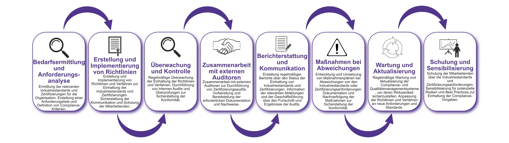

| Author | Dipl.-Ing. Daniel Mrskos, BSc |  
|--------|---------------------------------------------------------------|   
| Funktion | CEO von Security mit Passion, Penetration Tester, Mentor, FH-Lektor, NIS Prüfer |                               
| Datum  | 04. Juli 2024                                                 |
|     |                          |                                              |
| Zertifizierungen  | CSOM, CRTL, eCPTXv2, eWPTXv2, CCD, eCTHPv2, CRTE, CRTO, eCMAP, PNPT, eCPPTv2, eWPT, eCIR, CRTP, CARTP, PAWSP, eMAPT, eCXD, eCDFP, BTL1 (Gold), CAPEN, eEDA, OSWP, CNSP, Comptia Pentest+, ITIL Foundation V3, ICCA, CCNA, eJPTv2, Developing Security Software (LFD121), CAP, Checkmarx Security Champion                                         |
| LinkedIN  | [https://www.linkedin.com/in/dipl-ing-daniel-mrskos-bsc-0720081ab/](https://www.linkedin.com/in/dipl-ing-daniel-mrskos-bsc-0720081ab/)  
| Website  | [https://security-mit-passion.at](https://security-mit-passion.at)  

---

### Prozessbeschreibung: Einhaltung von Industriestandards und Zertifizierungen

#### Prozessname
Einhaltung von Industriestandards und Zertifizierungen

#### Prozessverantwortliche
- Max Mustermann (Compliance-Beauftragter)
- Erika Mustermann (Leiterin Qualitätsmanagement)

#### Ziele des Prozesses
Dieser Prozess hat das Ziel, die Einhaltung von Industriestandards und Zertifizierungen sicherzustellen, um die Qualität und Konformität der Produkte und Dienstleistungen der Organisation zu gewährleisten und die rechtlichen und regulatorischen Anforderungen zu erfüllen.

#### Beteiligte Stellen
- Compliance-Abteilung
- Qualitätsmanagement
- IT-Abteilung
- Fachabteilungen
- Externe Auditoren

#### Anforderungen an die auslösende Stelle
Die Einhaltung von Industriestandards und Zertifizierungen wird ausgelöst durch:
- Einführung neuer Produkte oder Dienstleistungen
- Regelmäßige Überprüfungen und Audits
- Veränderungen in den gesetzlichen oder regulatorischen Anforderungen
- Sicherheitsvorfälle oder Qualitätsprobleme

#### Anforderungen an die Ressourcen
- Compliance-Management-Software
- Audit- und Überwachungstools
- Fachliche Expertise in Industriestandards und Zertifizierungen
- Dokumentationssysteme für Richtlinien und Protokolle

#### Kosten und Zeitaufwand
- Einmalige Implementierung des Compliance-Management-Systems: ca. 70-120 Stunden
- Regelmäßige Überprüfungen und Audits: ca. 15-30 Stunden pro Monat

#### Ablauf / Tätigkeit

1. **Bedarfsermittlung und Anforderungsanalyse**
   - Verantwortlich: Compliance-Abteilung, Qualitätsmanagement
   - Beschreibung: Ermittlung der relevanten Industriestandards und Zertifizierungen für die Organisation. Erstellung einer Anforderungsliste und Definition von Compliance-Kriterien.

2. **Erstellung und Implementierung von Richtlinien**
   - Verantwortlich: Compliance-Abteilung, Qualitätsmanagement
   - Beschreibung: Erstellung und Implementierung von Richtlinien und Verfahren zur Einhaltung der Industriestandards und Zertifizierungen. Sicherstellung der Kommunikation und Schulung der Mitarbeitenden.

3. **Überwachung und Kontrolle**
   - Verantwortlich: Compliance-Abteilung, Qualitätsmanagement
   - Beschreibung: Regelmäßige Überwachung der Einhaltung der Richtlinien und Verfahren. Durchführung von internen Audits und Überprüfungen zur Sicherstellung der Konformität.

4. **Zusammenarbeit mit externen Auditoren**
   - Verantwortlich: Compliance-Abteilung, Qualitätsmanagement
   - Beschreibung: Zusammenarbeit mit externen Auditoren zur Durchführung von Zertifizierungsaudits. Vorbereitung und Bereitstellung der erforderlichen Dokumentation und Nachweise.

5. **Berichterstattung und Kommunikation**
   - Verantwortlich: Compliance-Abteilung, Qualitätsmanagement
   - Beschreibung: Erstellung regelmäßiger Berichte über den Status der Einhaltung von Industriestandards und Zertifizierungen. Information der relevanten Abteilungen und der Geschäftsführung über den Fortschritt und Ergebnisse der Audits.

6. **Maßnahmen bei Abweichungen**
   - Verantwortlich: Compliance-Abteilung, Qualitätsmanagement
   - Beschreibung: Entwicklung und Umsetzung von Maßnahmenplänen bei Abweichungen von den Industriestandards oder Zertifizierungsanforderungen. Dokumentation und Nachverfolgung der Maßnahmen zur Sicherstellung der Konformität.

7. **Wartung und Aktualisierung**
   - Verantwortlich: Compliance-Abteilung, Qualitätsmanagement
   - Beschreibung: Regelmäßige Wartung und Aktualisierung der Compliance- und Qualitätsmanagementsysteme, um deren Wirksamkeit sicherzustellen. Anpassung der Richtlinien und Verfahren an neue Anforderungen und Standards.

8. **Schulung und Sensibilisierung**
   - Verantwortlich: Compliance-Abteilung, Qualitätsmanagement
   - Beschreibung: Schulung der Mitarbeitenden über die Industriestandards und Zertifizierungsanforderungen. Sensibilisierung für potenzielle Risiken und Best Practices zur Einhaltung der Compliance-Vorgaben.

 

#### Dokumentation
Alle Schritte und Entscheidungen im Prozess werden dokumentiert und revisionssicher archiviert. Dazu gehören:
- Anforderungsliste und Compliance-Kriterien
- Richtlinien und Verfahren
- Überwachungs- und Auditprotokolle
- Berichte der externen Auditoren
- Maßnahmenpläne und Umsetzungsergebnisse

#### Kommunikationswege
- Regelmäßige Berichte an die Geschäftsführung über den Status der Einhaltung von Industriestandards und Zertifizierungen und durchgeführte Maßnahmen
- Information der beteiligten Abteilungen über Ergebnisse der Überwachungen und Audits durch E-Mails und Intranet-Ankündigungen
- Bereitstellung der Dokumentation im internen Dokumentenmanagementsystem