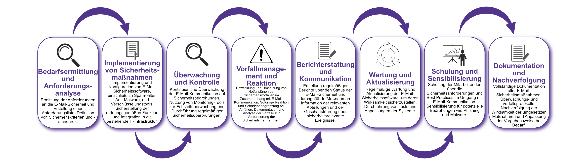

| Author | Dipl.-Ing. Daniel Mrskos, BSc |  
|--------|---------------------------------------------------------------|   
| Funktion | CEO von Security mit Passion, Penetration Tester, Mentor, FH-Lektor, NIS Prüfer |                               
| Datum  | 04. Juli 2024                                                 |
|     |                          |                                              |
| Zertifizierungen  | CSOM, CRTL, eCPTXv2, eWPTXv2, CCD, eCTHPv2, CRTE, CRTO, eCMAP, PNPT, eCPPTv2, eWPT, eCIR, CRTP, CARTP, PAWSP, eMAPT, eCXD, eCDFP, BTL1 (Gold), CAPEN, eEDA, OSWP, CNSP, Comptia Pentest+, ITIL Foundation V3, ICCA, CCNA, eJPTv2, Developing Security Software (LFD121), CAP, Checkmarx Security Champion                                         |
| LinkedIN  | [https://www.linkedin.com/in/dipl-ing-daniel-mrskos-bsc-0720081ab/](https://www.linkedin.com/in/dipl-ing-daniel-mrskos-bsc-0720081ab/)  
| Website  | [https://security-mit-passion.at](https://security-mit-passion.at)  

---

### Prozessbeschreibung: Verwaltung von E-Mail-Sicherheit

#### Prozessname
Verwaltung von E-Mail-Sicherheit

#### Prozessverantwortliche
- Max Mustermann (IT-Sicherheitsbeauftragter)
- Erika Mustermann (Leiterin IT-Abteilung)

#### Ziele des Prozesses
Dieser Prozess hat das Ziel, die Sicherheit der E-Mail-Kommunikation innerhalb der Organisation zu gewährleisten, um Bedrohungen wie Phishing, Spam, Malware und Datenverlust zu verhindern und die Vertraulichkeit, Integrität und Verfügbarkeit der E-Mails sicherzustellen.

#### Beteiligte Stellen
- IT-Abteilung
- Compliance-Abteilung
- Fachabteilungen
- Externe Sicherheitsdienstleister

#### Anforderungen an die auslösende Stelle
Die Verwaltung der E-Mail-Sicherheit wird ausgelöst durch:
- Implementierung neuer E-Mail-Systeme oder -Dienste
- Regelmäßige Überprüfungen und Audits der E-Mail-Sicherheit
- Sicherheitsvorfälle oder Änderungen in den Bedrohungslagen
- Änderungen in den gesetzlichen oder regulatorischen Anforderungen

#### Anforderungen an die Ressourcen
- E-Mail-Sicherheitssoftware (z.B. Spam-Filter, Anti-Malware, Verschlüsselungstools)
- Fachliche Expertise in E-Mail-Sicherheit und IT-Sicherheitsstandards
- Dokumentationssysteme für Sicherheitsrichtlinien und -protokolle

#### Kosten und Zeitaufwand
- Einmalige Implementierung der E-Mail-Sicherheitsmaßnahmen: ca. 50-100 Stunden
- Regelmäßige Überprüfungen und Wartung: ca. 10-20 Stunden pro Monat

#### Ablauf / Tätigkeit

1. **Bedarfsermittlung und Anforderungsanalyse**
   - Verantwortlich: IT-Abteilung, Compliance-Abteilung
   - Beschreibung: Ermittlung der Anforderungen an die E-Mail-Sicherheit und Erstellung einer Anforderungsliste. Definition von Sicherheitskriterien und -standards.

2. **Implementierung von Sicherheitsmaßnahmen**
   - Verantwortlich: IT-Abteilung, Externe Sicherheitsdienstleister
   - Beschreibung: Implementierung und Konfiguration von E-Mail-Sicherheitssoftware, einschließlich Spam-Filter, Anti-Malware, und Verschlüsselungstools. Sicherstellung der ordnungsgemäßen Funktion und Integration in die bestehende IT-Infrastruktur.

3. **Überwachung und Kontrolle**
   - Verantwortlich: IT-Abteilung
   - Beschreibung: Kontinuierliche Überwachung der E-Mail-Kommunikation auf Sicherheitsbedrohungen. Nutzung von Monitoring-Tools zur Echtzeitüberwachung und Durchführung regelmäßiger Sicherheitsüberprüfungen.

4. **Vorfallmanagement und Reaktion**
   - Verantwortlich: IT-Abteilung, Sicherheitsdienstleister
   - Beschreibung: Entwicklung und Umsetzung von Notfallplänen bei Sicherheitsvorfällen im Zusammenhang mit E-Mail-Kommunikation. Sofortige Reaktion und Schadensbegrenzung bei Vorfällen. Dokumentation und Analyse der Vorfälle zur Verbesserung der Sicherheitsmaßnahmen.

5. **Berichterstattung und Kommunikation**
   - Verantwortlich: IT-Abteilung, Compliance-Abteilung
   - Beschreibung: Erstellung regelmäßiger Berichte über den Status der E-Mail-Sicherheit und durchgeführte Maßnahmen. Information der relevanten Abteilungen und der Geschäftsführung über sicherheitsrelevante Ereignisse.

6. **Wartung und Aktualisierung**
   - Verantwortlich: IT-Abteilung
   - Beschreibung: Regelmäßige Wartung und Aktualisierung der E-Mail-Sicherheitssoftware, um deren Wirksamkeit sicherzustellen. Durchführung von Tests und Anpassungen der Systeme.

7. **Schulung und Sensibilisierung**
   - Verantwortlich: IT-Abteilung
   - Beschreibung: Schulung der Mitarbeitenden über die Sicherheitsanforderungen und Best Practices im Umgang mit E-Mail-Kommunikation. Sensibilisierung für potenzielle Bedrohungen wie Phishing und Malware.

8. **Dokumentation und Nachverfolgung**
   - Verantwortlich: IT-Sicherheitsbeauftragter
   - Beschreibung: Vollständige Dokumentation aller E-Mail-Sicherheitsmaßnahmen, Überwachungs- und Vorfallsprotokolle. Nachverfolgung der Wirksamkeit der umgesetzten Maßnahmen und Anpassung der Vorgehensweise bei Bedarf.
   
 

#### Dokumentation
Alle Schritte und Entscheidungen im Prozess werden dokumentiert und revisionssicher archiviert. Dazu gehören:
- Anforderungsliste und Sicherheitskriterien
- Konfigurationsprotokolle der Sicherheitssoftware
- Überwachungs- und Vorfallsprotokolle
- Sicherheitsvorfallsberichte und Maßnahmenpläne

#### Kommunikationswege
- Regelmäßige Berichte an die Geschäftsführung über den Status der E-Mail-Sicherheit und durchgeführte Maßnahmen
- Information der beteiligten Abteilungen über sicherheitsrelevante Ereignisse und Ergebnisse der Überwachungen durch E-Mails und Intranet-Ankündigungen
- Bereitstellung der Dokumentation im internen Dokumentenmanagementsystem