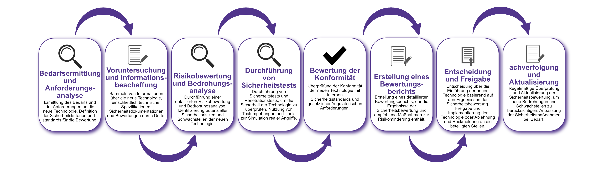

| Author | Dipl.-Ing. Daniel Mrskos, BSc |  
|--------|---------------------------------------------------------------|   
| Funktion | CEO von Security mit Passion, Penetration Tester, Mentor, FH-Lektor, NIS Prüfer |                               
| Datum  | 04. Juli 2024                                                 |
|     |                          |                                              |
| Zertifizierungen  | CSOM, CRTL, eCPTXv2, eWPTXv2, CCD, eCTHPv2, CRTE, CRTO, eCMAP, PNPT, eCPPTv2, eWPT, eCIR, CRTP, CARTP, PAWSP, eMAPT, eCXD, eCDFP, BTL1 (Gold), CAPEN, eEDA, OSWP, CNSP, Comptia Pentest+, ITIL Foundation V3, ICCA, CCNA, eJPTv2, Developing Security Software (LFD121), CAP, Checkmarx Security Champion                                         |
| LinkedIN  | [https://www.linkedin.com/in/dipl-ing-daniel-mrskos-bsc-0720081ab/](https://www.linkedin.com/in/dipl-ing-daniel-mrskos-bsc-0720081ab/)  
| Website  | [https://security-mit-passion.at](https://security-mit-passion.at)  

---

### Prozessbeschreibung: Sicherheitsbewertung neuer Technologien

#### Prozessname
Sicherheitsbewertung neuer Technologien

#### Prozessverantwortliche
- Max Mustermann (IT-Sicherheitsbeauftragter)
- Erika Mustermann (Leiterin IT-Abteilung)

#### Ziele des Prozesses
Dieser Prozess hat das Ziel, die Sicherheit neuer Technologien zu bewerten, bevor sie in der Organisation eingeführt werden, um potenzielle Sicherheitsrisiken zu identifizieren und zu mitigieren.

#### Beteiligte Stellen
- IT-Abteilung
- Compliance-Abteilung
- Fachabteilungen
- Externe Sicherheitsberater
- Lieferanten/Hersteller

#### Anforderungen an die auslösende Stelle
Die Sicherheitsbewertung neuer Technologien wird ausgelöst durch:
- Vorschläge zur Einführung neuer Technologien
- Änderungen oder Upgrades bestehender Technologien
- Identifizierung neuer Bedrohungen oder Sicherheitsanforderungen

#### Anforderungen an die Ressourcen
- Tools für Sicherheitsbewertung und -tests
- Fachliche Expertise in IT-Sicherheit und spezifischen Technologien
- Dokumentationssysteme für Sicherheitsbewertungen und Protokolle

#### Kosten und Zeitaufwand
- Einmalige Durchführung der Sicherheitsbewertung: ca. 40-80 Stunden
- Regelmäßige Aktualisierungen und Nachbewertungen: ca. 5-10 Stunden pro Monat

#### Ablauf / Tätigkeit

1. **Bedarfsermittlung und Anforderungsanalyse**
   - Verantwortlich: IT-Abteilung, Fachabteilungen
   - Beschreibung: Ermittlung des Bedarfs und der Anforderungen an die neue Technologie. Definition der Sicherheitskriterien und -standards für die Bewertung.

2. **Voruntersuchung und Informationsbeschaffung**
   - Verantwortlich: IT-Abteilung, Externe Sicherheitsberater
   - Beschreibung: Sammeln von Informationen über die neue Technologie, einschließlich technischer Spezifikationen, Sicherheitsdokumentationen und Bewertungen durch Dritte.

3. **Risikobewertung und Bedrohungsanalyse**
   - Verantwortlich: IT-Abteilung, Externe Sicherheitsberater
   - Beschreibung: Durchführung einer detaillierten Risikobewertung und Bedrohungsanalyse. Identifizierung potenzieller Sicherheitsrisiken und Schwachstellen der neuen Technologie.

4. **Durchführung von Sicherheitstests**
   - Verantwortlich: IT-Abteilung, Externe Sicherheitsberater
   - Beschreibung: Durchführung von Sicherheitstests und Penetrationstests, um die Sicherheit der Technologie zu überprüfen. Nutzung von Testumgebungen und -tools zur Simulation realer Angriffe.

5. **Bewertung der Konformität**
   - Verantwortlich: Compliance-Abteilung, IT-Abteilung
   - Beschreibung: Überprüfung der Konformität der neuen Technologie mit internen Sicherheitsstandards und gesetzlichen/regulatorischen Anforderungen.

6. **Erstellung eines Bewertungsberichts**
   - Verantwortlich: IT-Abteilung, Compliance-Abteilung
   - Beschreibung: Erstellung eines detaillierten Bewertungsberichts, der die Ergebnisse der Sicherheitsbewertung und empfohlene Maßnahmen zur Risikominderung enthält.

7. **Entscheidung und Freigabe**
   - Verantwortlich: Geschäftsführung, IT-Abteilung
   - Beschreibung: Entscheidung über die Einführung der neuen Technologie basierend auf den Ergebnissen der Sicherheitsbewertung. Freigabe und Implementierung der Technologie oder Ablehnung und Rückmeldung an die beteiligten Stellen.

8. **Nachverfolgung und Aktualisierung**
   - Verantwortlich: IT-Abteilung, Externe Sicherheitsberater
   - Beschreibung: Regelmäßige Überprüfung und Aktualisierung der Sicherheitsbewertung, um neue Bedrohungen und Schwachstellen zu berücksichtigen. Anpassung der Sicherheitsmaßnahmen bei Bedarf.

 

#### Dokumentation
Alle Schritte und Entscheidungen im Prozess werden dokumentiert und revisionssicher archiviert. Dazu gehören:
- Anforderungsliste und Sicherheitskriterien
- Informations- und Bewertungsprotokolle
- Risikobewertungs- und Testberichte
- Bewertungsberichte und Entscheidungsvorlagen

#### Kommunikationswege
- Regelmäßige Berichte an die Geschäftsführung über den Status der Sicherheitsbewertung und durchgeführte Maßnahmen
- Information der beteiligten Abteilungen über Ergebnisse der Sicherheitsbewertung und empfohlene Maßnahmen durch E-Mails und Intranet-Ankündigungen
- Bereitstellung der Dokumentation im internen Dokumentenmanagementsystem