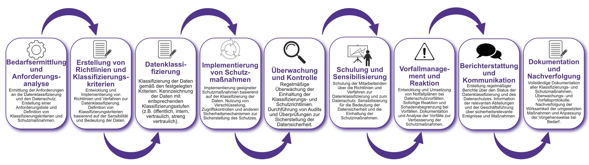

| Author | Dipl.-Ing. Daniel Mrskos, BSc |  
|--------|---------------------------------------------------------------|   
| Funktion | CEO von Security mit Passion, Penetration Tester, Mentor, FH-Lektor, NIS Prüfer |                               
| Datum  | 04. Juli 2024                                                 |
|     |                          |                                              |
| Zertifizierungen  | CSOM, CRTL, eCPTXv2, eWPTXv2, CCD, eCTHPv2, CRTE, CRTO, eCMAP, PNPT, eCPPTv2, eWPT, eCIR, CRTP, CARTP, PAWSP, eMAPT, eCXD, eCDFP, BTL1 (Gold), CAPEN, eEDA, OSWP, CNSP, Comptia Pentest+, ITIL Foundation V3, ICCA, CCNA, eJPTv2, Developing Security Software (LFD121), CAP, Checkmarx Security Champion                                         |
| LinkedIN  | [https://www.linkedin.com/in/dipl-ing-daniel-mrskos-bsc-0720081ab/](https://www.linkedin.com/in/dipl-ing-daniel-mrskos-bsc-0720081ab/)  
| Website  | [https://security-mit-passion.at](https://security-mit-passion.at)  

---

### Prozessbeschreibung: Verwaltung von Datenklassifizierung und -schutz

#### Prozessname
Verwaltung von Datenklassifizierung und -schutz

#### Prozessverantwortliche
- Max Mustermann (Datenschutzbeauftragter)
- Erika Mustermann (Leiterin IT-Abteilung)

#### Ziele des Prozesses
Dieser Prozess hat das Ziel, Daten nach ihrer Sensibilität und Bedeutung zu klassifizieren und entsprechende Schutzmaßnahmen zu implementieren, um die Vertraulichkeit, Integrität und Verfügbarkeit der Daten zu gewährleisten und gesetzliche und regulatorische Anforderungen zu erfüllen.

#### Beteiligte Stellen
- IT-Abteilung
- Datenschutzabteilung
- Compliance-Abteilung
- Fachabteilungen
- Externe Berater

#### Anforderungen an die auslösende Stelle
Die Verwaltung von Datenklassifizierung und -schutz wird ausgelöst durch:
- Erstellung neuer Datensätze oder Informationssysteme
- Änderungen in den gesetzlichen oder regulatorischen Anforderungen
- Identifizierung neuer Bedrohungen oder Sicherheitsanforderungen
- Regelmäßige Überprüfungen und Audits der Datensicherheit

#### Anforderungen an die Ressourcen
- Datenklassifizierungs- und Datenschutz-Software
- Verschlüsselungs- und Zugriffssteuerungstools
- Fachliche Expertise in Datenschutz und IT-Sicherheit
- Dokumentationssysteme für Richtlinien und Protokolle

#### Kosten und Zeitaufwand
- Einmalige Implementierung des Datenklassifizierungs- und -schutzsystems: ca. 80-120 Stunden
- Regelmäßige Überprüfungen und Wartung: ca. 15-30 Stunden pro Monat

#### Ablauf / Tätigkeit

1. **Bedarfsermittlung und Anforderungsanalyse**
   - Verantwortlich: IT-Abteilung, Datenschutzabteilung
   - Beschreibung: Ermittlung der Anforderungen an die Datenklassifizierung und den Datenschutz. Erstellung einer Anforderungsliste und Definition von Klassifizierungskriterien und Schutzmaßnahmen.

2. **Erstellung von Richtlinien und Klassifizierungskriterien**
   - Verantwortlich: Datenschutzabteilung, Compliance-Abteilung
   - Beschreibung: Entwicklung und Implementierung von Richtlinien und Verfahren zur Datenklassifizierung. Definition von Klassifizierungskriterien basierend auf der Sensibilität und Bedeutung der Daten.

3. **Datenklassifizierung**
   - Verantwortlich: IT-Abteilung, Fachabteilungen
   - Beschreibung: Klassifizierung der Daten gemäß den festgelegten Kriterien. Kennzeichnung der Daten mit entsprechenden Klassifizierungsstufen (z.B. öffentlich, intern, vertraulich, streng vertraulich).

4. **Implementierung von Schutzmaßnahmen**
   - Verantwortlich: IT-Abteilung
   - Beschreibung: Implementierung geeigneter Schutzmaßnahmen basierend auf der Klassifizierung der Daten. Nutzung von Verschlüsselung, Zugriffskontrollen und anderen Sicherheitsmechanismen zur Sicherstellung des Schutzes.

5. **Überwachung und Kontrolle**
   - Verantwortlich: IT-Abteilung, Datenschutzabteilung
   - Beschreibung: Regelmäßige Überwachung der Einhaltung der Klassifizierungs- und Schutzrichtlinien. Durchführung von Audits und Überprüfungen zur Sicherstellung der Datensicherheit.

6. **Schulung und Sensibilisierung**
   - Verantwortlich: Datenschutzabteilung, IT-Abteilung
   - Beschreibung: Schulung der Mitarbeitenden über die Richtlinien und Verfahren zur Datenklassifizierung und zum Datenschutz. Sensibilisierung für die Bedeutung der Datensicherheit und die Einhaltung der Schutzmaßnahmen.

7. **Vorfallmanagement und Reaktion**
   - Verantwortlich: IT-Abteilung, Datenschutzabteilung
   - Beschreibung: Entwicklung und Umsetzung von Notfallplänen bei Datenschutzvorfällen. Sofortige Reaktion und Schadensbegrenzung bei Vorfällen. Dokumentation und Analyse der Vorfälle zur Verbesserung der Schutzmaßnahmen.

8. **Berichterstattung und Kommunikation**
   - Verantwortlich: Datenschutzabteilung, Compliance-Abteilung
   - Beschreibung: Erstellung regelmäßiger Berichte über den Status der Datenklassifizierung und des Datenschutzes. Information der relevanten Abteilungen und der Geschäftsführung über sicherheitsrelevante Ereignisse und Maßnahmen.

9. **Dokumentation und Nachverfolgung**
   - Verantwortlich: Datenschutzbeauftragter
   - Beschreibung: Vollständige Dokumentation aller Klassifizierungs- und Schutzmaßnahmen, Überwachungs- und Vorfallsprotokolle. Nachverfolgung der Wirksamkeit der umgesetzten Maßnahmen und Anpassung der Vorgehensweise bei Bedarf.

 

#### Dokumentation
Alle Schritte und Entscheidungen im Prozess werden dokumentiert und revisionssicher archiviert. Dazu gehören:
- Anforderungsliste und Klassifizierungskriterien
- Richtlinien und Verfahren zur Datenklassifizierung und -schutz
- Klassifizierungsprotokolle
- Überwachungs- und Auditprotokolle
- Datenschutzvorfallsberichte und Maßnahmenpläne

#### Kommunikationswege
- Regelmäßige Berichte an die Geschäftsführung über den Status der Datenklassifizierung und des Datenschutzes und durchgeführte Maßnahmen
- Information der beteiligten Abteilungen über Ergebnisse der Überwachungen und Audits durch E-Mails und Intranet-Ankündigungen
- Bereitstellung der Dokumentation im internen Dokumentenmanagementsystem