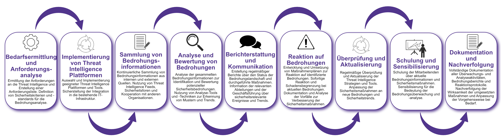

| Author | Dipl.-Ing. Daniel Mrskos, BSc |  
|--------|---------------------------------------------------------------|   
| Funktion | CEO von Security mit Passion, Penetration Tester, Mentor, FH-Lektor, NIS Prüfer |                               
| Datum  | 04. Juli 2024                                                 |
|     |                          |                                              |
| Zertifizierungen  | CSOM, CRTL, eCPTXv2, eWPTXv2, CCD, eCTHPv2, CRTE, CRTO, eCMAP, PNPT, eCPPTv2, eWPT, eCIR, CRTP, CARTP, PAWSP, eMAPT, eCXD, eCDFP, BTL1 (Gold), CAPEN, eEDA, OSWP, CNSP, Comptia Pentest+, ITIL Foundation V3, ICCA, CCNA, eJPTv2, Developing Security Software (LFD121), CAP, Checkmarx Security Champion                                         |
| LinkedIN  | [https://www.linkedin.com/in/dipl-ing-daniel-mrskos-bsc-0720081ab/](https://www.linkedin.com/in/dipl-ing-daniel-mrskos-bsc-0720081ab/)  
| Website  | [https://security-mit-passion.at](https://security-mit-passion.at)  

---
### Prozessbeschreibung: Überwachung und Analyse von Bedrohungsinformationen (Threat Intelligence)

#### Prozessname
Überwachung und Analyse von Bedrohungsinformationen (Threat Intelligence)

#### Prozessverantwortliche
- Max Mustermann (IT-Sicherheitsbeauftragter)
- Erika Mustermann (Leiterin IT-Abteilung)

#### Ziele des Prozesses
Dieser Prozess hat das Ziel, Bedrohungsinformationen kontinuierlich zu überwachen und zu analysieren, um frühzeitig auf Sicherheitsbedrohungen reagieren zu können und die Sicherheit der IT-Infrastruktur zu gewährleisten.

#### Beteiligte Stellen
- IT-Abteilung
- Sicherheitsabteilung
- Compliance-Abteilung
- Externe Bedrohungsinformationsdienstleister

#### Anforderungen an die auslösende Stelle
Die Überwachung und Analyse von Bedrohungsinformationen wird ausgelöst durch:
- Einführung neuer Technologien oder Systeme
- Regelmäßige Sicherheitsüberprüfungen und Audits
- Meldungen von Sicherheitsvorfällen oder -bedrohungen
- Änderungen in der Bedrohungslage oder neuen Sicherheitstrends

#### Anforderungen an die Ressourcen
- Threat Intelligence Plattformen und Tools
- Sicherheits- und Analyse-Software
- Fachliche Expertise in IT-Sicherheit und Bedrohungsanalyse
- Dokumentationssysteme für Sicherheitsinformationen und -protokolle

#### Kosten und Zeitaufwand
- Einmalige Implementierung der Threat Intelligence Plattform: ca. 60-100 Stunden
- Regelmäßige Überwachung und Analyse: ca. 20-40 Stunden pro Monat

#### Ablauf / Tätigkeit

1. **Bedarfsermittlung und Anforderungsanalyse**
   - Verantwortlich: IT-Abteilung, Sicherheitsabteilung
   - Beschreibung: Ermittlung der Anforderungen an die Threat Intelligence und Erstellung einer Anforderungsliste. Definition von Sicherheitskriterien und -standards für die Bedrohungsanalyse.

2. **Implementierung von Threat Intelligence Plattformen**
   - Verantwortlich: IT-Abteilung, Externe Dienstleister
   - Beschreibung: Auswahl und Implementierung geeigneter Threat Intelligence Plattformen und Tools. Sicherstellung der Integration in die bestehende IT-Infrastruktur.

3. **Sammlung von Bedrohungsinformationen**
   - Verantwortlich: IT-Abteilung, Sicherheitsabteilung
   - Beschreibung: Kontinuierliche Sammlung von Bedrohungsinformationen aus internen und externen Quellen. Nutzung von Threat Intelligence Feeds, Sicherheitsforen und Kooperation mit anderen Organisationen.

4. **Analyse und Bewertung von Bedrohungen**
   - Verantwortlich: IT-Abteilung, Sicherheitsabteilung
   - Beschreibung: Analyse der gesammelten Bedrohungsinformationen zur Identifikation und Bewertung potenzieller Sicherheitsbedrohungen. Nutzung von Analyse-Tools und -Techniken zur Erkennung von Mustern und Trends.

5. **Berichterstattung und Kommunikation**
   - Verantwortlich: IT-Abteilung, Sicherheitsabteilung
   - Beschreibung: Erstellung regelmäßiger Berichte über den Status der Bedrohungslandschaft und durchgeführte Maßnahmen. Information der relevanten Abteilungen und der Geschäftsführung über sicherheitsrelevante Ereignisse und Trends.

6. **Reaktion auf Bedrohungen**
   - Verantwortlich: IT-Abteilung, Sicherheitsabteilung
   - Beschreibung: Entwicklung und Umsetzung von Maßnahmenplänen zur Reaktion auf identifizierte Bedrohungen. Sofortige Reaktion und Schadensbegrenzung bei aktuellen Bedrohungen. Dokumentation und Analyse der Vorfälle zur Verbesserung der Sicherheitsmaßnahmen.

7. **Überprüfung und Aktualisierung**
   - Verantwortlich: IT-Abteilung, Sicherheitsabteilung
   - Beschreibung: Regelmäßige Überprüfung und Aktualisierung der Threat Intelligence Strategien und Tools. Anpassung der Sicherheitsmaßnahmen an neue Bedrohungen und Sicherheitstrends.

8. **Schulung und Sensibilisierung**
   - Verantwortlich: IT-Abteilung, Sicherheitsabteilung
   - Beschreibung: Schulung der Mitarbeitenden über aktuelle Bedrohungsinformationen und Sicherheitsmaßnahmen. Sensibilisierung für die Bedeutung der Bedrohungsüberwachung und -analyse.

9. **Dokumentation und Nachverfolgung**
   - Verantwortlich: IT-Sicherheitsbeauftragter
   - Beschreibung: Vollständige Dokumentation aller Überwachungs- und Analyseaktivitäten, Bedrohungsberichte und Reaktionsprotokolle. Nachverfolgung der Wirksamkeit der umgesetzten Maßnahmen und Anpassung der Vorgehensweise bei Bedarf.

 

#### Dokumentation
Alle Schritte und Entscheidungen im Prozess werden dokumentiert und revisionssicher archiviert. Dazu gehören:
- Anforderungsliste und Sicherheitskriterien
- Bedrohungsinformations- und Analyseprotokolle
- Überwachungsberichte und Bedrohungsanalysen
- Sicherheitsvorfallsberichte und Maßnahmenpläne

#### Kommunikationswege
- Regelmäßige Berichte an die Geschäftsführung über den Status der Bedrohungsinformationen und durchgeführte Maßnahmen
- Information der beteiligten Abteilungen über sicherheitsrelevante Ereignisse und Trends durch E-Mails und Intranet-Ankündigungen
- Bereitstellung der Dokumentation im internen Dokumentenmanagementsystem