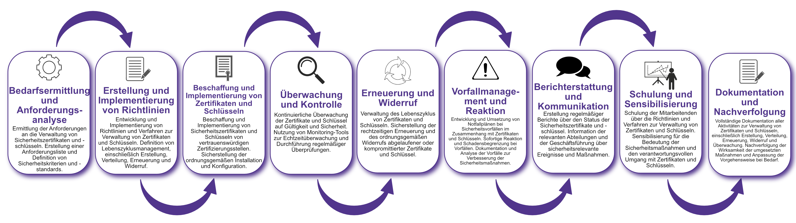

| Author | Dipl.-Ing. Daniel Mrskos, BSc |  
|--------|---------------------------------------------------------------|   
| Funktion | CEO von Security mit Passion, Penetration Tester, Mentor, FH-Lektor, NIS Prüfer |                               
| Datum  | 04. Juli 2024                                                 |
|     |                          |                                              |
| Zertifizierungen  | CSOM, CRTL, eCPTXv2, eWPTXv2, CCD, eCTHPv2, CRTE, CRTO, eCMAP, PNPT, eCPPTv2, eWPT, eCIR, CRTP, CARTP, PAWSP, eMAPT, eCXD, eCDFP, BTL1 (Gold), CAPEN, eEDA, OSWP, CNSP, Comptia Pentest+, ITIL Foundation V3, ICCA, CCNA, eJPTv2, Developing Security Software (LFD121), CAP, Checkmarx Security Champion                                         |
| LinkedIN  | [https://www.linkedin.com/in/dipl-ing-daniel-mrskos-bsc-0720081ab/](https://www.linkedin.com/in/dipl-ing-daniel-mrskos-bsc-0720081ab/)  
| Website  | [https://security-mit-passion.at](https://security-mit-passion.at)  

---
### Prozessbeschreibung: Verwaltung von Sicherheitszertifikaten und -schlüsseln

#### Prozessname
Verwaltung von Sicherheitszertifikaten und -schlüsseln

#### Prozessverantwortliche
- Max Mustermann (IT-Sicherheitsbeauftragter)
- Erika Mustermann (Leiterin IT-Abteilung)

#### Ziele des Prozesses
Dieser Prozess hat das Ziel, die Verwaltung von Sicherheitszertifikaten und -schlüsseln zu gewährleisten, um die Integrität, Vertraulichkeit und Authentizität der IT-Systeme und -Daten zu schützen.

#### Beteiligte Stellen
- IT-Abteilung
- Sicherheitsabteilung
- Compliance-Abteilung
- Fachabteilungen
- Externe Zertifizierungsstellen

#### Anforderungen an die auslösende Stelle
Die Verwaltung von Sicherheitszertifikaten und -schlüsseln wird ausgelöst durch:
- Implementierung neuer Systeme oder Dienste, die Zertifikate und Schlüssel erfordern
- Regelmäßige Sicherheitsüberprüfungen und Audits
- Ablauf oder Erneuerung bestehender Zertifikate und Schlüssel
- Sicherheitsvorfälle oder Änderungen in den Bedrohungslagen

#### Anforderungen an die Ressourcen
- Zertifikats- und Schlüsselmanagement-Software
- Verschlüsselungstools
- Fachliche Expertise in IT-Sicherheit und Kryptografie
- Dokumentationssysteme für Zertifikats- und Schlüsselprotokolle

#### Kosten und Zeitaufwand
- Einmalige Implementierung des Zertifikats- und Schlüsselmanagement-Systems: ca. 60-100 Stunden
- Regelmäßige Überprüfungen und Erneuerungen: ca. 10-20 Stunden pro Monat

#### Ablauf / Tätigkeit

1. **Bedarfsermittlung und Anforderungsanalyse**
   - Verantwortlich: IT-Abteilung, Sicherheitsabteilung
   - Beschreibung: Ermittlung der Anforderungen an die Verwaltung von Sicherheitszertifikaten und -schlüsseln. Erstellung einer Anforderungsliste und Definition von Sicherheitskriterien und -standards.

2. **Erstellung und Implementierung von Richtlinien**
   - Verantwortlich: IT-Abteilung, Compliance-Abteilung
   - Beschreibung: Entwicklung und Implementierung von Richtlinien und Verfahren zur Verwaltung von Zertifikaten und Schlüsseln. Definition von Lebenszyklusmanagement, einschließlich Erstellung, Verteilung, Erneuerung und Widerruf.

3. **Beschaffung und Implementierung von Zertifikaten und Schlüsseln**
   - Verantwortlich: IT-Abteilung, Externe Zertifizierungsstellen
   - Beschreibung: Beschaffung und Implementierung von Sicherheitszertifikaten und Schlüsseln von vertrauenswürdigen Zertifizierungsstellen. Sicherstellung der ordnungsgemäßen Installation und Konfiguration.

4. **Überwachung und Kontrolle**
   - Verantwortlich: IT-Abteilung
   - Beschreibung: Kontinuierliche Überwachung der Zertifikate und Schlüssel auf Gültigkeit und Sicherheit. Nutzung von Monitoring-Tools zur Echtzeitüberwachung und Durchführung regelmäßiger Überprüfungen.

5. **Erneuerung und Widerruf**
   - Verantwortlich: IT-Abteilung
   - Beschreibung: Verwaltung des Lebenszyklus von Zertifikaten und Schlüsseln. Sicherstellung der rechtzeitigen Erneuerung und des ordnungsgemäßen Widerrufs abgelaufener oder kompromittierter Zertifikate und Schlüssel.

6. **Vorfallmanagement und Reaktion**
   - Verantwortlich: IT-Abteilung, Sicherheitsabteilung
   - Beschreibung: Entwicklung und Umsetzung von Notfallplänen bei Sicherheitsvorfällen im Zusammenhang mit Zertifikaten und Schlüsseln. Sofortige Reaktion und Schadensbegrenzung bei Vorfällen. Dokumentation und Analyse der Vorfälle zur Verbesserung der Sicherheitsmaßnahmen.

7. **Berichterstattung und Kommunikation**
   - Verantwortlich: IT-Abteilung, Compliance-Abteilung
   - Beschreibung: Erstellung regelmäßiger Berichte über den Status der Sicherheitszertifikate und -schlüssel. Information der relevanten Abteilungen und der Geschäftsführung über sicherheitsrelevante Ereignisse und Maßnahmen.

8. **Schulung und Sensibilisierung**
   - Verantwortlich: IT-Abteilung
   - Beschreibung: Schulung der Mitarbeitenden über die Richtlinien und Verfahren zur Verwaltung von Zertifikaten und Schlüsseln. Sensibilisierung für die Bedeutung der Sicherheitsmaßnahmen und den verantwortungsvollen Umgang mit Zertifikaten und Schlüsseln.

9. **Dokumentation und Nachverfolgung**
   - Verantwortlich: IT-Sicherheitsbeauftragter
   - Beschreibung: Vollständige Dokumentation aller Aktivitäten zur Verwaltung von Zertifikaten und Schlüsseln, einschließlich Erstellung, Verteilung, Erneuerung, Widerruf und Überwachung. Nachverfolgung der Wirksamkeit der umgesetzten Maßnahmen und Anpassung der Vorgehensweise bei Bedarf.

 

#### Dokumentation
Alle Schritte und Entscheidungen im Prozess werden dokumentiert und revisionssicher archiviert. Dazu gehören:
- Anforderungsliste und Sicherheitskriterien
- Richtlinien und Verfahren zur Verwaltung von Zertifikaten und Schlüsseln
- Protokolle zur Erstellung, Verteilung, Erneuerung und Widerruf
- Überwachungs- und Vorfallsprotokolle
- Berichte und Maßnahmenpläne

#### Kommunikationswege
- Regelmäßige Berichte an die Geschäftsführung über den Status der Sicherheitszertifikate und -schlüssel und durchgeführte Maßnahmen
- Information der beteiligten Abteilungen über sicherheitsrelevante Ereignisse und Ergebnisse der Überwachungen durch E-Mails und Intranet-Ankündigungen
- Bereitstellung der Dokumentation im internen Dokumentenmanagementsystem