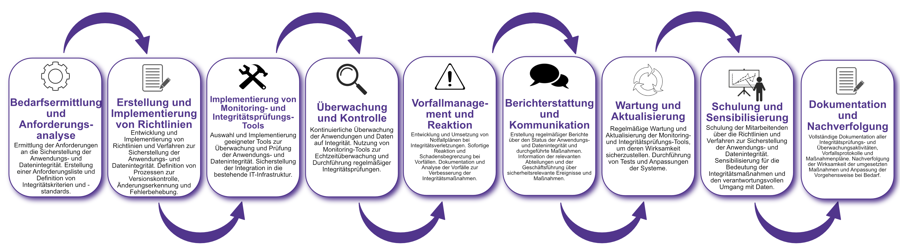

| Author | Dipl.-Ing. Daniel Mrskos, BSc |  
|--------|---------------------------------------------------------------|   
| Funktion | CEO von Security mit Passion, Penetration Tester, Mentor, FH-Lektor, NIS Prüfer |                               
| Datum  | 04. Juli 2024                                                 |
|     |                          |                                              |
| Zertifizierungen  | CSOM, CRTL, eCPTXv2, eWPTXv2, CCD, eCTHPv2, CRTE, CRTO, eCMAP, PNPT, eCPPTv2, eWPT, eCIR, CRTP, CARTP, PAWSP, eMAPT, eCXD, eCDFP, BTL1 (Gold), CAPEN, eEDA, OSWP, CNSP, Comptia Pentest+, ITIL Foundation V3, ICCA, CCNA, eJPTv2, Developing Security Software (LFD121), CAP, Checkmarx Security Champion                                         |
| LinkedIN  | [https://www.linkedin.com/in/dipl-ing-daniel-mrskos-bsc-0720081ab/](https://www.linkedin.com/in/dipl-ing-daniel-mrskos-bsc-0720081ab/)  
| Website  | [https://security-mit-passion.at](https://security-mit-passion.at)  

---
### Prozessbeschreibung: Sicherstellung der Anwendungs- und Datenintegrität

#### Prozessname
Sicherstellung der Anwendungs- und Datenintegrität

#### Prozessverantwortliche
- Max Mustermann (IT-Sicherheitsbeauftragter)
- Erika Mustermann (Leiterin IT-Abteilung)

#### Ziele des Prozesses
Dieser Prozess hat das Ziel, die Integrität von Anwendungen und Daten innerhalb der Organisation sicherzustellen, um sicherzustellen, dass die Daten vollständig, unverändert und zuverlässig bleiben und die Anwendungen ordnungsgemäß und sicher funktionieren.

#### Beteiligte Stellen
- IT-Abteilung
- Compliance-Abteilung
- Fachabteilungen
- Qualitätsmanagement
- Externe Dienstleister

#### Anforderungen an die auslösende Stelle
Die Sicherstellung der Anwendungs- und Datenintegrität wird ausgelöst durch:
- Einführung neuer Anwendungen oder Systeme
- Regelmäßige Sicherheits- und Integritätsüberprüfungen
- Identifizierung von Schwachstellen oder Vorfällen
- Änderungen in den gesetzlichen oder regulatorischen Anforderungen

#### Anforderungen an die Ressourcen
- Monitoring- und Integritätsprüfungssoftware
- Tools zur Versionskontrolle und Änderungserkennung
- Fachliche Expertise in IT-Sicherheit und Datenmanagement
- Dokumentationssysteme für Integritätsprüfungen und -protokolle

#### Kosten und Zeitaufwand
- Einmalige Implementierung der Integritätsprüfungs- und Monitoring-Tools: ca. 60-100 Stunden
- Regelmäßige Überprüfungen und Wartung: ca. 15-30 Stunden pro Monat

#### Ablauf / Tätigkeit

1. **Bedarfsermittlung und Anforderungsanalyse**
   - Verantwortlich: IT-Abteilung, Fachabteilungen
   - Beschreibung: Ermittlung der Anforderungen an die Sicherstellung der Anwendungs- und Datenintegrität. Erstellung einer Anforderungsliste und Definition von Integritätskriterien und -standards.

2. **Erstellung und Implementierung von Richtlinien**
   - Verantwortlich: IT-Abteilung, Compliance-Abteilung
   - Beschreibung: Entwicklung und Implementierung von Richtlinien und Verfahren zur Sicherstellung der Anwendungs- und Datenintegrität. Definition von Prozessen zur Versionskontrolle, Änderungserkennung und Fehlerbehebung.

3. **Implementierung von Monitoring- und Integritätsprüfungs-Tools**
   - Verantwortlich: IT-Abteilung
   - Beschreibung: Auswahl und Implementierung geeigneter Tools zur Überwachung und Prüfung der Anwendungs- und Datenintegrität. Sicherstellung der Integration in die bestehende IT-Infrastruktur.

4. **Überwachung und Kontrolle**
   - Verantwortlich: IT-Abteilung
   - Beschreibung: Kontinuierliche Überwachung der Anwendungen und Daten auf Integrität. Nutzung von Monitoring-Tools zur Echtzeitüberwachung und Durchführung regelmäßiger Integritätsprüfungen.

5. **Vorfallmanagement und Reaktion**
   - Verantwortlich: IT-Abteilung
   - Beschreibung: Entwicklung und Umsetzung von Notfallplänen bei Integritätsverletzungen. Sofortige Reaktion und Schadensbegrenzung bei Vorfällen. Dokumentation und Analyse der Vorfälle zur Verbesserung der Integritätsmaßnahmen.

6. **Berichterstattung und Kommunikation**
   - Verantwortlich: IT-Abteilung, Compliance-Abteilung
   - Beschreibung: Erstellung regelmäßiger Berichte über den Status der Anwendungs- und Datenintegrität und durchgeführte Maßnahmen. Information der relevanten Abteilungen und der Geschäftsführung über sicherheitsrelevante Ereignisse und Maßnahmen.

7. **Wartung und Aktualisierung**
   - Verantwortlich: IT-Abteilung
   - Beschreibung: Regelmäßige Wartung und Aktualisierung der Monitoring- und Integritätsprüfungs-Tools, um deren Wirksamkeit sicherzustellen. Durchführung von Tests und Anpassungen der Systeme.

8. **Schulung und Sensibilisierung**
   - Verantwortlich: IT-Abteilung
   - Beschreibung: Schulung der Mitarbeitenden über die Richtlinien und Verfahren zur Sicherstellung der Anwendungs- und Datenintegrität. Sensibilisierung für die Bedeutung der Integritätsmaßnahmen und den verantwortungsvollen Umgang mit Daten.

9. **Dokumentation und Nachverfolgung**
   - Verantwortlich: IT-Sicherheitsbeauftragter
   - Beschreibung: Vollständige Dokumentation aller Integritätsprüfungs- und Überwachungsaktivitäten, Vorfallsprotokolle und Maßnahmenpläne. Nachverfolgung der Wirksamkeit der umgesetzten Maßnahmen und Anpassung der Vorgehensweise bei Bedarf.

 

#### Dokumentation
Alle Schritte und Entscheidungen im Prozess werden dokumentiert und revisionssicher archiviert. Dazu gehören:
- Anforderungsliste und Integritätskriterien
- Richtlinien und Verfahren zur Sicherstellung der Anwendungs- und Datenintegrität
- Überwachungs- und Prüfprotokolle
- Vorfallsberichte und Maßnahmenpläne

#### Kommunikationswege
- Regelmäßige Berichte an die Geschäftsführung über den Status der Anwendungs- und Datenintegrität und durchgeführte Maßnahmen
- Information der beteiligten Abteilungen über sicherheitsrelevante Ereignisse und Ergebnisse der Überwachungen durch E-Mails und Intranet-Ankündigungen
- Bereitstellung der Dokumentation im internen Dokumentenmanagementsystem