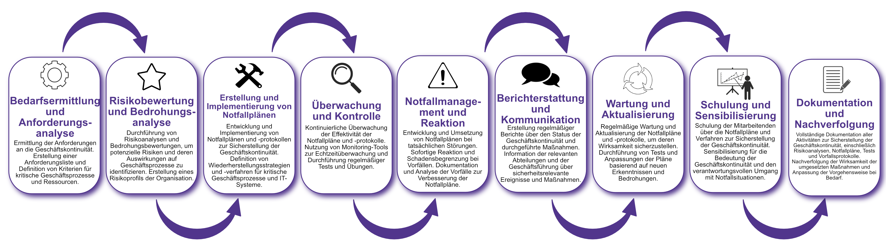

| Author | Dipl.-Ing. Daniel Mrskos, BSc |  
|--------|---------------------------------------------------------------|   
| Funktion | CEO von Security mit Passion, Penetration Tester, Mentor, FH-Lektor, NIS Prüfer |                               
| Datum  | 04. Juli 2024                                                 |
|     |                          |                                              |
| Zertifizierungen  | CSOM, CRTL, eCPTXv2, eWPTXv2, CCD, eCTHPv2, CRTE, CRTO, eCMAP, PNPT, eCPPTv2, eWPT, eCIR, CRTP, CARTP, PAWSP, eMAPT, eCXD, eCDFP, BTL1 (Gold), CAPEN, eEDA, OSWP, CNSP, Comptia Pentest+, ITIL Foundation V3, ICCA, CCNA, eJPTv2, Developing Security Software (LFD121), CAP, Checkmarx Security Champion                                         |
| LinkedIN  | [https://www.linkedin.com/in/dipl-ing-daniel-mrskos-bsc-0720081ab/](https://www.linkedin.com/in/dipl-ing-daniel-mrskos-bsc-0720081ab/)  
| Website  | [https://security-mit-passion.at](https://security-mit-passion.at)  

---
### Prozessbeschreibung: Sicherstellung der Betriebs- und Geschäftskontinuität (Business Continuity Management)

#### Prozessname
Sicherstellung der Betriebs- und Geschäftskontinuität (Business Continuity Management)

#### Prozessverantwortliche
- Max Mustermann (Business Continuity Manager)
- Erika Mustermann (Leiterin IT-Abteilung)

#### Ziele des Prozesses
Dieser Prozess hat das Ziel, die Kontinuität der Betriebs- und Geschäftsprozesse sicherzustellen, um Ausfallzeiten zu minimieren und die Erholung von Störungen zu gewährleisten.

#### Beteiligte Stellen
- IT-Abteilung
- Geschäftsführung
- Compliance-Abteilung
- Fachabteilungen
- Externe Berater

#### Anforderungen an die auslösende Stelle
Die Sicherstellung der Betriebs- und Geschäftskontinuität wird ausgelöst durch:
- Identifizierung kritischer Geschäftsprozesse und Ressourcen
- Durchführung von Risikoanalysen und Bedrohungsbewertungen
- Regelmäßige Überprüfungen und Tests der Notfallpläne
- Sicherheitsvorfälle oder Naturkatastrophen

#### Anforderungen an die Ressourcen
- Business Continuity Management (BCM)-Software
- Notfallpläne und -protokolle
- Fachliche Expertise in BCM und Risikoanalyse
- Dokumentationssysteme für Pläne und Protokolle

#### Kosten und Zeitaufwand
- Einmalige Implementierung des BCM-Systems: ca. 100-150 Stunden
- Regelmäßige Überprüfungen und Tests: ca. 20-40 Stunden pro Monat

#### Ablauf / Tätigkeit

1. **Bedarfsermittlung und Anforderungsanalyse**
   - Verantwortlich: IT-Abteilung, Fachabteilungen
   - Beschreibung: Ermittlung der Anforderungen an die Geschäftskontinuität. Erstellung einer Anforderungsliste und Definition von Kriterien für kritische Geschäftsprozesse und Ressourcen.

2. **Risikobewertung und Bedrohungsanalyse**
   - Verantwortlich: BCM-Team, Externe Berater
   - Beschreibung: Durchführung von Risikoanalysen und Bedrohungsbewertungen, um potenzielle Risiken und deren Auswirkungen auf Geschäftsprozesse zu identifizieren. Erstellung eines Risikoprofils der Organisation.

3. **Erstellung und Implementierung von Notfallplänen**
   - Verantwortlich: BCM-Team, IT-Abteilung
   - Beschreibung: Entwicklung und Implementierung von Notfallplänen und -protokollen zur Sicherstellung der Geschäftskontinuität. Definition von Wiederherstellungsstrategien und -verfahren für kritische Geschäftsprozesse und IT-Systeme.

4. **Überwachung und Kontrolle**
   - Verantwortlich: BCM-Team
   - Beschreibung: Kontinuierliche Überwachung der Effektivität der Notfallpläne und -protokolle. Nutzung von Monitoring-Tools zur Echtzeitüberwachung und Durchführung regelmäßiger Tests und Übungen.

5. **Notfallmanagement und Reaktion**
   - Verantwortlich: BCM-Team, IT-Abteilung
   - Beschreibung: Entwicklung und Umsetzung von Notfallplänen bei tatsächlichen Störungen. Sofortige Reaktion und Schadensbegrenzung bei Vorfällen. Dokumentation und Analyse der Vorfälle zur Verbesserung der Notfallpläne.

6. **Berichterstattung und Kommunikation**
   - Verantwortlich: BCM-Team, Compliance-Abteilung
   - Beschreibung: Erstellung regelmäßiger Berichte über den Status der Geschäftskontinuität und durchgeführte Maßnahmen. Information der relevanten Abteilungen und der Geschäftsführung über sicherheitsrelevante Ereignisse und Maßnahmen.

7. **Wartung und Aktualisierung**
   - Verantwortlich: BCM-Team
   - Beschreibung: Regelmäßige Wartung und Aktualisierung der Notfallpläne und -protokolle, um deren Wirksamkeit sicherzustellen. Durchführung von Tests und Anpassungen der Pläne basierend auf neuen Erkenntnissen und Bedrohungen.

8. **Schulung und Sensibilisierung**
   - Verantwortlich: BCM-Team
   - Beschreibung: Schulung der Mitarbeitenden über die Notfallpläne und Verfahren zur Sicherstellung der Geschäftskontinuität. Sensibilisierung für die Bedeutung der Geschäftskontinuität und den verantwortungsvollen Umgang mit Notfallsituationen.

9. **Dokumentation und Nachverfolgung**
   - Verantwortlich: Business Continuity Manager
   - Beschreibung: Vollständige Dokumentation aller Aktivitäten zur Sicherstellung der Geschäftskontinuität, einschließlich Risikoanalysen, Notfallpläne, Tests und Vorfallsprotokolle. Nachverfolgung der Wirksamkeit der umgesetzten Maßnahmen und Anpassung der Vorgehensweise bei Bedarf.

 

#### Dokumentation
Alle Schritte und Entscheidungen im Prozess werden dokumentiert und revisionssicher archiviert. Dazu gehören:
- Anforderungsliste und Risikoprofile
- Notfallpläne und Wiederherstellungsstrategien
- Überwachungs- und Testprotokolle
- Vorfallsberichte und Maßnahmenpläne

#### Kommunikationswege
- Regelmäßige Berichte an die Geschäftsführung über den Status der Geschäftskontinuität und durchgeführte Maßnahmen
- Information der beteiligten Abteilungen über sicherheitsrelevante Ereignisse und Ergebnisse der Überwachungen durch E-Mails und Intranet-Ankündigungen
- Bereitstellung der Dokumentation im internen Dokumentenmanagementsystem