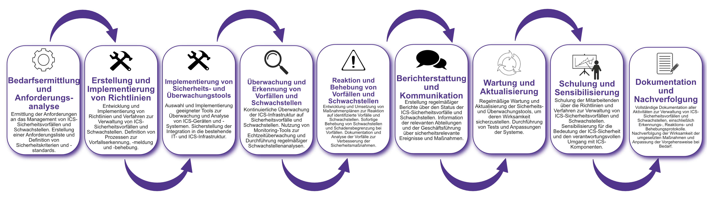

| Author | Dipl.-Ing. Daniel Mrskos, BSc |  
|--------|---------------------------------------------------------------|   
| Funktion | CEO von Security mit Passion, Penetration Tester, Mentor, FH-Lektor, NIS Prüfer |                               
| Datum  | 04. Juli 2024                                                 |
|     |                          |                                              |
| Zertifizierungen  | CSOM, CRTL, eCPTXv2, eWPTXv2, CCD, eCTHPv2, CRTE, CRTO, eCMAP, PNPT, eCPPTv2, eWPT, eCIR, CRTP, CARTP, PAWSP, eMAPT, eCXD, eCDFP, BTL1 (Gold), CAPEN, eEDA, OSWP, CNSP, Comptia Pentest+, ITIL Foundation V3, ICCA, CCNA, eJPTv2, Developing Security Software (LFD121), CAP, Checkmarx Security Champion                                         |
| LinkedIN  | [https://www.linkedin.com/in/dipl-ing-daniel-mrskos-bsc-0720081ab/](https://www.linkedin.com/in/dipl-ing-daniel-mrskos-bsc-0720081ab/)  
| Website  | [https://security-mit-passion.at](https://security-mit-passion.at)  

---
### Prozessbeschreibung: Verwaltung von Sicherheitsvorfällen und Schwachstellen in industriellen Steuerungssystemen (ICS)

#### Prozessname
Verwaltung von Sicherheitsvorfällen und Schwachstellen in industriellen Steuerungssystemen (ICS)

#### Prozessverantwortliche
- Max Mustermann (ICS-Sicherheitsbeauftragter)
- Erika Mustermann (Leiterin IT-Abteilung)

#### Ziele des Prozesses
Dieser Prozess hat das Ziel, Sicherheitsvorfälle und Schwachstellen in industriellen Steuerungssystemen (ICS) zu identifizieren, zu verwalten und zu beheben, um die Sicherheit, Integrität und Verfügbarkeit der industriellen Prozesse und Systeme zu gewährleisten.

#### Beteiligte Stellen
- IT-Abteilung
- ICS-Abteilung
- Sicherheitsabteilung
- Compliance-Abteilung
- Externe Sicherheitsberater
- ICS-Hersteller und -Dienstleister

#### Anforderungen an die auslösende Stelle
Die Verwaltung von Sicherheitsvorfällen und Schwachstellen in ICS wird ausgelöst durch:
- Meldungen von Sicherheitsvorfällen oder Schwachstellen
- Regelmäßige Sicherheitsüberprüfungen und Audits
- Einführung neuer ICS-Komponenten oder -Systeme
- Änderungen in den gesetzlichen oder regulatorischen Anforderungen

#### Anforderungen an die Ressourcen
- ICS-Sicherheitsmanagement-Software
- Tools zur Schwachstellenanalyse und Vorfallserkennung
- Fachliche Expertise in ICS-Sicherheit und Schwachstellenmanagement
- Dokumentationssysteme für Vorfalls- und Schwachstellenprotokolle

#### Kosten und Zeitaufwand
- Einmalige Implementierung des ICS-Sicherheitsmanagement-Systems: ca. 80-120 Stunden
- Regelmäßige Überprüfungen und Vorfallsmanagement: ca. 15-30 Stunden pro Monat

#### Ablauf / Tätigkeit

1. **Bedarfsermittlung und Anforderungsanalyse**
   - Verantwortlich: IT-Abteilung, ICS-Abteilung
   - Beschreibung: Ermittlung der Anforderungen an das Management von ICS-Sicherheitsvorfällen und Schwachstellen. Erstellung einer Anforderungsliste und Definition von Sicherheitskriterien und -standards.

2. **Erstellung und Implementierung von Richtlinien**
   - Verantwortlich: IT-Abteilung, Compliance-Abteilung
   - Beschreibung: Entwicklung und Implementierung von Richtlinien und Verfahren zur Verwaltung von ICS-Sicherheitsvorfällen und Schwachstellen. Definition von Prozessen zur Vorfallserkennung, -meldung und -behebung.

3. **Implementierung von Sicherheits- und Überwachungstools**
   - Verantwortlich: IT-Abteilung
   - Beschreibung: Auswahl und Implementierung geeigneter Tools zur Überwachung und Analyse von ICS-Geräten und -Systemen. Sicherstellung der Integration in die bestehende IT- und ICS-Infrastruktur.

4. **Überwachung und Erkennung von Vorfällen und Schwachstellen**
   - Verantwortlich: ICS-Abteilung, Sicherheitsabteilung
   - Beschreibung: Kontinuierliche Überwachung der ICS-Infrastruktur auf Sicherheitsvorfälle und Schwachstellen. Nutzung von Monitoring-Tools zur Echtzeitüberwachung und Durchführung regelmäßiger Schwachstellenanalysen.

5. **Reaktion und Behebung von Vorfällen und Schwachstellen**
   - Verantwortlich: IT-Abteilung, ICS-Abteilung
   - Beschreibung: Entwicklung und Umsetzung von Maßnahmenplänen zur Reaktion auf identifizierte Vorfälle und Schwachstellen. Sofortige Behebung von Schwachstellen und Schadensbegrenzung bei Vorfällen. Dokumentation und Analyse der Vorfälle zur Verbesserung der Sicherheitsmaßnahmen.

6. **Berichterstattung und Kommunikation**
   - Verantwortlich: ICS-Abteilung, Compliance-Abteilung
   - Beschreibung: Erstellung regelmäßiger Berichte über den Status der ICS-Sicherheitsvorfälle und Schwachstellen. Information der relevanten Abteilungen und der Geschäftsführung über sicherheitsrelevante Ereignisse und Maßnahmen.

7. **Wartung und Aktualisierung**
   - Verantwortlich: ICS-Abteilung
   - Beschreibung: Regelmäßige Wartung und Aktualisierung der Sicherheits- und Überwachungstools, um deren Wirksamkeit sicherzustellen. Durchführung von Tests und Anpassungen der Systeme.

8. **Schulung und Sensibilisierung**
   - Verantwortlich: IT-Abteilung, ICS-Abteilung
   - Beschreibung: Schulung der Mitarbeitenden über die Richtlinien und Verfahren zur Verwaltung von ICS-Sicherheitsvorfällen und Schwachstellen. Sensibilisierung für die Bedeutung der ICS-Sicherheit und den verantwortungsvollen Umgang mit ICS-Komponenten.

9. **Dokumentation und Nachverfolgung**
   - Verantwortlich: ICS-Sicherheitsbeauftragter
   - Beschreibung: Vollständige Dokumentation aller Aktivitäten zur Verwaltung von ICS-Sicherheitsvorfällen und Schwachstellen, einschließlich Erkennungs-, Reaktions- und Behebungsprotokolle. Nachverfolgung der Wirksamkeit der umgesetzten Maßnahmen und Anpassung der Vorgehensweise bei Bedarf.

 

#### Dokumentation
Alle Schritte und Entscheidungen im Prozess werden dokumentiert und revisionssicher archiviert. Dazu gehören:
- Anforderungsliste und Sicherheitskriterien
- Richtlinien und Verfahren zur Verwaltung von ICS-Sicherheitsvorfällen und Schwachstellen
- Überwachungs- und Analyseprotokolle
- Vorfallsberichte und Maßnahmenpläne

#### Kommunikationswege
- Regelmäßige Berichte an die Geschäftsführung über den Status der ICS-Sicherheitsvorfälle und Schwachstellen und durchgeführte Maßnahmen
- Information der beteiligten Abteilungen über sicherheitsrelevante Ereignisse und Ergebnisse der Überwachungen durch E-Mails und Intranet-Ankündigungen
- Bereitstellung der Dokumentation im internen Dokumentenmanagementsystem