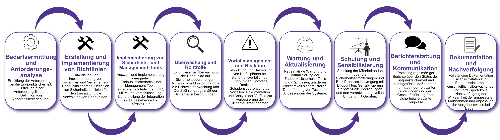

| Author | Dipl.-Ing. Daniel Mrskos, BSc |  
|--------|---------------------------------------------------------------|   
| Funktion | CEO von Security mit Passion, Penetration Tester, Mentor, FH-Lektor, NIS Prüfer |                               
| Datum  | 04. Juli 2024                                                 |
|     |                          |                                              |
| Zertifizierungen  | CSOM, CRTL, eCPTXv2, eWPTXv2, CCD, eCTHPv2, CRTE, CRTO, eCMAP, PNPT, eCPPTv2, eWPT, eCIR, CRTP, CARTP, PAWSP, eMAPT, eCXD, eCDFP, BTL1 (Gold), CAPEN, eEDA, OSWP, CNSP, Comptia Pentest+, ITIL Foundation V3, ICCA, CCNA, eJPTv2, Developing Security Software (LFD121), CAP, Checkmarx Security Champion                                         |
| LinkedIN  | [https://www.linkedin.com/in/dipl-ing-daniel-mrskos-bsc-0720081ab/](https://www.linkedin.com/in/dipl-ing-daniel-mrskos-bsc-0720081ab/)  
| Website  | [https://security-mit-passion.at](https://security-mit-passion.at)  

---
### Prozessbeschreibung: Sicherstellung der Endpunktsicherheit (Endpoint Security Management)

#### Prozessname
Sicherstellung der Endpunktsicherheit (Endpoint Security Management)

#### Prozessverantwortliche
- Max Mustermann (IT-Sicherheitsbeauftragter)
- Erika Mustermann (Leiterin IT-Abteilung)

#### Ziele des Prozesses
Dieser Prozess hat das Ziel, die Sicherheit von Endpunkten wie PCs, Laptops, mobilen Geräten und IoT-Geräten innerhalb der Organisation zu gewährleisten, um unbefugten Zugriff, Malware-Infektionen und Datenverlust zu verhindern.

#### Beteiligte Stellen
- IT-Abteilung
- Sicherheitsabteilung
- Compliance-Abteilung
- Fachabteilungen
- Externe Dienstleister

#### Anforderungen an die auslösende Stelle
Die Sicherstellung der Endpunktsicherheit wird ausgelöst durch:
- Einführung neuer Endpunktgeräte
- Regelmäßige Sicherheitsüberprüfungen und Audits
- Sicherheitsvorfälle oder Änderungen in den Bedrohungslagen
- Änderungen in den gesetzlichen oder regulatorischen Anforderungen

#### Anforderungen an die Ressourcen
- Endpunktsicherheits-Software (z.B. Antivirus, EDR, Verschlüsselungstools)
- Mobile Device Management (MDM)-Systeme
- Fachliche Expertise in IT-Sicherheit und Endpunktschutz
- Dokumentationssysteme für Sicherheitsrichtlinien und -protokolle

#### Kosten und Zeitaufwand
- Einmalige Implementierung des Endpunktsicherheits-Systems: ca. 80-120 Stunden
- Regelmäßige Überprüfungen und Wartung: ca. 15-30 Stunden pro Monat

#### Ablauf / Tätigkeit

1. **Bedarfsermittlung und Anforderungsanalyse**
   - Verantwortlich: IT-Abteilung, Sicherheitsabteilung
   - Beschreibung: Ermittlung der Anforderungen an die Endpunktsicherheit. Erstellung einer Anforderungsliste und Definition von Sicherheitskriterien und -standards.

2. **Erstellung und Implementierung von Richtlinien**
   - Verantwortlich: IT-Abteilung, Compliance-Abteilung
   - Beschreibung: Entwicklung und Implementierung von Richtlinien und Verfahren zur Endpunktsicherheit. Definition von Sicherheitsrichtlinien für den Einsatz und die Verwaltung von Endpunkten.

3. **Implementierung von Sicherheits- und Management-Tools**
   - Verantwortlich: IT-Abteilung
   - Beschreibung: Auswahl und Implementierung geeigneter Endpunktsicherheits- und Management-Tools, einschließlich Antivirus, EDR, MDM und Verschlüsselung. Sicherstellung der Integration in die bestehende IT-Infrastruktur.

4. **Überwachung und Kontrolle**
   - Verantwortlich: IT-Abteilung
   - Beschreibung: Kontinuierliche Überwachung der Endpunkte auf Sicherheitsbedrohungen. Nutzung von Monitoring-Tools zur Echtzeitüberwachung und Durchführung regelmäßiger Sicherheitsüberprüfungen.

5. **Vorfallmanagement und Reaktion**
   - Verantwortlich: IT-Abteilung, Sicherheitsabteilung
   - Beschreibung: Entwicklung und Umsetzung von Notfallplänen bei Sicherheitsvorfällen auf Endpunkten. Sofortige Reaktion und Schadensbegrenzung bei Vorfällen. Dokumentation und Analyse der Vorfälle zur Verbesserung der Sicherheitsmaßnahmen.

6. **Wartung und Aktualisierung**
   - Verantwortlich: IT-Abteilung
   - Beschreibung: Regelmäßige Wartung und Aktualisierung der Endpunktsicherheits-Tools und -Richtlinien, um deren Wirksamkeit sicherzustellen. Durchführung von Tests und Anpassungen der Systeme.

7. **Schulung und Sensibilisierung**
   - Verantwortlich: IT-Abteilung
   - Beschreibung: Schulung der Mitarbeitenden über die Sicherheitsanforderungen und Best Practices im Umgang mit Endpunkten. Sensibilisierung für potenzielle Bedrohungen und den verantwortungsvollen Umgang mit Geräten.

8. **Berichterstattung und Kommunikation**
   - Verantwortlich: IT-Abteilung, Compliance-Abteilung
   - Beschreibung: Erstellung regelmäßiger Berichte über den Status der Endpunktsicherheit und durchgeführte Maßnahmen. Information der relevanten Abteilungen und der Geschäftsführung über sicherheitsrelevante Ereignisse.

9. **Dokumentation und Nachverfolgung**
   - Verantwortlich: IT-Sicherheitsbeauftragter
   - Beschreibung: Vollständige Dokumentation aller Aktivitäten zur Endpunktsicherheit, einschließlich Überwachungs- und Vorfallsprotokolle. Nachverfolgung der Wirksamkeit der umgesetzten Maßnahmen und Anpassung der Vorgehensweise bei Bedarf.

 

#### Dokumentation
Alle Schritte und Entscheidungen im Prozess werden dokumentiert und revisionssicher archiviert. Dazu gehören:
- Anforderungsliste und Sicherheitskriterien
- Richtlinien und Verfahren zur Endpunktsicherheit
- Überwachungs- und Vorfallsprotokolle
- Berichte und Maßnahmenpläne

#### Kommunikationswege
- Regelmäßige Berichte an die Geschäftsführung über den Status der Endpunktsicherheit und durchgeführte Maßnahmen
- Information der beteiligten Abteilungen über sicherheitsrelevante Ereignisse und Ergebnisse der Überwachungen durch E-Mails und Intranet-Ankündigungen
- Bereitstellung der Dokumentation im internen Dokumentenmanagementsystem