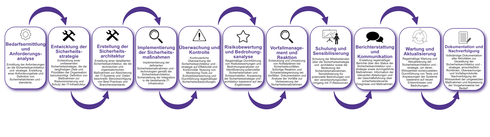

| Author | Dipl.-Ing. Daniel Mrskos, BSc |  
|--------|---------------------------------------------------------------|   
| Funktion | CEO von Security mit Passion, Penetration Tester, Mentor, FH-Lektor, NIS Prüfer |                               
| Datum  | 04. Juli 2024                                                 |
|     |                          |                                              |
| Zertifizierungen  | CSOM, CRTL, eCPTXv2, eWPTXv2, CCD, eCTHPv2, CRTE, CRTO, eCMAP, PNPT, eCPPTv2, eWPT, eCIR, CRTP, CARTP, PAWSP, eMAPT, eCXD, eCDFP, BTL1 (Gold), CAPEN, eEDA, OSWP, CNSP, Comptia Pentest+, ITIL Foundation V3, ICCA, CCNA, eJPTv2, Developing Security Software (LFD121), CAP, Checkmarx Security Champion                                         |
| LinkedIN  | [https://www.linkedin.com/in/dipl-ing-daniel-mrskos-bsc-0720081ab/](https://www.linkedin.com/in/dipl-ing-daniel-mrskos-bsc-0720081ab/)  
| Website  | [https://security-mit-passion.at](https://security-mit-passion.at)  

---
### Prozessbeschreibung: Verwaltung der Sicherheitsarchitektur und -strategie

#### Prozessname
Verwaltung der Sicherheitsarchitektur und -strategie

#### Prozessverantwortliche
- Max Mustermann (IT-Sicherheitsbeauftragter)
- Erika Mustermann (Leiterin IT-Abteilung)

#### Ziele des Prozesses
Dieser Prozess hat das Ziel, eine robuste und effektive Sicherheitsarchitektur und -strategie zu entwickeln, zu implementieren und zu verwalten, um die IT-Infrastruktur der Organisation vor Bedrohungen zu schützen und die Sicherheit der Daten und Systeme zu gewährleisten.

#### Beteiligte Stellen
- IT-Abteilung
- Sicherheitsabteilung
- Compliance-Abteilung
- Geschäftsführung
- Externe Berater

#### Anforderungen an die auslösende Stelle
Die Verwaltung der Sicherheitsarchitektur und -strategie wird ausgelöst durch:
- Einführung neuer Technologien und Systeme
- Regelmäßige Sicherheitsüberprüfungen und Audits
- Änderungen in der Bedrohungslage oder gesetzlichen Anforderungen
- Sicherheitsvorfälle oder identifizierte Schwachstellen

#### Anforderungen an die Ressourcen
- Sicherheitsarchitektur- und Management-Software
- Tools für Bedrohungsanalyse und Risikobewertung
- Fachliche Expertise in IT-Sicherheit und Architektur
- Dokumentationssysteme für Richtlinien und Protokolle

#### Kosten und Zeitaufwand
- Einmalige Entwicklung und Implementierung der Sicherheitsstrategie: ca. 100-150 Stunden
- Regelmäßige Überprüfungen und Aktualisierungen: ca. 20-40 Stunden pro Monat

#### Ablauf / Tätigkeit

1. **Bedarfsermittlung und Anforderungsanalyse**
   - Verantwortlich: IT-Abteilung, Sicherheitsabteilung
   - Beschreibung: Ermittlung der Anforderungen an die Sicherheitsarchitektur und -strategie. Erstellung einer Anforderungsliste und Definition von Sicherheitskriterien und -standards.

2. **Entwicklung der Sicherheitsstrategie**
   - Verantwortlich: IT-Abteilung, Sicherheitsabteilung
   - Beschreibung: Entwicklung einer umfassenden Sicherheitsstrategie, die die langfristigen Ziele und Prioritäten der Organisation berücksichtigt. Definition von Maßnahmen zur Risikominimierung und Schutz der IT-Infrastruktur.

3. **Erstellung der Sicherheitsarchitektur**
   - Verantwortlich: IT-Abteilung, Externe Berater
   - Beschreibung: Erstellung einer detaillierten Sicherheitsarchitektur, die die technischen und organisatorischen Maßnahmen zur Absicherung der IT-Systeme und -Daten beschreibt. Berücksichtigung von Best Practices und Branchenstandards.

4. **Implementierung der Sicherheitsmaßnahmen**
   - Verantwortlich: IT-Abteilung
   - Beschreibung: Implementierung der definierten Sicherheitsmaßnahmen und -technologien gemäß der Sicherheitsarchitektur. Sicherstellung der Integration in die bestehende IT-Infrastruktur.

5. **Überwachung und Kontrolle**
   - Verantwortlich: IT-Abteilung
   - Beschreibung: Kontinuierliche Überwachung der Sicherheitsarchitektur und -strategie auf Effektivität und Konformität. Nutzung von Monitoring-Tools zur Echtzeitüberwachung und Durchführung regelmäßiger Sicherheitsüberprüfungen.

6. **Risikobewertung und Bedrohungsanalyse**
   - Verantwortlich: IT-Abteilung, Sicherheitsabteilung
   - Beschreibung: Regelmäßige Durchführung von Risikobewertungen und Bedrohungsanalysen zur Identifizierung potenzieller Sicherheitsrisiken und Schwachstellen. Anpassung der Sicherheitsstrategie und -architektur basierend auf den Ergebnissen.

7. **Vorfallmanagement und Reaktion**
   - Verantwortlich: IT-Abteilung, Sicherheitsabteilung
   - Beschreibung: Entwicklung und Umsetzung von Notfallplänen bei Sicherheitsvorfällen. Sofortige Reaktion und Schadensbegrenzung bei Vorfällen. Dokumentation und Analyse der Vorfälle zur Verbesserung der Sicherheitsmaßnahmen.

8. **Schulung und Sensibilisierung**
   - Verantwortlich: IT-Abteilung
   - Beschreibung: Schulung der Mitarbeitenden über die Sicherheitsstrategie und -architektur sowie die Bedeutung der Sicherheitsmaßnahmen. Sensibilisierung für potenzielle Bedrohungen und den verantwortungsvollen Umgang mit IT-Ressourcen.

9. **Berichterstattung und Kommunikation**
   - Verantwortlich: IT-Abteilung, Compliance-Abteilung
   - Beschreibung: Erstellung regelmäßiger Berichte über den Status der Sicherheitsarchitektur und -strategie sowie durchgeführte Maßnahmen. Information der relevanten Abteilungen und der Geschäftsführung über sicherheitsrelevante Ereignisse und Maßnahmen.

10. **Wartung und Aktualisierung**
    - Verantwortlich: IT-Abteilung
    - Beschreibung: Regelmäßige Wartung und Aktualisierung der Sicherheitsarchitektur und -strategie, um deren Wirksamkeit sicherzustellen. Durchführung von Tests und Anpassungen der Systeme basierend auf neuen Erkenntnissen und Bedrohungen.

11. **Dokumentation und Nachverfolgung**
    - Verantwortlich: IT-Sicherheitsbeauftragter
    - Beschreibung: Vollständige Dokumentation aller Aktivitäten zur Verwaltung der Sicherheitsarchitektur und -strategie, einschließlich Richtlinien, Überwachungs- und Vorfallsprotokolle. Nachverfolgung der Wirksamkeit der umgesetzten Maßnahmen und Anpassung der Vorgehensweise bei Bedarf.

 

#### Dokumentation
Alle Schritte und Entscheidungen im Prozess werden dokumentiert und revisionssicher archiviert. Dazu gehören:
- Anforderungsliste und Sicherheitskriterien
- Sicherheitsstrategie und -architektur
- Überwachungs- und Prüfprotokolle
- Risikobewertungs- und Bedrohungsanalyseberichte
- Vorfallsberichte und Maßnahmenpläne

#### Kommunikationswege
- Regelmäßige Berichte an die Geschäftsführung über den Status der Sicherheitsarchitektur und -strategie sowie durchgeführte Maßnahmen
- Information der beteiligten Abteilungen über sicherheitsrelevante Ereignisse und Ergebnisse der Überwachungen durch E-Mails und Intranet-Ankündigungen
- Bereitstellung der Dokumentation im internen Dokumentenmanagementsystem