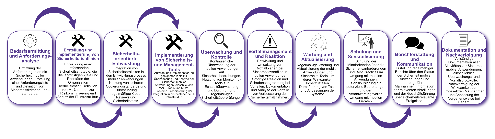

| Author | Dipl.-Ing. Daniel Mrskos, BSc |  
|--------|---------------------------------------------------------------|   
| Funktion | CEO von Security mit Passion, Penetration Tester, Mentor, FH-Lektor, NIS Prüfer |                               
| Datum  | 04. Juli 2024                                                 |
|     |                          |                                              |
| Zertifizierungen  | CSOM, CRTL, eCPTXv2, eWPTXv2, CCD, eCTHPv2, CRTE, CRTO, eCMAP, PNPT, eCPPTv2, eWPT, eCIR, CRTP, CARTP, PAWSP, eMAPT, eCXD, eCDFP, BTL1 (Gold), CAPEN, eEDA, OSWP, CNSP, Comptia Pentest+, ITIL Foundation V3, ICCA, CCNA, eJPTv2, Developing Security Software (LFD121), CAP, Checkmarx Security Champion                                         |
| LinkedIN  | [https://www.linkedin.com/in/dipl-ing-daniel-mrskos-bsc-0720081ab/](https://www.linkedin.com/in/dipl-ing-daniel-mrskos-bsc-0720081ab/)  
| Website  | [https://security-mit-passion.at](https://security-mit-passion.at)  

---

### Prozessbeschreibung: Verwaltung der Sicherheit mobiler Anwendungen (Mobile Application Security Management)

#### Prozessname
Verwaltung der Sicherheit mobiler Anwendungen (Mobile Application Security Management)

#### Prozessverantwortliche
- Max Mustermann (IT-Sicherheitsbeauftragter)
- Erika Mustermann (Leiterin Mobile Development)

#### Ziele des Prozesses
Dieser Prozess hat das Ziel, die Sicherheit mobiler Anwendungen innerhalb der Organisation zu gewährleisten, um unbefugten Zugriff, Datenverlust und andere Sicherheitsrisiken zu verhindern.

#### Beteiligte Stellen
- IT-Abteilung
- Mobile Development Team
- Sicherheitsabteilung
- Compliance-Abteilung
- Fachabteilungen
- Externe Sicherheitsberater

#### Anforderungen an die auslösende Stelle
Die Verwaltung der Sicherheit mobiler Anwendungen wird ausgelöst durch:
- Entwicklung und Einführung neuer mobiler Anwendungen
- Regelmäßige Sicherheitsüberprüfungen und Audits
- Sicherheitsvorfälle oder Schwachstellenberichte
- Änderungen in den gesetzlichen oder regulatorischen Anforderungen

#### Anforderungen an die Ressourcen
- Mobile Application Security Testing (MAST)-Tools
- Mobile Device Management (MDM)-Systeme
- Fachliche Expertise in mobiler Sicherheit und Anwendungsentwicklung
- Dokumentationssysteme für Sicherheitsrichtlinien und -protokolle

#### Kosten und Zeitaufwand
- Einmalige Implementierung der Sicherheitsmaßnahmen: ca. 80-120 Stunden
- Regelmäßige Überprüfungen und Wartung: ca. 15-30 Stunden pro Monat

#### Ablauf / Tätigkeit

1. **Bedarfsermittlung und Anforderungsanalyse**
   - Verantwortlich: IT-Abteilung, Mobile Development Team
   - Beschreibung: Ermittlung der Anforderungen an die Sicherheit mobiler Anwendungen. Erstellung einer Anforderungsliste und Definition von Sicherheitskriterien und -standards.

2. **Erstellung und Implementierung von Sicherheitsrichtlinien**
   - Verantwortlich: IT-Abteilung, Compliance-Abteilung
   - Beschreibung: Entwicklung und Implementierung von Richtlinien und Verfahren zur Sicherheit mobiler Anwendungen. Definition von Sicherheitsrichtlinien für den Einsatz und die Verwaltung mobiler Anwendungen.

3. **Sicherheitsorientierte Entwicklung**
   - Verantwortlich: Mobile Development Team
   - Beschreibung: Integration von Sicherheitspraktiken in den Entwicklungsprozess mobiler Anwendungen. Nutzung von sicheren Codierungsstandards und Durchführung regelmäßiger Code-Reviews und Sicherheitstests.

4. **Implementierung von Sicherheits- und Management-Tools**
   - Verantwortlich: IT-Abteilung
   - Beschreibung: Auswahl und Implementierung geeigneter Tools zur Überwachung und Analyse der Sicherheit mobiler Anwendungen, einschließlich MAST-Tools und MDM-Systeme. Sicherstellung der Integration in die bestehende IT-Infrastruktur.

5. **Überwachung und Kontrolle**
   - Verantwortlich: IT-Abteilung, Mobile Development Team
   - Beschreibung: Kontinuierliche Überwachung der mobilen Anwendungen auf Sicherheitsbedrohungen. Nutzung von Monitoring-Tools zur Echtzeitüberwachung und Durchführung regelmäßiger Sicherheitsüberprüfungen.

6. **Vorfallmanagement und Reaktion**
   - Verantwortlich: IT-Abteilung, Sicherheitsabteilung
   - Beschreibung: Entwicklung und Umsetzung von Notfallplänen bei Sicherheitsvorfällen in mobilen Anwendungen. Sofortige Reaktion und Schadensbegrenzung bei Vorfällen. Dokumentation und Analyse der Vorfälle zur Verbesserung der Sicherheitsmaßnahmen.

7. **Wartung und Aktualisierung**
   - Verantwortlich: Mobile Development Team
   - Beschreibung: Regelmäßige Wartung und Aktualisierung der mobilen Anwendungen und Sicherheits-Tools, um deren Wirksamkeit sicherzustellen. Durchführung von Tests und Anpassungen der Systeme.

8. **Schulung und Sensibilisierung**
   - Verantwortlich: IT-Abteilung, Mobile Development Team
   - Beschreibung: Schulung der Mitarbeitenden über die Sicherheitsanforderungen und Best Practices im Umgang mit mobilen Anwendungen. Sensibilisierung für potenzielle Bedrohungen und den verantwortungsvollen Umgang mit mobilen Geräten.

9. **Berichterstattung und Kommunikation**
   - Verantwortlich: IT-Abteilung, Compliance-Abteilung
   - Beschreibung: Erstellung regelmäßiger Berichte über den Status der Sicherheit mobiler Anwendungen und durchgeführte Maßnahmen. Information der relevanten Abteilungen und der Geschäftsführung über sicherheitsrelevante Ereignisse.

10. **Dokumentation und Nachverfolgung**
    - Verantwortlich: IT-Sicherheitsbeauftragter
    - Beschreibung: Vollständige Dokumentation aller Aktivitäten zur Sicherheit mobiler Anwendungen, einschließlich Überwachungs- und Vorfallsprotokolle. Nachverfolgung der Wirksamkeit der umgesetzten Maßnahmen und Anpassung der Vorgehensweise bei Bedarf.

 

#### Dokumentation
Alle Schritte und Entscheidungen im Prozess werden dokumentiert und revisionssicher archiviert. Dazu gehören:
- Anforderungsliste und Sicherheitskriterien
- Richtlinien und Verfahren zur Sicherheit mobiler Anwendungen
- Überwachungs- und Vorfallsprotokolle
- Berichte und Maßnahmenpläne

#### Kommunikationswege
- Regelmäßige Berichte an die Geschäftsführung über den Status der Sicherheit mobiler Anwendungen und durchgeführte Maßnahmen
- Information der beteiligten Abteilungen über sicherheitsrelevante Ereignisse und Ergebnisse der Überwachungen durch E-Mails und Intranet-Ankündigungen
- Bereitstellung der Dokumentation im internen Dokumentenmanagementsystem