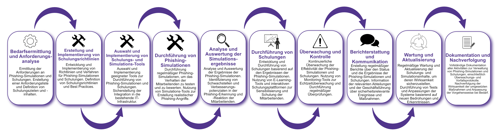

| Author | Dipl.-Ing. Daniel Mrskos, BSc |  
|--------|---------------------------------------------------------------|   
| Funktion | CEO von Security mit Passion, Penetration Tester, Mentor, FH-Lektor, NIS Prüfer |                               
| Datum  | 04. Juli 2024                                                 |
|     |                          |                                              |
| Zertifizierungen  | CSOM, CRTL, eCPTXv2, eWPTXv2, CCD, eCTHPv2, CRTE, CRTO, eCMAP, PNPT, eCPPTv2, eWPT, eCIR, CRTP, CARTP, PAWSP, eMAPT, eCXD, eCDFP, BTL1 (Gold), CAPEN, eEDA, OSWP, CNSP, Comptia Pentest+, ITIL Foundation V3, ICCA, CCNA, eJPTv2, Developing Security Software (LFD121), CAP, Checkmarx Security Champion                                         |
| LinkedIN  | [https://www.linkedin.com/in/dipl-ing-daniel-mrskos-bsc-0720081ab/](https://www.linkedin.com/in/dipl-ing-daniel-mrskos-bsc-0720081ab/)  
| Website  | [https://security-mit-passion.at](https://security-mit-passion.at)  

---
### Prozessbeschreibung: Verwaltung von Phishing-Simulationen und -Schulungen

#### Prozessname
Verwaltung von Phishing-Simulationen und -Schulungen

#### Prozessverantwortliche
- Max Mustermann (IT-Sicherheitsbeauftragter)
- Erika Mustermann (Leiterin Schulungsabteilung)

#### Ziele des Prozesses
Dieser Prozess hat das Ziel, die Sensibilisierung der Mitarbeitenden für Phishing-Angriffe zu erhöhen und ihre Fähigkeit zu stärken, solche Angriffe zu erkennen und darauf richtig zu reagieren, um die IT-Sicherheit der Organisation zu verbessern.

#### Beteiligte Stellen
- IT-Abteilung
- Sicherheitsabteilung
- Schulungsabteilung
- Compliance-Abteilung
- Externe Schulungsanbieter

#### Anforderungen an die auslösende Stelle
Die Verwaltung von Phishing-Simulationen und -Schulungen wird ausgelöst durch:
- Regelmäßige Schulungsprogramme
- Sicherheitsvorfälle oder erhöhte Bedrohungslagen
- Neue Mitarbeitende oder Änderungen in den Sicherheitsanforderungen

#### Anforderungen an die Ressourcen
- Phishing-Simulations-Software
- Schulungsplattformen und E-Learning-Tools
- Fachliche Expertise in IT-Sicherheit und Schulungsentwicklung
- Dokumentationssysteme für Schulungs- und Simulationsprotokolle

#### Kosten und Zeitaufwand
- Einmalige Implementierung der Schulungs- und Simulationsprogramme: ca. 40-60 Stunden
- Regelmäßige Überprüfungen und Aktualisierungen: ca. 10-20 Stunden pro Monat

#### Ablauf / Tätigkeit

1. **Bedarfsermittlung und Anforderungsanalyse**
   - Verantwortlich: IT-Abteilung, Schulungsabteilung
   - Beschreibung: Ermittlung der Anforderungen an Phishing-Simulationen und Schulungen. Erstellung einer Anforderungsliste und Definition von Schulungszielen und -inhalten.

2. **Erstellung und Implementierung von Schulungsrichtlinien**
   - Verantwortlich: Schulungsabteilung, Compliance-Abteilung
   - Beschreibung: Entwicklung und Implementierung von Richtlinien und Verfahren für Phishing-Simulationen und Schulungen. Definition von Schulungsrichtlinien und Best Practices.

3. **Auswahl und Implementierung von Schulungs- und Simulations-Tools**
   - Verantwortlich: IT-Abteilung
   - Beschreibung: Auswahl und Implementierung geeigneter Tools zur Durchführung von Phishing-Simulationen und Schulungen. Sicherstellung der Integration in die bestehende IT-Infrastruktur.

4. **Durchführung von Phishing-Simulationen**
   - Verantwortlich: IT-Abteilung, Sicherheitsabteilung
   - Beschreibung: Durchführung regelmäßiger Phishing-Simulationen, um das Verhalten der Mitarbeitenden zu testen und zu bewerten. Nutzung von Simulations-Tools zur Erstellung realistischer Phishing-Angriffe.

5. **Analyse und Auswertung der Simulationsergebnisse**
   - Verantwortlich: Sicherheitsabteilung, Schulungsabteilung
   - Beschreibung: Analyse und Auswertung der Ergebnisse der Phishing-Simulationen. Identifizierung von Schwachstellen und Verbesserungspotenzialen in der Phishing-Erkennung und -Reaktion der Mitarbeitenden.

6. **Durchführung von Schulungen**
   - Verantwortlich: Schulungsabteilung
   - Beschreibung: Entwicklung und Durchführung von Schulungen basierend auf den Ergebnissen der Phishing-Simulationen. Nutzung von E-Learning-Tools und interaktiven Schulungsplattformen zur Sensibilisierung und Schulung der Mitarbeitenden.

7. **Überwachung und Kontrolle**
   - Verantwortlich: IT-Abteilung, Schulungsabteilung
   - Beschreibung: Kontinuierliche Überwachung der Effektivität der Phishing-Simulationen und Schulungen. Nutzung von Monitoring-Tools zur Echtzeitüberwachung und Durchführung regelmäßiger Überprüfungen.

8. **Berichterstattung und Kommunikation**
   - Verantwortlich: Schulungsabteilung, Compliance-Abteilung
   - Beschreibung: Erstellung regelmäßiger Berichte über den Status und die Ergebnisse der Phishing-Simulationen und Schulungen. Information der relevanten Abteilungen und der Geschäftsführung über sicherheitsrelevante Ereignisse und Maßnahmen.

9. **Wartung und Aktualisierung**
   - Verantwortlich: Schulungsabteilung
   - Beschreibung: Regelmäßige Wartung und Aktualisierung der Schulungs- und Simulationsinhalte, um deren Wirksamkeit sicherzustellen. Durchführung von Tests und Anpassungen der Systeme basierend auf neuen Bedrohungen und Erkenntnissen.

10. **Dokumentation und Nachverfolgung**
    - Verantwortlich: IT-Sicherheitsbeauftragter
    - Beschreibung: Vollständige Dokumentation aller Aktivitäten zur Verwaltung von Phishing-Simulationen und Schulungen, einschließlich Überwachungs- und Vorfallsprotokolle. Nachverfolgung der Wirksamkeit der umgesetzten Maßnahmen und Anpassung der Vorgehensweise bei Bedarf.

 

#### Dokumentation
Alle Schritte und Entscheidungen im Prozess werden dokumentiert und revisionssicher archiviert. Dazu gehören:
- Anforderungsliste und Schulungsziele
- Richtlinien und Verfahren für Phishing-Simulationen und Schulungen
- Simulations- und Schulungsprotokolle
- Berichte und Maßnahmenpläne

#### Kommunikationswege
- Regelmäßige Berichte an die Geschäftsführung über den Status der Phishing-Simulationen und Schulungen sowie durchgeführte Maßnahmen
- Information der beteiligten Abteilungen über sicherheitsrelevante Ereignisse und Ergebnisse der Simulationen durch E-Mails und Intranet-Ankündigungen
- Bereitstellung der Dokumentation im internen Dokumentenmanagementsystem